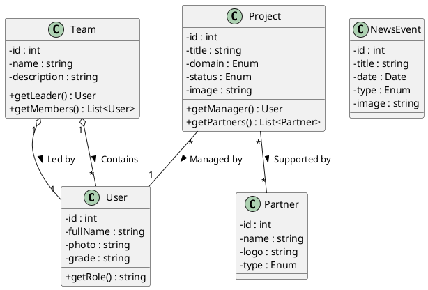

================================================================================
PROJECT SOURCE CODE COMPILATION
================================================================================
Project: Labo-Esi Laboratory Website
Generated: 2025-12-13 23:14:20
Root: C:\wamp64\www\proj
================================================================================

================================================================================
FILE: .gitignore
================================================================================
[UNKNOWN FILE TYPE - Content not included]
Type: .gitignore
Size: 0.84 KB

================================================================================
FILE: app\Config\config.php
================================================================================
Lines: 35
--------------------------------------------------------------------------------
<?php
// Clear opcache in development
if (function_exists('opcache_reset')) {
    opcache_reset();
}
/**
 * Configuration File
 * Database credentials and application constants
 */

// Database Configuration
define('DB_HOST', 'localhost');
define('DB_NAME', 'TDW');
define('DB_USER', 'root');
define('DB_PASS', 'password'); // Default WAMP password is empty
define('DB_CHARSET', 'utf8mb4');

// Application Configuration
define('APP_NAME', 'Laboratoire TDW-2CSSIL');
define('BASE_URL', 'http://localhost/proj/public/');
define('BASE_PATH', dirname(__DIR__, 2) . DIRECTORY_SEPARATOR);

// Upload directories
define('UPLOAD_PATH', BASE_PATH . 'public' . DIRECTORY_SEPARATOR . 'uploads' . DIRECTORY_SEPARATOR);

// Session Configuration
define('SESSION_LIFETIME', 3600); // 1 hour

// Timezone
date_default_timezone_set('Africa/Algiers');

// Error Reporting (Development mode)
error_reporting(E_ALL);
ini_set('display_errors', 1);


================================================================================
FILE: app\Controllers\AuthController.php
================================================================================
Lines: 100
--------------------------------------------------------------------------------
<?php
/**
 * AuthController
 * Handles user authentication (login/logout)
 */
class AuthController extends Controller {

    /**
     * Login page
     */
    public function login() {
        $lang = $this->loadLang('fr');
        
        // If already logged in, redirect to dashboard
        if (isset($_SESSION['user_id'])) {
            $this->redirect('Dashboard', 'index');
            return;
        }
        
        $data = [
            'error' => null
        ];
        
        // Handle POST request (form submission)
        if ($_SERVER['REQUEST_METHOD'] === 'POST') {
            $username = $_POST['username'] ?? '';
            $password = $_POST['password'] ?? '';
            
            if (empty($username) || empty($password)) {
                $data['error'] = 'Veuillez remplir tous les champs';
            } else {
                // Load User Model
                $userModel = $this->model('UserModel');
                
                // Authenticate user
                $user = $userModel->authenticate($username, $password);
                
                if ($user) {
                    // Store user data in session
                    $_SESSION['user_id'] = $user['id_user'];
                    $_SESSION['username'] = $user['username'];
                    $_SESSION['nom'] = $user['nom'];
                    $_SESSION['prenom'] = $user['prenom'];
                    $_SESSION['role'] = $user['role'];
                    $_SESSION['photo'] = $user['photo'];
                    
                    // Redirect to dashboard
                    $this->redirect('Dashboard', 'index');
                    return;
                } else {
                    $data['error'] = $lang['login_error'];
                }
            }
        }
        
        // Load Login View
        $this->view('Login', $data, $lang);
    }

    /**
     * Logout action
     */
    public function logout() {
        // Destroy session
        session_unset();
        session_destroy();
        
        // Redirect to homepage
        $this->redirect('Home', 'index');
    }

    /**
     * Check if user is authenticated (helper method)
     * @return bool
     */
    public static function isAuthenticated() {
        return isset($_SESSION['user_id']);
    }

    /**
     * Check if user has a specific role
     * @param string $role
     * @return bool
     */
    public static function hasRole($role) {
        return isset($_SESSION['role']) && $_SESSION['role'] === $role;
    }

    /**
     * Require authentication (helper method)
     * Redirects to login if not authenticated
     */
    protected function requireAuth() {
        if (!self::isAuthenticated()) {
            $this->redirect('Auth', 'login');
            exit;
        }
    }
}


================================================================================
FILE: app\Controllers\DashboardController.php
================================================================================
Lines: 100
--------------------------------------------------------------------------------
<?php
/**
 * DashboardController
 * User dashboard after authentication
 */
class DashboardController extends Controller {

    /**
     * Dashboard home
     */
    public function index() {
        // Check authentication
        if (!isset($_SESSION['user_id'])) {
            $this->redirect('Auth', 'login');
            return;
        }
        
        $lang = $this->loadLang('fr');
        
        // Load models
        $teamModel = $this->model('TeamModel');
        $userModel = $this->model('UserModel');
        $equipmentModel = $this->model('EquipmentModel');
        
        // Get user data
        $user = $userModel->getUserById($_SESSION['user_id']);
        $projects = $teamModel->getUserProjects($_SESSION['user_id']);
        $publications = $teamModel->getUserPublications($_SESSION['user_id']);
        $reservations = $equipmentModel->getUserReservations($_SESSION['user_id']);
        
        // Prepare data
        $data = [
            'user' => $user,
            'projects' => $projects,
            'publications' => $publications,
            'reservations' => $reservations
        ];
        
        // Load Dashboard View
        $this->view('Dashboard', $data, $lang);
    }

    /**
     * Profile update page
     */
    public function profile() {
        // Check authentication
        if (!isset($_SESSION['user_id'])) {
            $this->redirect('Auth', 'login');
            return;
        }
        
        $lang = $this->loadLang('fr');
        $userModel = $this->model('UserModel');
        
        $data = [
            'success' => null,
            'error' => null
        ];
        
        // Handle POST request (profile update)
        if ($_SERVER['REQUEST_METHOD'] === 'POST') {
            $updateData = [
                'domaine_recherche' => $_POST['domaine_recherche'] ?? '',
                'poste' => $_POST['poste'] ?? ''
            ];
            
            // Handle file upload (photo)
            if (isset($_FILES['photo']) && $_FILES['photo']['error'] === UPLOAD_ERR_OK) {
                $uploadDir = UPLOAD_PATH . 'profiles' . DIRECTORY_SEPARATOR;
                
                // Create directory if it doesn't exist
                if (!is_dir($uploadDir)) {
                    mkdir($uploadDir, 0755, true);
                }
                
                $fileName = time() . '_' . basename($_FILES['photo']['name']);
                $targetPath = $uploadDir . $fileName;
                
                if (move_uploaded_file($_FILES['photo']['tmp_name'], $targetPath)) {
                    $updateData['photo'] = 'uploads/profiles/' . $fileName;
                    $_SESSION['photo'] = $updateData['photo'];
                }
            }
            
            if ($userModel->updateProfile($_SESSION['user_id'], $updateData)) {
                $data['success'] = 'Profil mis à jour avec succès';
            } else {
                $data['error'] = 'Erreur lors de la mise à jour du profil';
            }
        }
        
        // Get current user data
        $data['user'] = $userModel->getUserById($_SESSION['user_id']);
        
        // Load Profile Edit View
        $this->view('ProfileEdit', $data, $lang);
    }
}


================================================================================
FILE: app\Controllers\EquipmentController.php
================================================================================
Lines: 72
--------------------------------------------------------------------------------
<?php
/**
 * EquipmentController
 * Handles equipment listing and reservations
 */
class EquipmentController extends Controller {

    /**
     * Equipment listing page
     */
    public function index() {
        $lang = $this->loadLang('fr');

        $equipModel = $this->model('EquipmentModel');

        $filters = [
            'category' => $_GET['category'] ?? 'all',
            'status' => $_GET['status'] ?? 'all',
            'q' => trim($_GET['q'] ?? '')
        ];

        $equipment = $equipModel->getAllEquipment($filters);
        $stats = $equipModel->getUsageStats(5);

        $data = [
            'pageTitle' => $lang['equipment_title'],
            'equipment' => $equipment ?: [],
            'categories' => $equipModel->getCategories(),
            'filters' => $filters,
            'stats' => $stats ?: [],
            'success' => $_GET['success'] ?? null,
            'error' => $_GET['error'] ?? null
        ];

        $this->view('Equipment', $data, $lang);
    }

    /**
     * Reservation submission
     */
    public function reserve() {
        if (!isset($_SESSION['user_id'])) {
            $this->redirect('Auth', 'login');
            return;
        }

        if ($_SERVER['REQUEST_METHOD'] !== 'POST') {
            $this->redirect('Equipment', 'index');
            return;
        }

        $equipId = $_POST['equip_id'] ?? null;
        $start = $_POST['date_debut'] ?? null;
        $end = $_POST['date_fin'] ?? null;
        $motif = $_POST['motif'] ?? '';

        if (!$equipId || !$start || !$end) {
            $this->redirect('Equipment', 'index', ['error' => 'Veuillez renseigner toutes les informations de réservation.']);
            return;
        }

        $equipModel = $this->model('EquipmentModel');
        $result = $equipModel->createReservation((int)$_SESSION['user_id'], (int)$equipId, $start, $end, $motif);

        if (!empty($result['success'])) {
            $this->redirect('Equipment', 'index', ['success' => 'Réservation enregistrée.']);
        }

        $this->redirect('Equipment', 'index', ['error' => $result['error'] ?? 'Erreur lors de la réservation.']);
    }
}


================================================================================
FILE: app\Controllers\EventController.php
================================================================================
Lines: 31
--------------------------------------------------------------------------------
<?php
/**
 * EventController
 * Minimal event detail page for links from the homepage
 */
class EventController extends Controller {
    public function view() {
        $lang = $this->loadLang('fr');

        $eventId = $_GET['id'] ?? null;
        if (!$eventId) {
            $this->redirect('Home', 'index');
            return;
        }

        $newsModel = $this->model('NewsModel');
        $event = $newsModel->getEventById((int)$eventId);

        if (!$event) {
            $this->redirect('Home', 'index');
            return;
        }

        $data = [
            'event' => $event
        ];

        $this->view('EventDetail', $data, $lang);
    }
}


================================================================================
FILE: app\Controllers\HomeController.php
================================================================================
Lines: 80
--------------------------------------------------------------------------------
<?php
/**
 * HomeController
 * Handles the homepage and contact page
 */
class HomeController extends Controller {

    /**
     * Homepage - Display slideshow and recent news
     */
    public function index() {
        // Load language
        $lang = $this->loadLang('fr');
        
        // Load News Model
        $newsModel = $this->model('NewsModel');
        
        // Get data for homepage
        $recentNews = $newsModel->getRecentNews(5); // For slideshow

        $eventsPerPage = 3;
        $eventsPage = 1;
        $upcomingEvents = $newsModel->getUpcomingEventsPaginated($eventsPage, $eventsPerPage);
        $totalUpcoming = $newsModel->countUpcomingEvents();
        $eventsTotalPages = (int)ceil($totalUpcoming / $eventsPerPage);
        
        // Prepare data (ensure arrays even if empty)
        $data = [
            'recentNews' => $recentNews ?: [],
            'upcomingEvents' => $upcomingEvents ?: [],
            'eventsPage' => $eventsPage,
            'eventsTotalPages' => $eventsTotalPages,
            'eventsPerPage' => $eventsPerPage
        ];
        
        // Load Home View
        $this->view('Home', $data, $lang);
    }

    /**
     * AJAX: Get upcoming events page (JSON)
     */
    public function upcomingEvents() {
        $newsModel = $this->model('NewsModel');

        $page = isset($_GET['page']) ? (int)$_GET['page'] : 1;
        $perPage = isset($_GET['perPage']) ? (int)$_GET['perPage'] : 3;
        $page = max(1, $page);
        $perPage = max(1, min(12, $perPage));

        $events = $newsModel->getUpcomingEventsPaginated($page, $perPage);
        $total = $newsModel->countUpcomingEvents();
        $totalPages = (int)ceil($total / $perPage);

        $this->json([
            'success' => true,
            'data' => $events ?: [],
            'pagination' => [
                'page' => $page,
                'perPage' => $perPage,
                'total' => $total,
                'totalPages' => $totalPages
            ]
        ]);
    }

    /**
     * Contact page
     */
    public function contact() {
        $lang = $this->loadLang('fr');
        
        $data = [
            'pageTitle' => 'Contact'
        ];
        
        $this->view('Contact', $data, $lang);
    }
}


================================================================================
FILE: app\Controllers\OfferController.php
================================================================================
Lines: 17
--------------------------------------------------------------------------------
<?php
/**
 * OfferController
 * Handles "Offres et opportunités" page
 */
class OfferController extends Controller {
    public function index() {
        $lang = $this->loadLang('fr');

        $data = [
            'pageTitle' => $lang['offers_title'] ?? 'Offres et opportunités'
        ];

        $this->view('Offer', $data, $lang);
    }
}


================================================================================
FILE: app\Controllers\ProjectController.php
================================================================================
Lines: 179
--------------------------------------------------------------------------------
<?php
/**
 * ProjectController
 * Handles project listing, filtering, and details
 */
class ProjectController extends Controller {

    /**
     * Project catalog page
     */
    public function index() {
        $lang = $this->loadLang('fr');
        
        // Load Project Model
        $projectModel = $this->model('ProjectModel');
        
        // Get all projects
        $projects = $projectModel->getAllProjects();
        $domains = $projectModel->getDomains();
        $statuses = $projectModel->getStatuses();
        $supervisors = $projectModel->getSupervisors();
        
        // Prepare data
        $data = [
            'projects' => $projects,
            'domains' => $domains,
            'statuses' => $statuses,
            'supervisors' => $supervisors
        ];
        
        // Load Project View
        $this->view('Project', $data, $lang);
    }

    /**
     * AJAX filter action
     * Returns JSON response
     */
    public function filter() {
        // Load Project Model
        $projectModel = $this->model('ProjectModel');
        
        // Get filter parameters
        $domain = $_GET['domain'] ?? null;
        $status = $_GET['status'] ?? null;
        $supervisor = $_GET['supervisor'] ?? null;
        
        // Filter projects
        $projects = $projectModel->filterProjects($domain, $status, $supervisor);
        
        // Return JSON response
        $this->json([
            'success' => true,
            'data' => $projects
        ]);
    }

    /**
     * Project edit page (only for project manager)
     */
    public function edit() {
        if (!isset($_SESSION['user_id'])) {
            $this->redirect('Auth', 'login');
            return;
        }

        $lang = $this->loadLang('fr');
        $projectId = $_GET['id'] ?? null;

        if (!$projectId) {
            $this->redirect('Dashboard', 'index');
            return;
        }

        $projectModel = $this->model('ProjectModel');
        $project = $projectModel->getProjectById((int)$projectId);

        if (!$project || (int)$project['responsable_id'] !== (int)$_SESSION['user_id']) {
            $this->redirect('Dashboard', 'index');
            return;
        }

        $data = [
            'project' => $project,
            'domains' => $projectModel->getDomains(),
            'statuses' => $projectModel->getStatuses(),
            'success' => null,
            'error' => null
        ];

        $this->view('ProjectEdit', $data, $lang);
    }

    /**
     * Project update (POST) - only for project manager
     */
    public function update() {
        if (!isset($_SESSION['user_id'])) {
            $this->redirect('Auth', 'login');
            return;
        }

        if ($_SERVER['REQUEST_METHOD'] !== 'POST') {
            $this->redirect('Dashboard', 'index');
            return;
        }

        $projectId = $_POST['id_project'] ?? null;
        if (!$projectId) {
            $this->redirect('Dashboard', 'index');
            return;
        }

        $projectModel = $this->model('ProjectModel');

        $updateData = [
            'titre' => $_POST['titre'] ?? '',
            'description' => $_POST['description'] ?? '',
            'domaine' => $_POST['domaine'] ?? '',
            'statut' => $_POST['statut'] ?? '',
            'type_financement' => $_POST['type_financement'] ?? '',
            'image_url' => $_POST['image_url'] ?? ''
        ];

        $ok = $projectModel->updateProjectByManager((int)$projectId, (int)$_SESSION['user_id'], $updateData);

        $redirectParams = ['id' => (int)$projectId];
        if ($ok) {
            $redirectParams['success'] = 1;
        } else {
            $redirectParams['error'] = 1;
        }

        $this->redirect('Project', 'edit', $redirectParams);
    }

    /**
     * Project detail page
     */
    public function detail() {
        $lang = $this->loadLang('fr');
        
        // Get project ID from URL
        $projectId = $_GET['id'] ?? null;
        
        if (!$projectId) {
            $this->redirect('Project', 'index');
            return;
        }
        
        // Load Project Model
        $projectModel = $this->model('ProjectModel');
        
        // Get project details
        $project = $projectModel->getProjectById($projectId);
        
        if (!$project) {
            $this->redirect('Project', 'index');
            return;
        }
        
        // Get related data
        $members = $projectModel->getProjectMembers($projectId);
        $partners = $projectModel->getProjectPartners($projectId);
        $publications = $projectModel->getProjectPublications($projectId);
        
        // Prepare data
        $data = [
            'project' => $project,
            'members' => $members,
            'partners' => $partners,
            'publications' => $publications
        ];
        
        // Load Project Detail View
        $this->view('ProjectDetail', $data, $lang);
    }
}


================================================================================
FILE: app\Controllers\PublicationController.php
================================================================================
Lines: 90
--------------------------------------------------------------------------------
<?php
/**
 * PublicationController
 * Handles publication listing and details
 */
class PublicationController extends Controller {

    /**
     * Publications listing page
     */
    public function index() {
        $lang = $this->loadLang('fr');

        $pubModel = $this->model('PublicationModel');

        $teamId = $_GET['team_id'] ?? null;

        $filters = [
            'year' => $_GET['year'] ?? 'all',
            'type' => $_GET['type'] ?? 'all',
            'domain' => $_GET['domain'] ?? 'all',
            'author' => $_GET['author'] ?? 'all',
            'team' => $teamId ? (int)$teamId : ($_GET['team'] ?? 'all'),
            'q' => trim($_GET['q'] ?? '')
        ];

        $sort = $_GET['sort'] ?? 'date_desc';
        $page = isset($_GET['page']) ? (int)$_GET['page'] : 1;
        $perPage = 6;

        $publications = $pubModel->searchPublications($filters, $page, $perPage, $sort);
        $total = $pubModel->countPublications($filters);
        $totalPages = (int)ceil($total / $perPage);

        $data = [
            'pageTitle' => $lang['publications_title'],
            'publications' => $publications ?: [],
            'years' => $pubModel->getYears(),
            'types' => $pubModel->getTypes(),
            'domains' => $pubModel->getDomains(),
            'authors' => $pubModel->getAuthors(),
            'filters' => $filters,
            'sort' => $sort,
            'page' => max(1, $page),
            'totalPages' => $totalPages,
            'perPage' => $perPage,
            'total' => $total
        ];

        $this->view('Publication', $data, $lang);
    }

    /**
     * AJAX filter endpoint for publications
     */
    public function filter() {
        $pubModel = $this->model('PublicationModel');

        $filters = [
            'year' => $_GET['year'] ?? 'all',
            'type' => $_GET['type'] ?? 'all',
            'domain' => $_GET['domain'] ?? 'all',
            'author' => $_GET['author'] ?? 'all',
            'team' => $_GET['team'] ?? 'all',
            'q' => trim($_GET['q'] ?? '')
        ];

        $sort = $_GET['sort'] ?? 'date_desc';
        $page = isset($_GET['page']) ? (int)$_GET['page'] : 1;
        $perPage = isset($_GET['perPage']) ? (int)$_GET['perPage'] : 6;
        $page = max(1, $page);
        $perPage = max(1, min(24, $perPage));

        $publications = $pubModel->searchPublications($filters, $page, $perPage, $sort);
        $total = $pubModel->countPublications($filters);
        $totalPages = (int)ceil($total / $perPage);

        $this->json([
            'success' => true,
            'data' => $publications ?: [],
            'pagination' => [
                'page' => $page,
                'perPage' => $perPage,
                'total' => $total,
                'totalPages' => $totalPages
            ]
        ]);
    }
}


================================================================================
FILE: app\Controllers\TeamController.php
================================================================================
Lines: 109
--------------------------------------------------------------------------------
<?php
/**
 * TeamController
 * Handles team listing, organizational chart, and member profiles
 */
class TeamController extends Controller {

    /**
     * Teams overview page
     */
    public function index() {
        $lang = $this->loadLang('fr');
        
        // Load Team Model
        $teamModel = $this->model('TeamModel');
        
        // Get all teams with their members
        $teams = $teamModel->getAllTeams();
        
        // For each team, get its members
        $teamsWithMembers = [];
        foreach ($teams as $team) {
            $team['members'] = $teamModel->getTeamMembers($team['id_team']);
            $teamsWithMembers[] = $team;
        }
        
        // Prepare data
        $data = [
            'teams' => $teamsWithMembers
        ];
        
        // Load Team View
        $this->view('Team', $data, $lang);
    }

    /**
     * Organizational chart page
     */
    public function orgChart() {
        $lang = $this->loadLang('fr');
        
        // Load Team Model
        $teamModel = $this->model('TeamModel');
        
        // Get all members
        $members = $teamModel->getAllMembers();
        
        // Group members by role
        $groupedMembers = [
            'admin' => [],
            'enseignant-chercheur' => [],
            'doctorant' => [],
            'etudiant' => []
        ];
        
        foreach ($members as $member) {
            $groupedMembers[$member['role']][] = $member;
        }
        
        // Prepare data
        $data = [
            'groupedMembers' => $groupedMembers
        ];
        
        // Load OrgChart View
        $this->view('OrgChart', $data, $lang);
    }

    /**
     * Member profile page
     */
    public function profile() {
        $lang = $this->loadLang('fr');
        
        // Get user ID from URL
        $userId = $_GET['id'] ?? null;
        
        if (!$userId) {
            $this->redirect('Team', 'index');
            return;
        }
        
        // Load Team Model
        $teamModel = $this->model('TeamModel');
        
        // Get user details
        $user = $teamModel->getUserById($userId);
        
        if (!$user) {
            $this->redirect('Team', 'index');
            return;
        }
        
        // Get user's projects and publications
        $projects = $teamModel->getUserProjects($userId);
        $publications = $teamModel->getUserPublications($userId);
        
        // Prepare data
        $data = [
            'user' => $user,
            'projects' => $projects,
            'publications' => $publications
        ];
        
        // Load MemberProfile View
        $this->view('MemberProfile', $data, $lang);
    }
}


================================================================================
FILE: app\Models\EquipmentModel.php
================================================================================
Lines: 214
--------------------------------------------------------------------------------
<?php
/**
 * EquipmentModel
 * Handles equipment listing, reservations, and simple usage stats
 */
class EquipmentModel {
    private $db;

    public function __construct() {
        $this->db = Database::getInstance();
    }

    /**
     * Get categories
     * @return array
     */
    public function getCategories() {
        $stmt = $this->db->query("SELECT DISTINCT categorie FROM equipment ORDER BY categorie");
        return $stmt->fetchAll(PDO::FETCH_COLUMN);
    }

    /**
     * List equipment with computed current state (maintenance/reserved/free)
     * @param array $filters
     * @return array
     */
    public function getAllEquipment($filters = []) {
        $sql = "
            SELECT
                e.id_equip,
                e.nom,
                e.reference,
                e.categorie,
                e.description,
                e.etat,
                e.image_url,
                e.date_acquisition,
                CASE
                    WHEN EXISTS (
                        SELECT 1 FROM maintenances m
                        WHERE m.equip_id = e.id_equip
                        AND m.date_debut <= NOW() AND m.date_fin >= NOW()
                    ) THEN 'maintenance'
                    WHEN EXISTS (
                        SELECT 1 FROM reservations r
                        WHERE r.equip_id = e.id_equip
                        AND r.date_debut <= NOW() AND r.date_fin >= NOW()
                    ) THEN 'réservé'
                    ELSE 'libre'
                END as etat_actuel
            FROM equipment e
            WHERE 1=1
        ";

        $params = [];

        if (!empty($filters['category']) && $filters['category'] !== 'all') {
            $sql .= " AND e.categorie = :cat";
            $params[':cat'] = $filters['category'];
        }

        if (!empty($filters['q'])) {
            $sql .= " AND (e.nom LIKE :q OR e.reference LIKE :q OR e.description LIKE :q)";
            $params[':q'] = '%' . $filters['q'] . '%';
        }

        // Filter by computed state
        if (!empty($filters['status']) && $filters['status'] !== 'all') {
            $sql .= " AND (
                CASE
                    WHEN EXISTS (
                        SELECT 1 FROM maintenances m
                        WHERE m.equip_id = e.id_equip
                        AND m.date_debut <= NOW() AND m.date_fin >= NOW()
                    ) THEN 'maintenance'
                    WHEN EXISTS (
                        SELECT 1 FROM reservations r
                        WHERE r.equip_id = e.id_equip
                        AND r.date_debut <= NOW() AND r.date_fin >= NOW()
                    ) THEN 'réservé'
                    ELSE 'libre'
                END
            ) = :status";
            $params[':status'] = $filters['status'];
        }

        $sql .= " ORDER BY e.nom";

        $stmt = $this->db->prepare($sql);
        $stmt->execute($params);
        return $stmt->fetchAll();
    }

    /**
     * Get reservations for a user
     * @param int $userId
     * @return array
     */
    public function getUserReservations($userId) {
        $stmt = $this->db->prepare("
            SELECT
                r.id_res,
                r.user_id,
                r.equip_id,
                r.date_debut,
                r.date_fin,
                r.motif,
                e.nom as equip_nom,
                e.reference as equip_reference,
                e.categorie as equip_categorie,
                CASE
                    WHEN r.date_fin < NOW() THEN 'passée'
                    WHEN r.date_debut > NOW() THEN 'à venir'
                    ELSE 'en cours'
                END as statut_reservation
            FROM reservations r
            JOIN equipment e ON r.equip_id = e.id_equip
            WHERE r.user_id = :uid
            ORDER BY r.date_debut DESC
        ");
        $stmt->execute([':uid' => (int)$userId]);
        return $stmt->fetchAll();
    }

    /**
     * Create a reservation with basic overlap checks
     * @return array [success=>bool, error=>string|null]
     */
    public function createReservation($userId, $equipId, $start, $end, $motif = '') {
        try {
            $startDt = new DateTime($start);
            $endDt = new DateTime($end);

            if ($endDt <= $startDt) {
                return ['success' => false, 'error' => 'La date de fin doit être après la date de début.'];
            }

            // Check overlaps with existing reservations
            $stmt = $this->db->prepare("
                SELECT COUNT(*) as c
                FROM reservations
                WHERE equip_id = :eid
                AND NOT (date_fin <= :start OR date_debut >= :end)
            ");
            $stmt->execute([
                ':eid' => (int)$equipId,
                ':start' => $startDt->format('Y-m-d H:i:s'),
                ':end' => $endDt->format('Y-m-d H:i:s')
            ]);
            $row = $stmt->fetch();
            if ((int)($row['c'] ?? 0) > 0) {
                return ['success' => false, 'error' => 'Ce créneau est déjà réservé pour cet équipement.'];
            }

            // Check overlaps with maintenances
            $stmt = $this->db->prepare("
                SELECT COUNT(*) as c
                FROM maintenances
                WHERE equip_id = :eid
                AND NOT (date_fin <= :start OR date_debut >= :end)
            ");
            $stmt->execute([
                ':eid' => (int)$equipId,
                ':start' => $startDt->format('Y-m-d H:i:s'),
                ':end' => $endDt->format('Y-m-d H:i:s')
            ]);
            $row = $stmt->fetch();
            if ((int)($row['c'] ?? 0) > 0) {
                return ['success' => false, 'error' => 'Cet équipement est en maintenance pendant ce créneau.'];
            }

            $stmt = $this->db->prepare("
                INSERT INTO reservations (user_id, equip_id, date_debut, date_fin, motif)
                VALUES (:uid, :eid, :start, :end, :motif)
            ");
            $ok = $stmt->execute([
                ':uid' => (int)$userId,
                ':eid' => (int)$equipId,
                ':start' => $startDt->format('Y-m-d H:i:s'),
                ':end' => $endDt->format('Y-m-d H:i:s'),
                ':motif' => $motif
            ]);

            return ['success' => (bool)$ok, 'error' => $ok ? null : 'Erreur lors de la réservation.'];
        } catch (Exception $e) {
            return ['success' => false, 'error' => 'Erreur: ' . $e->getMessage()];
        }
    }

    /**
     * Simple usage stats: most reserved equipment
     * @param int $limit
     * @return array
     */
    public function getUsageStats($limit = 5) {
        $limit = max(1, min(10, (int)$limit));
        $stmt = $this->db->prepare("
            SELECT
                e.id_equip,
                e.nom,
                e.categorie,
                COUNT(r.id_res) as nb_reservations
            FROM equipment e
            LEFT JOIN reservations r ON r.equip_id = e.id_equip
            GROUP BY e.id_equip
            ORDER BY nb_reservations DESC, e.nom ASC
            LIMIT :limit
        ");
        $stmt->bindValue(':limit', $limit, PDO::PARAM_INT);
        $stmt->execute();
        return $stmt->fetchAll();
    }
}


================================================================================
FILE: app\Models\NewsModel.php
================================================================================
Lines: 126
--------------------------------------------------------------------------------
<?php
/**
 * NewsModel
 * Handles database operations for events/news
 */
class NewsModel {
    private $db;

    public function __construct() {
        $this->db = Database::getInstance();
    }

    /**
     * Get recent news/events for slideshow (limit 5)
     * @return array
     */
    public function getRecentNews($limit = 5) {
        $stmt = $this->db->prepare("
            SELECT id_event, titre, description, date_event, type, image_url, lieu
            FROM events
            ORDER BY date_event DESC
            LIMIT :limit
        ");
        $stmt->bindValue(':limit', $limit, PDO::PARAM_INT);
        $stmt->execute();
        return $stmt->fetchAll();
    }

    /**
     * Get upcoming events
     * @return array
     */
    public function getUpcomingEvents($limit = 3) {
        $stmt = $this->db->prepare("
            SELECT id_event, titre, description, date_event, type, image_url, lieu
            FROM events
            WHERE date_event >= NOW()
            ORDER BY date_event ASC
            LIMIT :limit
        ");
        $stmt->bindValue(':limit', $limit, PDO::PARAM_INT);
        $stmt->execute();
        return $stmt->fetchAll();
    }

    /**
     * Get upcoming events with pagination
     * @param int $page
     * @param int $perPage
     * @return array
     */
    public function getUpcomingEventsPaginated($page = 1, $perPage = 3) {
        $page = max(1, (int)$page);
        $perPage = max(1, (int)$perPage);
        $offset = ($page - 1) * $perPage;

        $stmt = $this->db->prepare("
            SELECT id_event, titre, description, date_event, type, image_url, lieu
            FROM events
            WHERE date_event >= NOW()
            ORDER BY date_event ASC
            LIMIT :limit OFFSET :offset
        ");
        $stmt->bindValue(':limit', $perPage, PDO::PARAM_INT);
        $stmt->bindValue(':offset', $offset, PDO::PARAM_INT);
        $stmt->execute();
        return $stmt->fetchAll();
    }

    /**
     * Count upcoming events
     * @return int
     */
    public function countUpcomingEvents() {
        $stmt = $this->db->query("SELECT COUNT(*) as total FROM events WHERE date_event >= NOW()");
        $result = $stmt->fetch();
        return (int)($result['total'] ?? 0);
    }

    /**
     * Get a single event by ID
     * @param int $eventId
     * @return array|false
     */
    public function getEventById($eventId) {
        $stmt = $this->db->prepare("
            SELECT id_event, titre, description, date_event, type, image_url, lieu
            FROM events
            WHERE id_event = :id
        ");
        $stmt->execute([':id' => (int)$eventId]);
        return $stmt->fetch();
    }

    /**
     * Get all events with pagination
     * @param int $page
     * @param int $perPage
     * @return array
     */
    public function getAllEvents($page = 1, $perPage = 9) {
        $offset = ($page - 1) * $perPage;
        
        $stmt = $this->db->prepare("
            SELECT id_event, titre, description, date_event, type, image_url, lieu
            FROM events
            ORDER BY date_event DESC
            LIMIT :limit OFFSET :offset
        ");
        $stmt->bindValue(':limit', $perPage, PDO::PARAM_INT);
        $stmt->bindValue(':offset', $offset, PDO::PARAM_INT);
        $stmt->execute();
        return $stmt->fetchAll();
    }

    /**
     * Count total events
     * @return int
     */
    public function countEvents() {
        $stmt = $this->db->query("SELECT COUNT(*) as total FROM events");
        $result = $stmt->fetch();
        return (int)$result['total'];
    }
}


================================================================================
FILE: app\Models\ProjectModel.php
================================================================================
Lines: 241
--------------------------------------------------------------------------------
<?php
/**
 * ProjectModel
 * Handles database operations for research projects
 */
class ProjectModel {
    private $db;

    public function __construct() {
        $this->db = Database::getInstance();
    }

    /**
     * Get all projects with manager information
     * @return array
     */
    public function getAllProjects() {
        $stmt = $this->db->query("
            SELECT 
                p.id_project, p.titre, p.description, p.domaine, p.statut, 
                p.type_financement, p.date_debut, p.image_url,
                u.nom as responsable_nom, u.prenom as responsable_prenom,
                COALESCE(pm_stats.membres_count, 0) as membres_count,
                pm_stats.membres_noms as membres_noms
            FROM projects p
            LEFT JOIN users u ON p.responsable_id = u.id_user
            LEFT JOIN (
                SELECT 
                    pm.id_project,
                    COUNT(pm.id_user) as membres_count,
                    GROUP_CONCAT(CONCAT(u2.prenom, ' ', u2.nom) SEPARATOR ', ') as membres_noms
                FROM project_members pm
                JOIN users u2 ON pm.id_user = u2.id_user
                GROUP BY pm.id_project
            ) pm_stats ON pm_stats.id_project = p.id_project
            ORDER BY p.date_debut DESC
        ");
        return $stmt->fetchAll();
    }

    /**
     * Filter projects by domain and/or status
     * @param string|null $domain
     * @param string|null $status
     * @return array
     */
    public function filterProjects($domain = null, $status = null, $supervisorId = null) {
        $sql = "
            SELECT 
                p.id_project, p.titre, p.description, p.domaine, p.statut, 
                p.type_financement, p.date_debut, p.image_url,
                u.nom as responsable_nom, u.prenom as responsable_prenom,
                COALESCE(pm_stats.membres_count, 0) as membres_count,
                pm_stats.membres_noms as membres_noms
            FROM projects p
            LEFT JOIN users u ON p.responsable_id = u.id_user
            LEFT JOIN (
                SELECT 
                    pm.id_project,
                    COUNT(pm.id_user) as membres_count,
                    GROUP_CONCAT(CONCAT(u2.prenom, ' ', u2.nom) SEPARATOR ', ') as membres_noms
                FROM project_members pm
                JOIN users u2 ON pm.id_user = u2.id_user
                GROUP BY pm.id_project
            ) pm_stats ON pm_stats.id_project = p.id_project
            WHERE 1=1
        ";
        
        $params = [];
        
        if ($domain && $domain !== 'all') {
            $sql .= " AND p.domaine = :domain";
            $params[':domain'] = $domain;
        }
        
        if ($status && $status !== 'all') {
            $sql .= " AND p.statut = :status";
            $params[':status'] = $status;
        }

        if ($supervisorId && $supervisorId !== 'all') {
            $sql .= " AND p.responsable_id = :supervisor";
            $params[':supervisor'] = (int)$supervisorId;
        }
        
        $sql .= " ORDER BY p.date_debut DESC";
        
        $stmt = $this->db->prepare($sql);
        $stmt->execute($params);
        return $stmt->fetchAll();
    }

    /**
     * Get supervisors (responsables) that are linked to at least one project
     * @return array
     */
    public function getSupervisors() {
        $stmt = $this->db->query("
            SELECT DISTINCT u.id_user, u.prenom, u.nom
            FROM projects p
            JOIN users u ON p.responsable_id = u.id_user
            ORDER BY u.nom, u.prenom
        ");
        return $stmt->fetchAll();
    }

    /**
     * Update project (used by manager from dashboard)
     * @param int $projectId
     * @param int $managerId
     * @param array $data
     * @return bool
     */
    public function updateProjectByManager($projectId, $managerId, $data) {
        $allowed = [
            'titre',
            'description',
            'domaine',
            'statut',
            'type_financement',
            'image_url'
        ];

        $fields = [];
        $params = [':id' => (int)$projectId, ':manager' => (int)$managerId];

        foreach ($allowed as $key) {
            if (array_key_exists($key, $data)) {
                $fields[] = "$key = :$key";
                $params[":" . $key] = $data[$key];
            }
        }

        if (empty($fields)) {
            return false;
        }

        $sql = "UPDATE projects SET " . implode(', ', $fields) . " WHERE id_project = :id AND responsable_id = :manager";
        $stmt = $this->db->prepare($sql);
        return $stmt->execute($params);
    }

    /**
     * Get a single project by ID with full details
     * @param int $id
     * @return array|false
     */
    public function getProjectById($id) {
        $stmt = $this->db->prepare("
            SELECT 
                p.id_project, p.titre, p.description, p.domaine, p.statut, 
                p.type_financement, p.date_debut, p.image_url,
                u.id_user as responsable_id, u.nom as responsable_nom, 
                u.prenom as responsable_prenom, u.email as responsable_email
            FROM projects p
            LEFT JOIN users u ON p.responsable_id = u.id_user
            WHERE p.id_project = :id
        ");
        $stmt->execute([':id' => $id]);
        return $stmt->fetch();
    }

    /**
     * Get project members
     * @param int $projectId
     * @return array
     */
    public function getProjectMembers($projectId) {
        $stmt = $this->db->prepare("
            SELECT 
                u.id_user, u.nom, u.prenom, u.photo, u.grade,
                pm.role_dans_projet
            FROM project_members pm
            JOIN users u ON pm.id_user = u.id_user
            WHERE pm.id_project = :project_id
        ");
        $stmt->execute([':project_id' => $projectId]);
        return $stmt->fetchAll();
    }

    /**
     * Get project partners
     * @param int $projectId
     * @return array
     */
    public function getProjectPartners($projectId) {
        $stmt = $this->db->prepare("
            SELECT 
                p.id_partner, p.nom, p.logo_url, p.type, p.site_web
            FROM project_partners pp
            JOIN partners p ON pp.id_partner = p.id_partner
            WHERE pp.id_project = :project_id
        ");
        $stmt->execute([':project_id' => $projectId]);
        return $stmt->fetchAll();
    }

    /**
     * Get project publications
     * @param int $projectId
     * @return array
     */
    public function getProjectPublications($projectId) {
        $stmt = $this->db->prepare("
            SELECT 
                id_pub, titre, resume, date_publication, lien_pdf, doi, type
            FROM publications
            WHERE project_id = :project_id
            ORDER BY date_publication DESC
        ");
        $stmt->execute([':project_id' => $projectId]);
        return $stmt->fetchAll();
    }

    /**
     * Get available domains
     * @return array
     */
    public function getDomains() {
        $stmt = $this->db->query("
            SELECT DISTINCT domaine 
            FROM projects 
            ORDER BY domaine
        ");
        return $stmt->fetchAll(PDO::FETCH_COLUMN);
    }

    /**
     * Get available statuses
     * @return array
     */
    public function getStatuses() {
        $stmt = $this->db->query("
            SELECT DISTINCT statut 
            FROM projects 
            ORDER BY statut
        ");
        return $stmt->fetchAll(PDO::FETCH_COLUMN);
    }
}


================================================================================
FILE: app\Models\PublicationModel.php
================================================================================
Lines: 224
--------------------------------------------------------------------------------
<?php
/**
 * PublicationModel
 * Handles database operations for publications listing & filters
 */
class PublicationModel {
    private $db;

    public function __construct() {
        $this->db = Database::getInstance();
    }

    /**
     * Get available years from publications
     * @return array
     */
    public function getYears() {
        $stmt = $this->db->query("
            SELECT DISTINCT YEAR(date_publication) as annee
            FROM publications
            WHERE date_publication IS NOT NULL
            ORDER BY annee DESC
        ");
        return $stmt->fetchAll(PDO::FETCH_COLUMN);
    }

    /**
     * Get publication types
     * @return array
     */
    public function getTypes() {
        $stmt = $this->db->query("
            SELECT DISTINCT type
            FROM publications
            ORDER BY type
        ");
        return $stmt->fetchAll(PDO::FETCH_COLUMN);
    }

    /**
     * Get domains from linked projects
     * @return array
     */
    public function getDomains() {
        $stmt = $this->db->query("
            SELECT DISTINCT pr.domaine
            FROM publications p
            JOIN projects pr ON p.project_id = pr.id_project
            ORDER BY pr.domaine
        ");
        return $stmt->fetchAll(PDO::FETCH_COLUMN);
    }

    /**
     * Get authors that have at least one publication
     * @return array
     */
    public function getAuthors() {
        $stmt = $this->db->query("
            SELECT DISTINCT u.id_user, u.prenom, u.nom
            FROM publication_authors pa
            JOIN users u ON pa.id_user = u.id_user
            ORDER BY u.nom, u.prenom
        ");
        return $stmt->fetchAll();
    }

    /**
     * Search publications with filters
     * @param array $filters
     * @param int $page
     * @param int $perPage
     * @param string $sort
     * @return array
     */
    public function searchPublications($filters = [], $page = 1, $perPage = 6, $sort = 'date_desc') {
        $page = max(1, (int)$page);
        $perPage = max(1, min(24, (int)$perPage));
        $offset = ($page - 1) * $perPage;

        $sql = "
            SELECT
                p.id_pub,
                p.titre,
                p.resume,
                p.date_publication,
                p.lien_pdf,
                p.doi,
                p.type,
                pr.domaine as domaine,
                GROUP_CONCAT(DISTINCT CONCAT(u.prenom, ' ', u.nom) ORDER BY u.nom, u.prenom SEPARATOR ', ') as auteurs
            FROM publications p
            LEFT JOIN projects pr ON p.project_id = pr.id_project
            LEFT JOIN publication_authors pa ON p.id_pub = pa.id_pub
            LEFT JOIN users u ON pa.id_user = u.id_user
            WHERE 1=1
        ";

        $params = [];

        if (!empty($filters['year']) && $filters['year'] !== 'all') {
            $sql .= " AND YEAR(p.date_publication) = :year";
            $params[':year'] = (int)$filters['year'];
        }

        if (!empty($filters['type']) && $filters['type'] !== 'all') {
            $sql .= " AND p.type = :type";
            $params[':type'] = $filters['type'];
        }

        if (!empty($filters['domain']) && $filters['domain'] !== 'all') {
            $sql .= " AND pr.domaine = :domain";
            $params[':domain'] = $filters['domain'];
        }

        if (!empty($filters['q'])) {
            $sql .= " AND (p.titre LIKE :q OR p.resume LIKE :q OR p.doi LIKE :q)";
            $params[':q'] = '%' . $filters['q'] . '%';
        }

        if (!empty($filters['author']) && $filters['author'] !== 'all') {
            $sql .= " AND EXISTS (SELECT 1 FROM publication_authors pa2 WHERE pa2.id_pub = p.id_pub AND pa2.id_user = :author)";
            $params[':author'] = (int)$filters['author'];
        }

        if (!empty($filters['team']) && $filters['team'] !== 'all') {
            $sql .= " AND EXISTS (
                SELECT 1
                FROM publication_authors pa3
                JOIN team_members tm3 ON pa3.id_user = tm3.usr_id
                WHERE pa3.id_pub = p.id_pub AND tm3.team_id = :team
            )";
            $params[':team'] = (int)$filters['team'];
        }

        $sql .= " GROUP BY p.id_pub";

        $orderBy = "p.date_publication DESC";
        switch ($sort) {
            case 'date_asc':
                $orderBy = "p.date_publication ASC";
                break;
            case 'title_asc':
                $orderBy = "p.titre ASC";
                break;
            case 'title_desc':
                $orderBy = "p.titre DESC";
                break;
            case 'date_desc':
            default:
                $orderBy = "p.date_publication DESC";
                break;
        }

        $sql .= " ORDER BY $orderBy LIMIT :limit OFFSET :offset";

        $stmt = $this->db->prepare($sql);
        foreach ($params as $k => $v) {
            $stmt->bindValue($k, $v, is_int($v) ? PDO::PARAM_INT : PDO::PARAM_STR);
        }
        $stmt->bindValue(':limit', $perPage, PDO::PARAM_INT);
        $stmt->bindValue(':offset', $offset, PDO::PARAM_INT);
        $stmt->execute();

        return $stmt->fetchAll();
    }

    /**
     * Count publications with same filters
     * @param array $filters
     * @return int
     */
    public function countPublications($filters = []) {
        $sql = "
            SELECT COUNT(DISTINCT p.id_pub) as total
            FROM publications p
            LEFT JOIN projects pr ON p.project_id = pr.id_project
            WHERE 1=1
        ";

        $params = [];

        if (!empty($filters['year']) && $filters['year'] !== 'all') {
            $sql .= " AND YEAR(p.date_publication) = :year";
            $params[':year'] = (int)$filters['year'];
        }

        if (!empty($filters['type']) && $filters['type'] !== 'all') {
            $sql .= " AND p.type = :type";
            $params[':type'] = $filters['type'];
        }

        if (!empty($filters['domain']) && $filters['domain'] !== 'all') {
            $sql .= " AND pr.domaine = :domain";
            $params[':domain'] = $filters['domain'];
        }

        if (!empty($filters['q'])) {
            $sql .= " AND (p.titre LIKE :q OR p.resume LIKE :q OR p.doi LIKE :q)";
            $params[':q'] = '%' . $filters['q'] . '%';
        }

        if (!empty($filters['author']) && $filters['author'] !== 'all') {
            $sql .= " AND EXISTS (SELECT 1 FROM publication_authors pa2 WHERE pa2.id_pub = p.id_pub AND pa2.id_user = :author)";
            $params[':author'] = (int)$filters['author'];
        }

        if (!empty($filters['team']) && $filters['team'] !== 'all') {
            $sql .= " AND EXISTS (
                SELECT 1
                FROM publication_authors pa3
                JOIN team_members tm3 ON pa3.id_user = tm3.usr_id
                WHERE pa3.id_pub = p.id_pub AND tm3.team_id = :team
            )";
            $params[':team'] = (int)$filters['team'];
        }

        $stmt = $this->db->prepare($sql);
        $stmt->execute($params);
        $row = $stmt->fetch();
        return (int)($row['total'] ?? 0);
    }
}


================================================================================
FILE: app\Models\TeamModel.php
================================================================================
Lines: 149
--------------------------------------------------------------------------------
<?php
/**
 * TeamModel
 * Handles database operations for teams and members
 */
class TeamModel {
    private $db;

    public function __construct() {
        $this->db = Database::getInstance();
    }

    /**
     * Get all teams with their leaders
     * @return array
     */
    public function getAllTeams() {
        $stmt = $this->db->query("
            SELECT 
                t.id_team, t.nom, t.description,
                u.id_user as chef_id, u.nom as chef_nom, u.prenom as chef_prenom,
                u.photo as chef_photo, u.grade as chef_grade, u.email as chef_email
            FROM teams t
            LEFT JOIN users u ON t.chef_id = u.id_user
            ORDER BY t.nom
        ");
        return $stmt->fetchAll();
    }

    /**
     * Get a single team by ID
     * @param int $id
     * @return array|false
     */
    public function getTeamById($id) {
        $stmt = $this->db->prepare("
            SELECT 
                t.id_team, t.nom, t.description,
                u.id_user as chef_id, u.nom as chef_nom, u.prenom as chef_prenom,
                u.photo as chef_photo, u.grade as chef_grade, u.email as chef_email,
                u.domaine_recherche as chef_domaine
            FROM teams t
            LEFT JOIN users u ON t.chef_id = u.id_user
            WHERE t.id_team = :id
        ");
        $stmt->execute([':id' => $id]);
        return $stmt->fetch();
    }

    /**
     * Get team members (excluding the leader)
     * @param int $teamId
     * @return array
     */
    public function getTeamMembers($teamId) {
        $stmt = $this->db->prepare("
            SELECT 
                u.id_user, u.nom, u.prenom, u.photo, u.grade, u.email,
                u.domaine_recherche, tm.role_dans_equipe
            FROM team_members tm
            JOIN users u ON tm.usr_id = u.id_user
            JOIN teams t ON tm.team_id = t.id_team
            WHERE tm.team_id = :team_id 
            AND u.id_user != t.chef_id
            ORDER BY u.nom, u.prenom
        ");
        $stmt->execute([':team_id' => $teamId]);
        return $stmt->fetchAll();
    }

    /**
     * Get all laboratory members (for organizational chart)
     * @return array
     */
    public function getAllMembers() {
        $stmt = $this->db->query("
            SELECT 
                u.id_user, u.nom, u.prenom, u.photo, u.grade, 
                u.poste, u.domaine_recherche, u.email, u.role
            FROM users
            WHERE role IN ('admin', 'enseignant-chercheur', 'doctorant', 'etudiant')
            ORDER BY 
                CASE role
                    WHEN 'admin' THEN 1
                    WHEN 'enseignant-chercheur' THEN 2
                    WHEN 'doctorant' THEN 3
                    WHEN 'etudiant' THEN 4
                END,
                u.nom, u.prenom
        ");
        return $stmt->fetchAll();
    }

    /**
     * Get user by ID
     * @param int $userId
     * @return array|false
     */
    public function getUserById($userId) {
        $stmt = $this->db->prepare("
            SELECT 
                id_user, username, nom, prenom, email, photo, grade, 
                poste, domaine_recherche, role
            FROM users
            WHERE id_user = :id
        ");
        $stmt->execute([':id' => $userId]);
        return $stmt->fetch();
    }

    /**
     * Get user's projects
     * @param int $userId
     * @return array
     */
    public function getUserProjects($userId) {
        $stmt = $this->db->prepare("
            SELECT DISTINCT
                p.id_project, p.titre, p.domaine, p.statut, p.image_url, p.date_debut,
                p.responsable_id
            FROM projects p
            LEFT JOIN project_members pm ON p.id_project = pm.id_project
            WHERE p.responsable_id = :user_id1 
            OR pm.id_user = :user_id2
            ORDER BY p.date_debut DESC
        ");
        $stmt->execute([':user_id1' => $userId, ':user_id2' => $userId]);
        return $stmt->fetchAll();
    }

    /**
     * Get user's publications
     * @param int $userId
     * @return array
     */
    public function getUserPublications($userId) {
        $stmt = $this->db->prepare("
            SELECT DISTINCT
                p.id_pub, p.titre, p.date_publication, p.type, p.lien_pdf
            FROM publications p
            JOIN publication_authors pa ON p.id_pub = pa.id_pub
            WHERE pa.id_user = :user_id
            ORDER BY p.date_publication DESC
        ");
        $stmt->execute([':user_id' => $userId]);
        return $stmt->fetchAll();
    }
}


================================================================================
FILE: app\Models\UserModel.php
================================================================================
Lines: 126
--------------------------------------------------------------------------------
<?php
/**
 * UserModel
 * Handles user authentication and profile management
 */
class UserModel {
    private $db;

    public function __construct() {
        $this->db = Database::getInstance();
    }

    /**
     * Find user by username
     * @param string $username
     * @return array|false
     */
    public function findByUsername($username) {
        $stmt = $this->db->prepare("
            SELECT id_user, username, password, nom, prenom, email, photo, 
                   grade, poste, domaine_recherche, role
            FROM users
            WHERE username = :username
        ");
        $stmt->execute([':username' => $username]);
        return $stmt->fetch();
    }

    /**
     * Verify user credentials
     * @param string $username
     * @param string $password
     * @return array|false Returns user data if successful, false otherwise
     */
    public function authenticate($username, $password) {
        $user = $this->findByUsername($username);
        
        if (!$user) {
            return false;
        }
        
        // Verify password using secure password hashing
        if (password_verify($password, $user['password'])) {
            // Remove password from returned data
            unset($user['password']);
            return $user;
        }
        
        return false;
    }

    /**
     * Get user by ID
     * @param int $userId
     * @return array|false
     */
    public function getUserById($userId) {
        $stmt = $this->db->prepare("
            SELECT id_user, username, nom, prenom, email, photo, 
                   grade, poste, domaine_recherche, role
            FROM users
            WHERE id_user = :id
        ");
        $stmt->execute([':id' => $userId]);
        return $stmt->fetch();
    }

    /**
     * Update user profile
     * @param int $userId
     * @param array $data
     * @return bool
     */
    public function updateProfile($userId, $data) {
        $sql = "UPDATE users SET ";
        $fields = [];
        $params = [':id' => $userId];
        
        if (isset($data['photo'])) {
            $fields[] = "photo = :photo";
            $params[':photo'] = $data['photo'];
        }
        
        if (isset($data['domaine_recherche'])) {
            $fields[] = "domaine_recherche = :domaine";
            $params[':domaine'] = $data['domaine_recherche'];
        }
        
        if (isset($data['poste'])) {
            $fields[] = "poste = :poste";
            $params[':poste'] = $data['poste'];
        }
        
        if (empty($fields)) {
            return false;
        }
        
        $sql .= implode(', ', $fields);
        $sql .= " WHERE id_user = :id";
        
        $stmt = $this->db->prepare($sql);
        return $stmt->execute($params);
    }

    /**
     * Change user password
     * @param int $userId
     * @param string $newPassword
     * @return bool
     */
    public function changePassword($userId, $newPassword) {
        // Hash the password securely before storing
        $hashedPassword = password_hash($newPassword, PASSWORD_DEFAULT);
        
        $stmt = $this->db->prepare("
            UPDATE users 
            SET password = :password 
            WHERE id_user = :id
        ");
        return $stmt->execute([
            ':password' => $hashedPassword,
            ':id' => $userId
        ]);
    }
}


================================================================================
FILE: app\Views\Classes\ContactView.php
================================================================================
Lines: 14
--------------------------------------------------------------------------------
<?php
/**
 * ContactView Class
 */
class ContactView extends View {
    public function render() {
        ob_start();
        $this->template('contact');
        $content = ob_get_clean();
        $layout = new LayoutView($content, $this->lang);
        $layout->render();
    }
}


================================================================================
FILE: app\Views\Classes\DashboardView.php
================================================================================
Lines: 26
--------------------------------------------------------------------------------
<?php
/**
 * DashboardView Class
 * Renders the user dashboard
 */
class DashboardView extends View {

    /**
     * Render the dashboard
     */
    public function render() {
        // Start output buffering
        ob_start();
        
        // Include the dashboard template
        $this->template('dashboard');
        
        // Get the buffered content
        $content = ob_get_clean();
        
        // Load the layout with this content
        $layout = new LayoutView($content, $this->lang);
        $layout->render();
    }
}


================================================================================
FILE: app\Views\Classes\EquipmentView.php
================================================================================
Lines: 14
--------------------------------------------------------------------------------
<?php
/**
 * EquipmentView Class
 */
class EquipmentView extends View {
    public function render() {
        ob_start();
        $this->template('equipment_list');
        $content = ob_get_clean();
        $layout = new LayoutView($content, $this->lang);
        $layout->render();
    }
}


================================================================================
FILE: app\Views\Classes\EventDetailView.php
================================================================================
Lines: 14
--------------------------------------------------------------------------------
<?php
/**
 * EventDetailView Class
 */
class EventDetailView extends View {
    public function render() {
        ob_start();
        $this->template('event_detail');
        $content = ob_get_clean();
        $layout = new LayoutView($content, $this->lang);
        $layout->render();
    }
}


================================================================================
FILE: app\Views\Classes\HomeView.php
================================================================================
Lines: 26
--------------------------------------------------------------------------------
<?php
/**
 * HomeView Class
 * Renders the homepage with slideshow and news
 */
class HomeView extends View {

    /**
     * Render the homepage
     */
    public function render() {
        // Start output buffering to capture the content
        ob_start();
        
        // Include the home template
        $this->template('home');
        
        // Get the buffered content
        $content = ob_get_clean();
        
        // Load the layout with this content
        $layout = new LayoutView($content, $this->lang);
        $layout->render();
    }
}


================================================================================
FILE: app\Views\Classes\LayoutView.php
================================================================================
Lines: 27
--------------------------------------------------------------------------------
<?php
/**
 * LayoutView Class
 * Renders the main layout wrapper (header, nav, footer)
 */
class LayoutView extends View {
    private $contentHtml;

    /**
     * Constructor
     * @param string $contentHtml The inner HTML content
     * @param array $lang Language strings
     */
    public function __construct($contentHtml, $lang = []) {
        parent::__construct([], $lang);
        $this->contentHtml = $contentHtml;
    }

    /**
     * Render the layout with content
     */
    public function render() {
        // Pass the inner page HTML to the layout template so it can be displayed
        $this->template('layout', ['content' => $this->contentHtml]);
    }
}


================================================================================
FILE: app\Views\Classes\LoginView.php
================================================================================
Lines: 26
--------------------------------------------------------------------------------
<?php
/**
 * LoginView Class
 * Renders the login form
 */
class LoginView extends View {

    /**
     * Render the login page
     */
    public function render() {
        // Start output buffering
        ob_start();
        
        // Include the login template
        $this->template('login');
        
        // Get the buffered content
        $content = ob_get_clean();
        
        // Load the layout with this content
        $layout = new LayoutView($content, $this->lang);
        $layout->render();
    }
}


================================================================================
FILE: app\Views\Classes\MemberProfileView.php
================================================================================
Lines: 26
--------------------------------------------------------------------------------
<?php
/**
 * MemberProfileView Class
 * Renders a member's profile page
 */
class MemberProfileView extends View {

    /**
     * Render the member profile
     */
    public function render() {
        // Start output buffering
        ob_start();
        
        // Include the member profile template
        $this->template('member_profile');
        
        // Get the buffered content
        $content = ob_get_clean();
        
        // Load the layout with this content
        $layout = new LayoutView($content, $this->lang);
        $layout->render();
    }
}


================================================================================
FILE: app\Views\Classes\OfferView.php
================================================================================
Lines: 14
--------------------------------------------------------------------------------
<?php
/**
 * OfferView Class
 */
class OfferView extends View {
    public function render() {
        ob_start();
        $this->template('offers');
        $content = ob_get_clean();
        $layout = new LayoutView($content, $this->lang);
        $layout->render();
    }
}


================================================================================
FILE: app\Views\Classes\OrgChartView.php
================================================================================
Lines: 15
--------------------------------------------------------------------------------
<?php
/**
 * OrgChartView Class
 * Renders the organizational chart
 */
class OrgChartView extends View {
    public function render() {
        ob_start();
        $this->template('org_chart');
        $content = ob_get_clean();
        $layout = new LayoutView($content, $this->lang);
        $layout->render();
    }
}


================================================================================
FILE: app\Views\Classes\ProfileEditView.php
================================================================================
Lines: 15
--------------------------------------------------------------------------------
<?php
/**
 * ProfileEditView Class
 * Renders the profile edit form
 */
class ProfileEditView extends View {
    public function render() {
        ob_start();
        $this->template('profile_edit');
        $content = ob_get_clean();
        $layout = new LayoutView($content, $this->lang);
        $layout->render();
    }
}


================================================================================
FILE: app\Views\Classes\ProjectDetailView.php
================================================================================
Lines: 26
--------------------------------------------------------------------------------
<?php
/**
 * ProjectDetailView Class
 * Renders a single project's details
 */
class ProjectDetailView extends View {

    /**
     * Render the project detail page
     */
    public function render() {
        // Start output buffering
        ob_start();
        
        // Include the project detail template
        $this->template('project_detail');
        
        // Get the buffered content
        $content = ob_get_clean();
        
        // Load the layout with this content
        $layout = new LayoutView($content, $this->lang);
        $layout->render();
    }
}


================================================================================
FILE: app\Views\Classes\ProjectEditView.php
================================================================================
Lines: 15
--------------------------------------------------------------------------------
<?php
/**
 * ProjectEditView Class
 * Renders the project edit form for project managers
 */
class ProjectEditView extends View {
    public function render() {
        ob_start();
        $this->template('project_edit');
        $content = ob_get_clean();
        $layout = new LayoutView($content, $this->lang);
        $layout->render();
    }
}


================================================================================
FILE: app\Views\Classes\ProjectView.php
================================================================================
Lines: 26
--------------------------------------------------------------------------------
<?php
/**
 * ProjectView Class
 * Renders the project catalog with filtering
 */
class ProjectView extends View {

    /**
     * Render the project catalog
     */
    public function render() {
        // Start output buffering
        ob_start();
        
        // Include the project list template
        $this->template('project_list');
        
        // Get the buffered content
        $content = ob_get_clean();
        
        // Load the layout with this content
        $layout = new LayoutView($content, $this->lang);
        $layout->render();
    }
}


================================================================================
FILE: app\Views\Classes\PublicationView.php
================================================================================
Lines: 14
--------------------------------------------------------------------------------
<?php
/**
 * PublicationView Class
 */
class PublicationView extends View {
    public function render() {
        ob_start();
        $this->template('publication_list');
        $content = ob_get_clean();
        $layout = new LayoutView($content, $this->lang);
        $layout->render();
    }
}


================================================================================
FILE: app\Views\Classes\TeamView.php
================================================================================
Lines: 26
--------------------------------------------------------------------------------
<?php
/**
 * TeamView Class
 * Renders the team listing with organizational structure
 */
class TeamView extends View {

    /**
     * Render the teams page
     */
    public function render() {
        // Start output buffering
        ob_start();
        
        // Include the team list template
        $this->template('team_list');
        
        // Get the buffered content
        $content = ob_get_clean();
        
        // Load the layout with this content
        $layout = new LayoutView($content, $this->lang);
        $layout->render();
    }
}


================================================================================
FILE: app\Views\Templates\contact.phtml
================================================================================
Lines: 41
--------------------------------------------------------------------------------
<!-- Contact Page -->
<section class="contact-section">
    <h1 class="section-title"><?= $lang['footer_contact'] ?></h1>
    
    <div style="display: grid; grid-template-columns: 1fr 1fr; gap: 3rem; margin-top: 2rem;">
        <div style="background: white; border: 1px solid var(--border-color); padding: 2rem; border-radius: 8px;">
            <h2 style="color: var(--primary-color); margin-bottom: 1.5rem;">Informations de Contact</h2>
            
            <div style="margin-bottom: 1.5rem;">
                <strong style="color: var(--text-color);"><?= $lang['footer_address'] ?>:</strong><br>
                BP 68M, Oued Smar, 16270, Alger, Algérie
            </div>
            
            <div style="margin-bottom: 1.5rem;">
                <strong style="color: var(--text-color);"><?= $lang['footer_email'] ?>:</strong><br>
                <a href="mailto:contact@labo-tdw.dz">contact@labo-tdw.dz</a>
            </div>
            
            <div style="margin-bottom: 1.5rem;">
                <strong style="color: var(--text-color);"><?= $lang['footer_phone'] ?>:</strong><br>
                +213 (0) 21 51 11 00
            </div>
            
            <div>
                <strong style="color: var(--text-color);"><?= $lang['footer_social'] ?>:</strong><br>
                <div style="display: flex; gap: 1rem; margin-top: 0.5rem;">
                    <a href="#" style="color: var(--secondary-color);">Facebook</a>
                    <a href="#" style="color: var(--secondary-color);">Twitter</a>
                    <a href="#" style="color: var(--secondary-color);">LinkedIn</a>
                </div>
            </div>
        </div>
        
        <div style="background: var(--bg-light); padding: 2rem; border-radius: 8px;">
            <h2 style="color: var(--primary-color); margin-bottom: 1.5rem;">Localisation</h2>
            <p>École Supérieure d'Informatique (ESI)</p>
            <p>Oued Smar, Alger</p>
        </div>
    </div>
</section>


================================================================================
FILE: app\Views\Templates\dashboard.phtml
================================================================================
Lines: 218
--------------------------------------------------------------------------------
<!-- Dashboard Template -->

<section class="dashboard-section">
    <h1 class="section-title">
        <?= $lang['welcome'] ?>, <?= $this->escape($_SESSION['prenom'] . ' ' . $_SESSION['nom']) ?>
    </h1>
    
    <div style="display: grid; grid-template-columns: 300px 1fr; gap: 2rem; margin-top: 2rem;">
        <!-- Sidebar -->
        <div>
            <div style="background: white; border: 1px solid var(--border-color); padding: 2rem; border-radius: 8px; text-align: center; position: sticky; top: 20px;">
                <?php if ($user['photo']): ?>
                escape($user['photo']) ?>" 
                     alt="<?= $this->escape($user['prenom'] . ' ' . $user['nom']) ?>"
                     style="width: 150px; height: 150px; border-radius: 50%; object-fit: cover; margin-bottom: 1rem; border: 4px solid var(--secondary-color);"
                     onerror="this.src='<?= BASE_URL ?>assets/img/user-placeholder.jpg'">
                <?php else: ?>
                <div style="width: 150px; height: 150px; border-radius: 50%; background: var(--secondary-color); color: white; display: flex; align-items: center; justify-content: center; font-size: 3rem; margin: 0 auto 1rem; border: 4px solid var(--secondary-color);">
                    <?= strtoupper(substr($user['prenom'], 0, 1) . substr($user['nom'], 0, 1)) ?>
                </div>
                <?php endif; ?>
                
                <h3 style="color: var(--primary-color); margin-bottom: 0.5rem;">
                    <?= $this->escape($user['prenom'] . ' ' . $user['nom']) ?>
                </h3>
                
                <p style="color: var(--text-light); margin-bottom: 1.5rem;">
                    <?= $this->escape($user['grade']) ?>
                </p>
                
                <a href="<?= BASE_URL ?>index.php?controller=Dashboard&action=profile" 
                   class="btn btn-primary" 
                   style="width: 100%; margin-bottom: 0.5rem;">
                    <?= $lang['update_profile'] ?>
                </a>
                
                <a href="<?= BASE_URL ?>index.php?controller=Auth&action=logout" 
                   class="btn btn-secondary" 
                   style="width: 100%;">
                    <?= $lang['logout'] ?>
                </a>
            </div>
        </div>
        
        <!-- Main Content -->
        <div>
            <!-- User Info -->
            <div style="background: var(--bg-light); padding: 2rem; border-radius: 8px; margin-bottom: 2rem;">
                <h2 style="color: var(--primary-color); margin-bottom: 1rem;">
                    <?= $lang['my_profile'] ?>
                </h2>
                <div style="display: grid; grid-template-columns: repeat(2, 1fr); gap: 1rem;">
                    <div>
                        <strong style="color: var(--text-light);">Email:</strong><br>
                        <?= $this->escape($user['email']) ?>
                    </div>
                    <div>
                        <strong style="color: var(--text-light);"><?= $lang['member_grade'] ?>:</strong><br>
                        <?= $this->escape($user['grade']) ?>
                    </div>
                    <?php if ($user['poste']): ?>
                    <div>
                        <strong style="color: var(--text-light);"><?= $lang['member_post'] ?>:</strong><br>
                        <?= $this->escape($user['poste']) ?>
                    </div>
                    <?php endif; ?>
                    <?php if ($user['domaine_recherche']): ?>
                    <div>
                        <strong style="color: var(--text-light);"><?= $lang['member_research'] ?>:</strong><br>
                        <?= $this->escape($user['domaine_recherche']) ?>
                    </div>
                    <?php endif; ?>
                    <div>
                        <strong style="color: var(--text-light);">Rôle:</strong><br>
                        <?= $this->escape($user['role']) ?>
                    </div>
                </div>
            </div>
            
            <!-- Projects -->
            <div style="background: white; border: 1px solid var(--border-color); padding: 2rem; border-radius: 8px; margin-bottom: 2rem;">
                <h2 style="color: var(--primary-color); margin-bottom: 1.5rem;">
                    <?= $lang['my_projects'] ?> 
                    <span style="background: var(--secondary-color); color: white; padding: 0.2rem 0.6rem; border-radius: 20px; font-size: 0.9rem;">
                        <?= count($projects) ?>
                    </span>
                </h2>
                
                <?php if (!empty($projects)): ?>
                    <div style="display: grid; gap: 1rem;">
                        <?php foreach ($projects as $project): ?>
                        <div style="padding: 1.5rem; background: var(--bg-light); border-radius: 8px; display: flex; justify-content: space-between; align-items: center;">
                            <div>
                                <h4 style="color: var(--primary-color); margin-bottom: 0.5rem;">
                                    <?= $this->escape($project['titre']) ?>
                                </h4>
                                <div>
                                    <span class="badge badge-primary"><?= $this->escape($project['domaine']) ?></span>
                                    <?php
                                    $statusClass = 'badge-primary';
                                    if ($project['statut'] === 'terminé') {
                                        $statusClass = 'badge-success';
                                    } elseif ($project['statut'] === 'soumis') {
                                        $statusClass = 'badge-warning';
                                    }
                                    ?>
                                    <span class="badge <?= $statusClass ?>"><?= $this->escape($project['statut']) ?></span>
                                </div>
                            </div>
                            <div style="display: flex; gap: 0.75rem; align-items: center;">
                                <?php if (!empty($project['responsable_id']) && (int)$project['responsable_id'] === (int)$_SESSION['user_id']): ?>
                                    <a href="<?= BASE_URL ?>index.php?controller=Project&action=edit&id=<?= $project['id_project'] ?>" class="btn btn-secondary">
                                        <?= $lang['edit'] ?>
                                    </a>
                                <?php endif; ?>
                                <a href="<?= BASE_URL ?>index.php?controller=Project&action=detail&id=<?= $project['id_project'] ?>" 
                                   class="btn btn-primary">
                                    <?= $lang['view_details'] ?>
                                </a>
                            </div>
                        </div>
                        <?php endforeach; ?>
                    </div>
                <?php else: ?>
                    <p style="color: var(--text-light); text-align: center; padding: 2rem;">
                        Aucun projet trouvé
                    </p>
                <?php endif; ?>
            </div>

            <!-- Reservations -->
            <div style="background: white; border: 1px solid var(--border-color); padding: 2rem; border-radius: 8px; margin-bottom: 2rem;">
                <h2 style="color: var(--primary-color); margin-bottom: 1.5rem;">
                    <?= $lang['my_reservations'] ?>
                    <span style="background: var(--secondary-color); color: white; padding: 0.2rem 0.6rem; border-radius: 20px; font-size: 0.9rem;">
                        <?= !empty($reservations) ? count($reservations) : 0 ?>
                    </span>
                </h2>

                <?php if (!empty($reservations)): ?>
                    <div style="display: grid; gap: 1rem;">
                        <?php foreach ($reservations as $res): ?>
                            <div style="padding: 1.5rem; background: var(--bg-light); border-radius: 8px; display: flex; justify-content: space-between; align-items: center; gap: 1rem;">
                                <div>
                                    <h4 style="color: var(--primary-color); margin-bottom: 0.3rem;">
                                        <?= $this->escape($res['equip_nom']) ?>
                                    </h4>
                                    <p style="color: var(--text-light); margin: 0;">
                                        <?= date('d/m/Y H:i', strtotime($res['date_debut'])) ?> → <?= date('d/m/Y H:i', strtotime($res['date_fin'])) ?>
                                    </p>
                                    <?php if (!empty($res['motif'])): ?>
                                        <p style="margin: 0.5rem 0 0;">
                                            <strong>Motif:</strong> <?= $this->escape($res['motif']) ?>
                                        </p>
                                    <?php endif; ?>
                                </div>
                                <div>
                                    <?php
                                    $badge = 'badge-primary';
                                    if ($res['statut_reservation'] === 'en cours') {
                                        $badge = 'badge-warning';
                                    } elseif ($res['statut_reservation'] === 'passée') {
                                        $badge = 'badge-success';
                                    }
                                    ?>
                                    <span class="badge <?= $badge ?>"><?= $this->escape($res['statut_reservation']) ?></span>
                                </div>
                            </div>
                        <?php endforeach; ?>
                    </div>
                <?php else: ?>
                    <p style="color: var(--text-light); text-align: center; padding: 2rem;">
                        Aucune réservation trouvée
                    </p>
                <?php endif; ?>
            </div>
            
            <!-- Publications -->
            <div style="background: white; border: 1px solid var(--border-color); padding: 2rem; border-radius: 8px;">
                <h2 style="color: var(--primary-color); margin-bottom: 1.5rem;">
                    <?= $lang['my_publications'] ?>
                    <span style="background: var(--secondary-color); color: white; padding: 0.2rem 0.6rem; border-radius: 20px; font-size: 0.9rem;">
                        <?= count($publications) ?>
                    </span>
                </h2>
                
                <?php if (!empty($publications)): ?>
                    <div style="display: grid; gap: 1rem;">
                        <?php foreach ($publications as $pub): ?>
                        <div style="padding: 1.5rem; background: var(--bg-light); border-radius: 8px;">
                            <h4 style="color: var(--primary-color); margin-bottom: 0.5rem;">
                                <?= $this->escape($pub['titre']) ?>
                            </h4>
                            <p style="color: var(--text-light); font-size: 0.9rem;">
                                <span class="badge badge-primary"><?= $this->escape($pub['type']) ?></span>
                                <?= date('Y', strtotime($pub['date_publication'])) ?>
                            </p>
                            <?php if ($pub['lien_pdf']): ?>
                            <a href="<?= $this->escape($pub['lien_pdf']) ?>" 
                               target="_blank" 
                               class="btn btn-primary" 
                               style="font-size: 0.9rem; padding: 0.5rem 1rem; margin-top: 0.5rem;">
                                <?= $lang['pub_download'] ?>
                            </a>
                            <?php endif; ?>
                        </div>
                        <?php endforeach; ?>
                    </div>
                <?php else: ?>
                    <p style="color: var(--text-light); text-align: center; padding: 2rem;">
                        Aucune publication trouvée
                    </p>
                <?php endif; ?>
            </div>
        </div>
    </div>
</section>


================================================================================
FILE: app\Views\Templates\equipment_list.phtml
================================================================================
Lines: 152
--------------------------------------------------------------------------------
<!-- Equipment List -->
<section class="equipment-section">
    <h1 class="section-title"><?= $lang['equipment_title'] ?></h1>

    <?php if (!empty($success)): ?>
        <div style="background: var(--bg-light); border-left: 4px solid var(--secondary-color); padding: 1rem; border-radius: 6px; margin-bottom: 1rem;">
            <?= $this->escape($success) ?>
        </div>
    <?php endif; ?>
    <?php if (!empty($error)): ?>
        <div style="background: var(--bg-light); border-left: 4px solid #e74c3c; padding: 1rem; border-radius: 6px; margin-bottom: 1rem;">
            <?= $this->escape($error) ?>
        </div>
    <?php endif; ?>

    <div class="filter-bar">
        <form method="GET" action="<?= BASE_URL ?>index.php" style="display: flex; gap: 1rem; flex-wrap: wrap; align-items: center;">
            <input type="hidden" name="controller" value="Equipment">
            <input type="hidden" name="action" value="index">

            <div>
                <label for="equip-q"><?= $lang['search'] ?>:</label>
                <input id="equip-q" name="q" class="form-control" style="width: 240px; display: inline-block;" type="text" value="<?= $this->escape($filters['q'] ?? '') ?>" placeholder="Nom, référence...">
            </div>

            <div>
                <label for="equip-category"><?= $lang['equip_category'] ?>:</label>
                <select id="equip-category" name="category" class="form-control" style="width: auto; display: inline-block;">
                    <option value="all"><?= $lang['all'] ?></option>
                    <?php if (!empty($categories)): ?>
                        <?php foreach ($categories as $cat): ?>
                            <option value="<?= $this->escape($cat) ?>" <?= (($filters['category'] ?? 'all') == $cat) ? 'selected' : '' ?>>
                                <?= $this->escape($cat) ?>
                            </option>
                        <?php endforeach; ?>
                    <?php endif; ?>
                </select>
            </div>

            <div>
                <label for="equip-status"><?= $lang['equip_status'] ?>:</label>
                <select id="equip-status" name="status" class="form-control" style="width: auto; display: inline-block;">
                    <option value="all"><?= $lang['all'] ?></option>
                    <option value="libre" <?= (($filters['status'] ?? 'all') === 'libre') ? 'selected' : '' ?>><?= $lang['status_free'] ?></option>
                    <option value="réservé" <?= (($filters['status'] ?? 'all') === 'réservé') ? 'selected' : '' ?>><?= $lang['status_reserved'] ?></option>
                    <option value="maintenance" <?= (($filters['status'] ?? 'all') === 'maintenance') ? 'selected' : '' ?>><?= $lang['status_maintenance'] ?></option>
                </select>
            </div>

            <div>
                <button type="submit" class="btn btn-primary"><?= $lang['filter'] ?></button>
            </div>
        </form>
    </div>

    <?php if (!empty($stats)): ?>
        <div style="background: white; border: 1px solid var(--border-color); padding: 1.5rem; border-radius: 8px; margin: 1.5rem 0;">
            <h2 style="color: var(--primary-color); margin-bottom: 1rem;">Statistiques d'utilisation</h2>
            <div style="display: grid; gap: 0.75rem;">
                <?php foreach ($stats as $s): ?>
                    <div style="display: flex; justify-content: space-between; gap: 1rem; padding: 0.75rem; background: var(--bg-light); border-radius: 6px;">
                        <div>
                            <strong><?= $this->escape($s['nom']) ?></strong>
                            <small style="color: var(--text-light);">(<?= $this->escape($s['categorie']) ?>)</small>
                        </div>
                        <div style="color: var(--text-light);">
                            <?= (int)$s['nb_reservations'] ?> réservation(s)
                        </div>
                    </div>
                <?php endforeach; ?>
            </div>
        </div>
    <?php endif; ?>

    <div class="card-grid">
        <?php if (!empty($equipment)): ?>
            <?php foreach ($equipment as $equip): ?>
                <div class="card">
                    <?php if (!empty($equip['image_url'])): ?>
                        escape($equip['image_url']) ?>" alt="<?= $this->escape($equip['nom']) ?>" onerror="this.src='<?= BASE_URL ?>assets/img/project-placeholder.jpg'">
                    <?php else: ?>
                        assets/img/project-placeholder.jpg" alt="<?= $this->escape($equip['nom']) ?>">
                    <?php endif; ?>

                    <div class="card-body">
                        <h3 class="card-title"><?= $this->escape($equip['nom']) ?></h3>

                        <div class="card-meta">
                            <span><strong><?= $lang['equip_category'] ?>:</strong> <?= $this->escape($equip['categorie']) ?></span>
                            <?php if (!empty($equip['reference'])): ?>
                                <span><strong>Réf:</strong> <?= $this->escape($equip['reference']) ?></span>
                            <?php endif; ?>
                        </div>

                        <div class="mb-2">
                            <?php
                            $etat = $equip['etat_actuel'] ?? $equip['etat'] ?? 'libre';
                            $badge = 'badge-success';
                            $label = $lang['status_free'];
                            if ($etat === 'réservé') {
                                $badge = 'badge-warning';
                                $label = $lang['status_reserved'];
                            } elseif ($etat === 'maintenance') {
                                $badge = 'badge-primary';
                                $label = $lang['status_maintenance'];
                            }
                            ?>
                            <span class="badge <?= $badge ?>"><?= $this->escape($label) ?></span>
                        </div>

                        <?php if (!empty($equip['description'])): ?>
                            <p class="card-text"><?= $this->escape(substr($equip['description'], 0, 140)) ?>...</p>
                        <?php endif; ?>

                        <?php if (isset($_SESSION['user_id'])): ?>
                            <div style="margin-top: 1rem;">
                                <h4 style="font-size: 1rem; color: var(--primary-color); margin-bottom: 0.5rem;">
                                    <?= $lang['equip_reserve'] ?>
                                </h4>
                                <form method="POST" action="<?= BASE_URL ?>index.php?controller=Equipment&action=reserve" style="display: grid; gap: 0.5rem;">
                                    <input type="hidden" name="equip_id" value="<?= (int)$equip['id_equip'] ?>">
                                    <div style="display: grid; grid-template-columns: 1fr 1fr; gap: 0.5rem;">
                                        <div>
                                            <label style="display:block; font-size:0.9rem; color: var(--text-light);">Début</label>
                                            <input required type="datetime-local" name="date_debut" class="form-control">
                                        </div>
                                        <div>
                                            <label style="display:block; font-size:0.9rem; color: var(--text-light);">Fin</label>
                                            <input required type="datetime-local" name="date_fin" class="form-control">
                                        </div>
                                    </div>
                                    <div>
                                        <label style="display:block; font-size:0.9rem; color: var(--text-light);">Motif (optionnel)</label>
                                        <input type="text" name="motif" class="form-control" placeholder="Ex: Expérience, TP, test...">
                                    </div>
                                    <button type="submit" class="btn btn-primary" style="width: 100%;">Réserver</button>
                                </form>
                            </div>
                        <?php else: ?>
                            <a href="<?= BASE_URL ?>index.php?controller=Auth&action=login" class="btn btn-primary">
                                Se connecter pour réserver
                            </a>
                        <?php endif; ?>
                    </div>
                </div>
            <?php endforeach; ?>
        <?php else: ?>
            <div class="no-results">Aucun équipement trouvé</div>
        <?php endif; ?>
    </div>
</section>


================================================================================
FILE: app\Views\Templates\event_detail.phtml
================================================================================
Lines: 47
--------------------------------------------------------------------------------
<!-- Event Detail Template -->
<section class="event-detail">
    <div style="margin-bottom: 2rem;">
        <a href="<?= BASE_URL ?>index.php?controller=Home&action=index" class="btn btn-secondary">â—€ <?= $lang['back'] ?></a>
    </div>

    <h1 class="section-title"><?= $this->escape($event['titre']) ?></h1>

    <div style="display: grid; grid-template-columns: 2fr 1fr; gap: 2rem; margin-top: 2rem;">
        <div>
            <?php if (!empty($event['image_url'])): ?>
                escape($event['image_url']) ?>" alt="<?= $this->escape($event['titre']) ?>" style="width: 100%; border-radius: 8px; margin-bottom: 1.5rem;" onerror="this.src='<?= BASE_URL ?>assets/img/event-placeholder.jpg'">
            <?php endif; ?>

            <div style="background: var(--bg-light); padding: 2rem; border-radius: 8px;">
                <h2 style="color: var(--primary-color); margin-bottom: 1rem;">Description</h2>
                <p style="line-height: 1.8; margin: 0;">
                    <?= !empty($event['description']) ? nl2br($this->escape($event['description'])) : 'Aucune description disponible.' ?>
                </p>
            </div>
        </div>

        <div>
            <div style="background: white; border: 1px solid var(--border-color); padding: 1.5rem; border-radius: 8px;">
                <h3 style="color: var(--primary-color); margin-bottom: 1rem;">Informations</h3>

                <div style="margin-bottom: 1rem;">
                    <strong style="color: var(--text-light);"><?= $lang['event_date'] ?>:</strong><br>
                    <?= !empty($event['date_event']) ? date('d/m/Y H:i', strtotime($event['date_event'])) : 'N/A' ?>
                </div>

                <?php if (!empty($event['lieu'])): ?>
                    <div style="margin-bottom: 1rem;">
                        <strong style="color: var(--text-light);"><?= $lang['event_location'] ?>:</strong><br>
                        <?= $this->escape($event['lieu']) ?>
                    </div>
                <?php endif; ?>

                <div>
                    <strong style="color: var(--text-light);"><?= $lang['event_type'] ?>:</strong><br>
                    <span class="badge badge-primary"><?= $this->escape($event['type']) ?></span>
                </div>
            </div>
        </div>
    </div>
</section>


================================================================================
FILE: app\Views\Templates\home.phtml
================================================================================
Lines: 142
--------------------------------------------------------------------------------
<!-- Homepage Template -->

<!-- Slideshow Section -->
<?php if (!empty($recentNews)): ?>
<section class="slideshow-container">
    <?php foreach ($recentNews as $index => $news): ?>
    <div class="slide <?= $index === 0 ? 'active' : '' ?>">
        <?php if ($news['image_url']): ?>
            escape($news['image_url']) ?>" 
                 alt="<?= $this->escape($news['titre']) ?>"
                 onerror="this.src='<?= BASE_URL ?>assets/img/news-placeholder.jpg'">
        <?php else: ?>
            assets/img/news-placeholder.jpg" alt="<?= $this->escape($news['titre']) ?>">
        <?php endif; ?>
        
        <div class="slide-content">
            <h2><?= $this->escape($news['titre']) ?></h2>
            <p><?= $this->escape(substr($news['description'], 0, 150)) ?>...</p>
            <a href="<?= BASE_URL ?>index.php?controller=Event&action=view&id=<?= $news['id_event'] ?>" 
               class="btn btn-primary"><?= $lang['view_details'] ?></a>
        </div>
    </div>
    <?php endforeach; ?>
    
    <div class="slide-controls">
        <button class="slide-prev">â—€ <?= $lang['back'] ?></button>
        <button class="slide-next"><?= $lang['view_details'] ?> â–¶</button>
    </div>
</section>
<?php endif; ?>

<!-- Lab Overview Section -->
<section class="lab-overview mt-4">
    <h2 class="section-title"><?= $lang['lab_overview'] ?></h2>
    <div style="background: var(--bg-light); padding: 2rem; border-radius: 8px;">
        <p style="line-height: 1.8; font-size: 1.1rem;">
            Le <strong>Laboratoire TDW-2CSSIL</strong> est un centre de recherche dédié à l'innovation 
            technologique et à la recherche scientifique dans les domaines de l'informatique. 
            Notre équipe multidisciplinaire travaille sur des projets de pointe en Intelligence Artificielle, 
            Cybersécurité, Cloud Computing, et Systèmes Embarqués.
        </p>
        <p style="line-height: 1.8; font-size: 1.1rem; margin-top: 1rem;">
            Nous collaborons avec des partenaires académiques et industriels pour produire des recherches 
            de qualité et former la prochaine génération de chercheurs et d'ingénieurs.
        </p>

        <div style="margin-top: 1.5rem;">
            <a href="<?= BASE_URL ?>index.php?controller=Team&action=orgChart" class="btn btn-secondary">
                Voir l'organigramme
            </a>
        </div>
    </div>
</section>

<!-- Upcoming Events Section -->
<?php if (!empty($upcomingEvents)): ?>
<section class="upcoming-events mt-4">
    <h2 class="section-title"><?= $lang['upcoming_events'] ?></h2>
    <div class="card-grid" id="upcoming-events-grid"
         data-page="<?= (int)($eventsPage ?? 1) ?>"
         data-total-pages="<?= (int)($eventsTotalPages ?? 1) ?>"
         data-per-page="<?= (int)($eventsPerPage ?? 3) ?>">
        <?php foreach ($upcomingEvents as $event): ?>
        <div class="card">
            <?php if ($event['image_url']): ?>
                escape($event['image_url']) ?>" 
                     alt="<?= $this->escape($event['titre']) ?>"
                     onerror="this.src='<?= BASE_URL ?>assets/img/event-placeholder.jpg'">
            <?php else: ?>
                assets/img/event-placeholder.jpg" alt="<?= $this->escape($event['titre']) ?>">
            <?php endif; ?>
            
            <div class="card-body">
                <h3 class="card-title"><?= $this->escape($event['titre']) ?></h3>
                
                <div class="card-meta">
                    <span><strong><?= $lang['event_date'] ?>:</strong> 
                        <?= date('d/m/Y H:i', strtotime($event['date_event'])) ?>
                    </span>
                    <?php if ($event['lieu']): ?>
                    <span><strong><?= $lang['event_location'] ?>:</strong> 
                        <?= $this->escape($event['lieu']) ?>
                    </span>
                    <?php endif; ?>
                </div>
                
                <div class="mb-2">
                    <span class="badge badge-primary"><?= $this->escape($event['type']) ?></span>
                </div>
                
                <p class="card-text">
                    <?= $this->escape(substr($event['description'], 0, 120)) ?>...
                </p>
                
                <a href="<?= BASE_URL ?>index.php?controller=Event&action=view&id=<?= $event['id_event'] ?>" 
                   class="btn btn-primary"><?= $lang['read_more'] ?></a>
            </div>
        </div>
        <?php endforeach; ?>
    </div>

    <?php if (!empty($eventsTotalPages) && (int)$eventsTotalPages > 1): ?>
    <div style="display: flex; gap: 1rem; justify-content: center; margin-top: 1.5rem;">
        <button type="button" class="btn btn-secondary" id="events-prev">Précédent</button>
        <div style="align-self: center; color: var(--text-light);">
            Page <span id="events-page-label"><?= (int)($eventsPage ?? 1) ?></span> / <span id="events-total-label"><?= (int)($eventsTotalPages ?? 1) ?></span>
        </div>
        <button type="button" class="btn btn-secondary" id="events-next">Suivant</button>
    </div>
    <?php endif; ?>
</section>
<?php endif; ?>

<!-- Partners Section -->
<section class="partners-section mt-4 mb-4">
    <h2 class="section-title"><?= $lang['our_partners'] ?></h2>
    <div style="background: var(--bg-light); padding: 2rem; border-radius: 8px; text-align: center;">
        <p style="color: var(--text-light); margin-bottom: 2rem;">
            Nous travaillons en étroite collaboration avec des partenaires académiques et industriels de renom.
        </p>
        <div style="display: flex; justify-content: center; gap: 3rem; flex-wrap: wrap; align-items: center;">
            <div style="text-align: center;">
                <strong>Sonatrach</strong><br>
                <small style="color: var(--text-light);">Entreprise</small>
            </div>
            <div style="text-align: center;">
                <strong>USTHB</strong><br>
                <small style="color: var(--text-light);">Université</small>
            </div>
            <div style="text-align: center;">
                <strong>CERIST</strong><br>
                <small style="color: var(--text-light);">Organisme</small>
            </div>
        </div>
        <div style="margin-top: 2rem;">
            <a href="<?= BASE_URL ?>index.php?controller=Partner&action=index" class="btn btn-secondary">
                Voir tous les partenaires
            </a>
        </div>
    </div>
</section>


================================================================================
FILE: app\Views\Templates\layout.phtml
================================================================================
Lines: 120
--------------------------------------------------------------------------------
<!DOCTYPE html>
<html lang="fr">
<head>
    <meta charset="UTF-8">
    <meta name="viewport" content="width=device-width, initial-scale=1.0">
    <title><?= $lang['site_name'] ?? 'Laboratoire TDW-2CSSIL' ?></title>
    <link rel="stylesheet" href="<?= BASE_URL ?>assets/css/style.css">
    <script>
        // Global BASE_URL for JavaScript AJAX calls
        const BASE_URL = "<?= BASE_URL ?>";
    </script>
    <script src="<?= BASE_URL ?>assets/js/jquery-3.6.0.js"></script>
</head>
<body>
    <!-- Header -->
    <header class="site-header">
        <div class="container">
            <div class="header-content">
                <div class="logo">
                    <a href="<?= BASE_URL ?>index.php?controller=Home&action=index">
                        assets/img/logo.png" alt="<?= $lang['site_name'] ?>" onerror="this.style.display='none'">
                        <span class="logo-text"><?= $lang['site_name'] ?></span>
                    </a>
                </div>
                <div class="header-right">
                    <div class="social-links">
                        <a href="#" title="Facebook"><i class="icon-facebook"></i></a>
                        <a href="#" title="Twitter"><i class="icon-twitter"></i></a>
                        <a href="#" title="LinkedIn"><i class="icon-linkedin"></i></a>
                    </div>
                    <a href="https://www.esi.dz" target="_blank" class="university-link">ESI - École Supérieure d'Informatique</a>
                </div>
            </div>
        </div>
    </header>

    <!-- Navigation -->
    <nav class="main-nav">
        <div class="container">
            <ul class="nav-menu">
                <li><a href="<?= BASE_URL ?>index.php?controller=Home&action=index"><?= $lang['nav_home'] ?></a></li>
                <li><a href="<?= BASE_URL ?>index.php?controller=Project&action=index"><?= $lang['nav_projects'] ?></a></li>
                <li><a href="<?= BASE_URL ?>index.php?controller=Publication&action=index"><?= $lang['nav_publications'] ?></a></li>
                <li><a href="<?= BASE_URL ?>index.php?controller=Equipment&action=index"><?= $lang['nav_equipment'] ?></a></li>
                <li><a href="<?= BASE_URL ?>index.php?controller=Offer&action=index"><?= $lang['nav_offers'] ?? 'Offres' ?></a></li>
                <li><a href="<?= BASE_URL ?>index.php?controller=Team&action=index"><?= $lang['nav_teams'] ?></a></li>
                <li><a href="<?= BASE_URL ?>index.php?controller=Home&action=contact"><?= $lang['nav_contact'] ?></a></li>
                <?php if (isset($_SESSION['user_id'])): ?>
                    <li class="user-menu">
                        <a href="<?= BASE_URL ?>index.php?controller=Dashboard&action=index"><?= $lang['dashboard'] ?></a>
                    </li>
                    <li><a href="<?= BASE_URL ?>index.php?controller=Auth&action=logout"><?= $lang['logout'] ?></a></li>
                <?php else: ?>
                    <li><a href="<?= BASE_URL ?>index.php?controller=Auth&action=login"><?= $lang['login'] ?></a></li>
                <?php endif; ?>
            </ul>
        </div>
    </nav>

    <!-- Main Content -->
    <main class="main-content">
        <div class="container">
            <?php
            // Content will be inserted here by child templates
            if (isset($content)) {
                echo $content;
            }
            ?>
        </div>
    </main>

    <!-- Footer -->
    <footer class="site-footer">
        <div class="container">
            <div class="footer-content">
                <div class="footer-section">
                    <h3><?= $lang['footer_contact'] ?></h3>
                    <p><strong><?= $lang['footer_address'] ?>:</strong><br>
                    BP 68M, Oued Smar, 16270, Alger, Algérie</p>
                    <p><strong><?= $lang['footer_email'] ?>:</strong><br>
                    contact@labo-tdw.dz</p>
                    <p><strong><?= $lang['footer_phone'] ?>:</strong><br>
                    +213 (0) 21 51 11 00</p>
                </div>
                
                <div class="footer-section">
                    <h3><?= $lang['nav_home'] ?></h3>
                    <ul class="footer-menu">
                        <li><a href="<?= BASE_URL ?>index.php?controller=Home&action=index"><?= $lang['nav_home'] ?></a></li>
                        <li><a href="<?= BASE_URL ?>index.php?controller=Project&action=index"><?= $lang['nav_projects'] ?></a></li>
                        <li><a href="<?= BASE_URL ?>index.php?controller=Team&action=index"><?= $lang['nav_teams'] ?></a></li>
                        <li><a href="<?= BASE_URL ?>index.php?controller=Home&action=contact"><?= $lang['nav_contact'] ?></a></li>
                    </ul>
                </div>
                
                <div class="footer-section">
                    <h3><?= $lang['footer_social'] ?></h3>
                    <div class="footer-social">
                        <a href="#" title="Facebook">Facebook</a>
                        <a href="#" title="Twitter">Twitter</a>
                        <a href="#" title="LinkedIn">LinkedIn</a>
                    </div>
                    <div class="university-logo">
                        <a href="https://www.esi.dz" target="_blank">
                            assets/img/esi-logo.png" alt="ESI" onerror="this.alt='ESI - École Supérieure d\'Informatique'">
                        </a>
                    </div>
                </div>
            </div>
            
            <div class="footer-bottom">
                <p><?= $lang['footer_copyright'] ?></p>
            </div>
        </div>
    </footer>

    <script src="<?= BASE_URL ?>assets/js/script.js"></script>
</body>
</html>


================================================================================
FILE: app\Views\Templates\login.phtml
================================================================================
Lines: 60
--------------------------------------------------------------------------------
<!-- Login Template -->

<section class="login-section">
    <div style="max-width: 500px; margin: 3rem auto;">
        <h1 class="section-title" style="text-align: center;"><?= $lang['login_title'] ?></h1>
        
        <div style="background: white; border: 1px solid var(--border-color); padding: 2.5rem; border-radius: 8px; box-shadow: 0 4px 6px rgba(0,0,0,0.1);">
            
            <?php if (isset($error) && $error): ?>
            <div style="background: #fee; border: 1px solid #fcc; color: #c33; padding: 1rem; border-radius: 4px; margin-bottom: 1.5rem;">
                <?= $this->escape($error) ?>
            </div>
            <?php endif; ?>
            
            <form method="POST" action="<?= BASE_URL ?>index.php?controller=Auth&action=login">
                <div class="form-group">
                    <label for="username"><?= $lang['username'] ?> *</label>
                    <input type="text" 
                           id="username" 
                           name="username" 
                           class="form-control" 
                           required
                           autofocus
                           placeholder="admin ou user">
                </div>
                
                <div class="form-group">
                    <label for="password"><?= $lang['password'] ?> *</label>
                    <input type="password" 
                           id="password" 
                           name="password" 
                           class="form-control" 
                           required
                           placeholder="••••••••">
                </div>
                
                <button type="submit" class="btn btn-primary" style="width: 100%; font-size: 1.1rem; padding: 0.9rem;">
                    <?= $lang['login_button'] ?>
                </button>
            </form>
            
            <div style="margin-top: 2rem; padding-top: 2rem; border-top: 1px solid var(--border-color); text-align: center;">
                <p style="color: var(--text-light); margin-bottom: 0.5rem;">
                    <strong>Comptes de test :</strong>
                </p>
                <p style="color: var(--text-light); font-size: 0.9rem;">
                    Admin: <code>admin / admin</code><br>
                    Utilisateur: <code>user / user</code>
                </p>
            </div>
        </div>
        
        <div style="text-align: center; margin-top: 2rem;">
            <a href="<?= BASE_URL ?>index.php?controller=Home&action=index" style="color: var(--text-light);">
                ← Retour à l'accueil
            </a>
        </div>
    </div>
</section>


================================================================================
FILE: app\Views\Templates\member_profile.phtml
================================================================================
Lines: 139
--------------------------------------------------------------------------------
<!-- Member Profile Template -->

<section class="member-profile">
    <div style="margin-bottom: 2rem;">
        <a href="<?= BASE_URL ?>index.php?controller=Team&action=index" class="btn btn-secondary">
            â—€ <?= $lang['back'] ?>
        </a>
    </div>
    
    <div style="display: grid; grid-template-columns: 300px 1fr; gap: 2rem; margin-top: 2rem;">
        <!-- Profile Sidebar -->
        <div>
            <div style="background: white; border: 1px solid var(--border-color); padding: 2rem; border-radius: 8px; text-align: center; position: sticky; top: 20px;">
                <?php if ($user['photo']): ?>
                escape($user['photo']) ?>" 
                     alt="<?= $this->escape($user['prenom'] . ' ' . $user['nom']) ?>"
                     style="width: 200px; height: 200px; border-radius: 50%; object-fit: cover; margin-bottom: 1rem; border: 4px solid var(--secondary-color);"
                     onerror="this.src='<?= BASE_URL ?>assets/img/user-placeholder.jpg'">
                <?php else: ?>
                <div style="width: 200px; height: 200px; border-radius: 50%; background: var(--secondary-color); color: white; display: flex; align-items: center; justify-content: center; font-size: 4rem; margin: 0 auto 1rem; border: 4px solid var(--secondary-color);">
                    <?= strtoupper(substr($user['prenom'], 0, 1) . substr($user['nom'], 0, 1)) ?>
                </div>
                <?php endif; ?>
                
                <h2 style="color: var(--primary-color); margin-bottom: 0.5rem;">
                    <?= $this->escape($user['prenom'] . ' ' . $user['nom']) ?>
                </h2>
                
                <p style="color: var(--text-light); font-size: 1.1rem; margin-bottom: 1rem;">
                    <?= $this->escape($user['grade']) ?>
                </p>
                
                <?php if ($user['poste']): ?>
                <p style="color: var(--text-light); margin-bottom: 1rem;">
                    <strong><?= $lang['member_post'] ?>:</strong><br>
                    <?= $this->escape($user['poste']) ?>
                </p>
                <?php endif; ?>
                
                <?php if ($user['domaine_recherche']): ?>
                <p style="color: var(--text-light); margin-bottom: 1rem;">
                    <strong><?= $lang['member_research'] ?>:</strong><br>
                    <?= $this->escape($user['domaine_recherche']) ?>
                </p>
                <?php endif; ?>
                
                <?php if ($user['email']): ?>
                <a href="mailto:<?= $this->escape($user['email']) ?>" class="btn btn-primary" style="width: 100%;">
                    Contact
                </a>
                <?php endif; ?>
            </div>
        </div>
        
        <!-- Main Content -->
        <div>
            <!-- Projects Section -->
            <?php if (!empty($projects)): ?>
            <div style="background: white; border: 1px solid var(--border-color); padding: 2rem; border-radius: 8px; margin-bottom: 2rem;">
                <h2 style="color: var(--primary-color); margin-bottom: 1.5rem;">
                    <?= $lang['my_projects'] ?>
                </h2>
                <div style="display: grid; gap: 1.5rem;">
                    <?php foreach ($projects as $project): ?>
                    <div style="padding: 1.5rem; background: var(--bg-light); border-radius: 8px; display: flex; gap: 1rem; align-items: start;">
                        <?php if ($project['image_url']): ?>
                        escape($project['image_url']) ?>" 
                             alt="<?= $this->escape($project['titre']) ?>"
                             style="width: 120px; height: 80px; object-fit: cover; border-radius: 4px;"
                             onerror="this.style.display='none'">
                        <?php endif; ?>
                        <div style="flex: 1;">
                            <h3 style="color: var(--primary-color); margin-bottom: 0.5rem;">
                                <?= $this->escape($project['titre']) ?>
                            </h3>
                            <div style="margin-bottom: 0.5rem;">
                                <span class="badge badge-primary"><?= $this->escape($project['domaine']) ?></span>
                                <?php
                                $statusClass = 'badge-primary';
                                if ($project['statut'] === 'terminé') {
                                    $statusClass = 'badge-success';
                                } elseif ($project['statut'] === 'soumis') {
                                    $statusClass = 'badge-warning';
                                }
                                ?>
                                <span class="badge <?= $statusClass ?>"><?= $this->escape($project['statut']) ?></span>
                            </div>
                            <a href="<?= BASE_URL ?>index.php?controller=Project&action=detail&id=<?= $project['id_project'] ?>" 
                               class="btn btn-primary" 
                               style="font-size: 0.9rem; padding: 0.5rem 1rem; margin-top: 0.5rem;">
                                <?= $lang['view_details'] ?>
                            </a>
                        </div>
                    </div>
                    <?php endforeach; ?>
                </div>
            </div>
            <?php endif; ?>
            
            <!-- Publications Section -->
            <?php if (!empty($publications)): ?>
            <div style="background: white; border: 1px solid var(--border-color); padding: 2rem; border-radius: 8px;">
                <h2 style="color: var(--primary-color); margin-bottom: 1.5rem;">
                    <?= $lang['my_publications'] ?>
                </h2>
                <div style="display: grid; gap: 1.5rem;">
                    <?php foreach ($publications as $pub): ?>
                    <div style="padding: 1.5rem; background: var(--bg-light); border-radius: 8px;">
                        <h3 style="color: var(--primary-color); margin-bottom: 0.5rem;">
                            <?= $this->escape($pub['titre']) ?>
                        </h3>
                        <p style="color: var(--text-light); font-size: 0.9rem; margin-bottom: 0.5rem;">
                            <span class="badge badge-primary"><?= $this->escape($pub['type']) ?></span>
                            <?= date('Y', strtotime($pub['date_publication'])) ?>
                        </p>
                        <?php if ($pub['lien_pdf']): ?>
                        <a href="<?= $this->escape($pub['lien_pdf']) ?>" 
                           target="_blank" 
                           class="btn btn-primary" 
                           style="font-size: 0.9rem; padding: 0.5rem 1rem; margin-top: 0.5rem;">
                            <?= $lang['pub_download'] ?>
                        </a>
                        <?php endif; ?>
                    </div>
                    <?php endforeach; ?>
                </div>
            </div>
            <?php endif; ?>
            
            <!-- Empty State -->
            <?php if (empty($projects) && empty($publications)): ?>
            <div class="no-results">
                Aucune activité disponible pour ce membre.
            </div>
            <?php endif; ?>
        </div>
    </div>
</section>


================================================================================
FILE: app\Views\Templates\offers.phtml
================================================================================
Lines: 38
--------------------------------------------------------------------------------
<!-- Offers & Opportunities -->
<section class="offers-section">
    <h1 class="section-title"><?= $lang['offers_title'] ?? 'Offres et opportunités' ?></h1>

    <div style="background: var(--bg-light); padding: 2rem; border-radius: 8px; margin-bottom: 2rem;">
        <p style="color: var(--text-light); margin: 0;">
            Retrouvez ici les opportunités proposées par le laboratoire: stages, thèses, bourses, collaborations.
        </p>
    </div>

    <div class="card-grid">
        <div class="card">
            <div class="card-body">
                <h3 class="card-title">Stages</h3>
                <p class="card-text">Propositions de stages (L3/M1/M2) et sujets encadrés.</p>
            </div>
        </div>
        <div class="card">
            <div class="card-body">
                <h3 class="card-title">Thèses</h3>
                <p class="card-text">Sujets de doctorat, co-encadrements et appels à candidatures.</p>
            </div>
        </div>
        <div class="card">
            <div class="card-body">
                <h3 class="card-title">Bourses</h3>
                <p class="card-text">Bourses de mobilité, financement de conférences, programmes.</p>
            </div>
        </div>
        <div class="card">
            <div class="card-body">
                <h3 class="card-title">Collaborations</h3>
                <p class="card-text">Projets industriels, partenariats académiques, co-publications.</p>
            </div>
        </div>
    </div>
</section>


================================================================================
FILE: app\Views\Templates\org_chart.phtml
================================================================================
Lines: 73
--------------------------------------------------------------------------------
<!-- Organizational Chart Template -->
<section class="orgchart-section">
    <div style="margin-bottom: 2rem;">
        <a href="<?= BASE_URL ?>index.php?controller=Team&action=index" class="btn btn-secondary">â—€ <?= $lang['back'] ?></a>
    </div>

    <h1 class="section-title"><?= $lang['organizational_chart'] ?></h1>

    <?php if (!empty($groupedMembers)): ?>
        <?php
        $roleLabels = [
            'admin' => 'Direction / Administration',
            'enseignant-chercheur' => 'Enseignants-Chercheurs',
            'doctorant' => 'Doctorants',
            'etudiant' => 'Étudiants'
        ];
        ?>

        <?php foreach ($roleLabels as $role => $label): ?>
            <div style="margin: 2rem 0;">
                <h2 style="color: var(--primary-color); margin-bottom: 1rem;">
                    <?= $this->escape($label) ?>
                    <span style="background: var(--secondary-color); color: white; padding: 0.2rem 0.6rem; border-radius: 20px; font-size: 0.9rem;">
                        <?= !empty($groupedMembers[$role]) ? count($groupedMembers[$role]) : 0 ?>
                    </span>
                </h2>

                <?php if (!empty($groupedMembers[$role])): ?>
                    <div class="card-grid">
                        <?php foreach ($groupedMembers[$role] as $m): ?>
                            <div class="card">
                                <div class="card-body" style="text-align: center;">
                                    <?php if (!empty($m['photo'])): ?>
                                        escape($m['photo']) ?>" alt="<?= $this->escape($m['prenom'] . ' ' . $m['nom']) ?>" style="width: 110px; height: 110px; border-radius: 50%; object-fit: cover; margin: 0 auto 1rem;" onerror="this.src='<?= BASE_URL ?>assets/img/user-placeholder.jpg'">
                                    <?php else: ?>
                                        <div style="width: 110px; height: 110px; border-radius: 50%; background: var(--secondary-color); color: white; display: flex; align-items: center; justify-content: center; font-size: 2.2rem; margin: 0 auto 1rem; border: 3px solid var(--secondary-color);">
                                            <?= strtoupper(substr($m['prenom'], 0, 1) . substr($m['nom'], 0, 1)) ?>
                                        </div>
                                    <?php endif; ?>

                                    <h3 class="card-title" style="margin-bottom: 0.25rem;">
                                        <?= $this->escape($m['prenom'] . ' ' . $m['nom']) ?>
                                    </h3>

                                    <p style="color: var(--text-light); margin: 0.25rem 0;">
                                        <?= $this->escape($m['grade']) ?>
                                    </p>

                                    <?php if (!empty($m['poste'])): ?>
                                        <p style="color: var(--text-light); margin: 0;">
                                            <?= $this->escape($m['poste']) ?>
                                        </p>
                                    <?php endif; ?>

                                    <div style="margin-top: 1rem;">
                                        <a href="<?= BASE_URL ?>index.php?controller=Team&action=profile&id=<?= (int)$m['id_user'] ?>" class="btn btn-primary" style="font-size: 0.9rem; padding: 0.5rem 1rem;">
                                            <?= $lang['view_details'] ?>
                                        </a>
                                    </div>
                                </div>
                            </div>
                        <?php endforeach; ?>
                    </div>
                <?php else: ?>
                    <div class="no-results">Aucun membre</div>
                <?php endif; ?>
            </div>
        <?php endforeach; ?>
    <?php else: ?>
        <div class="no-results">Aucun membre</div>
    <?php endif; ?>
</section>


================================================================================
FILE: app\Views\Templates\profile_edit.phtml
================================================================================
Lines: 46
--------------------------------------------------------------------------------
<!-- Profile Edit Template -->
<section class="profile-edit-section">
    <div style="margin-bottom: 2rem;">
        <a href="<?= BASE_URL ?>index.php?controller=Dashboard&action=index" class="btn btn-secondary">â—€ <?= $lang['back'] ?></a>
    </div>

    <h1 class="section-title"><?= $lang['update_profile'] ?></h1>

    <?php if (!empty($success)): ?>
        <div style="background: var(--bg-light); border-left: 4px solid var(--secondary-color); padding: 1rem; border-radius: 6px; margin-bottom: 1rem;">
            <?= $this->escape($success) ?>
        </div>
    <?php endif; ?>

    <?php if (!empty($error)): ?>
        <div style="background: var(--bg-light); border-left: 4px solid #e74c3c; padding: 1rem; border-radius: 6px; margin-bottom: 1rem;">
            <?= $this->escape($error) ?>
        </div>
    <?php endif; ?>

    <div style="background: white; border: 1px solid var(--border-color); padding: 2rem; border-radius: 8px;">
        <form method="POST" enctype="multipart/form-data" action="<?= BASE_URL ?>index.php?controller=Dashboard&action=profile" style="display: grid; gap: 1rem;">
            <div>
                <label for="poste"><strong><?= $lang['member_post'] ?></strong></label>
                <input id="poste" name="poste" class="form-control" value="<?= $this->escape($user['poste'] ?? '') ?>">
            </div>

            <div>
                <label for="domaine_recherche"><strong><?= $lang['member_research'] ?></strong></label>
                <input id="domaine_recherche" name="domaine_recherche" class="form-control" value="<?= $this->escape($user['domaine_recherche'] ?? '') ?>">
            </div>

            <div>
                <label for="photo"><strong>Photo</strong></label>
                <input id="photo" name="photo" type="file" class="form-control" accept="image/*">
                <small style="color: var(--text-light);">Formats image uniquement.</small>
            </div>

            <div style="display: flex; gap: 1rem;">
                <button type="submit" class="btn btn-primary"><?= $lang['save'] ?></button>
                <a href="<?= BASE_URL ?>index.php?controller=Dashboard&action=index" class="btn btn-secondary"><?= $lang['cancel'] ?></a>
            </div>
        </form>
    </div>
</section>


================================================================================
FILE: app\Views\Templates\project_detail.phtml
================================================================================
Lines: 165
--------------------------------------------------------------------------------
<!-- Project Detail Template -->

<section class="project-detail">
    <div style="margin-bottom: 2rem;">
        <a href="<?= BASE_URL ?>index.php?controller=Project&action=index" class="btn btn-secondary">
            â—€ <?= $lang['back'] ?>
        </a>
    </div>
    
    <h1 class="section-title"><?= $this->escape($project['titre']) ?></h1>
    
    <div style="display: grid; grid-template-columns: 2fr 1fr; gap: 2rem; margin-top: 2rem;">
        <!-- Main Content -->
        <div>
            <?php if ($project['image_url']): ?>
            escape($project['image_url']) ?>" 
                 alt="<?= $this->escape($project['titre']) ?>"
                 style="width: 100%; border-radius: 8px; margin-bottom: 2rem;"
                 onerror="this.style.display='none'">
            <?php endif; ?>
            
            <div style="background: var(--bg-light); padding: 2rem; border-radius: 8px; margin-bottom: 2rem;">
                <h2 style="color: var(--primary-color); margin-bottom: 1rem;">Description</h2>
                <p style="line-height: 1.8;">
                    <?= $project['description'] ? nl2br($this->escape($project['description'])) : 'Aucune description disponible.' ?>
                </p>
            </div>
            
            <!-- Project Members -->
            <?php if (!empty($members)): ?>
            <div style="background: white; border: 1px solid var(--border-color); padding: 2rem; border-radius: 8px; margin-bottom: 2rem;">
                <h2 style="color: var(--primary-color); margin-bottom: 1rem;">
                    <?= $lang['project_members'] ?>
                </h2>
                <div style="display: grid; grid-template-columns: repeat(auto-fill, minmax(200px, 1fr)); gap: 1rem;">
                    <?php foreach ($members as $member): ?>
                    <div style="text-align: center; padding: 1rem; background: var(--bg-light); border-radius: 8px;">
                        <?php if ($member['photo']): ?>
                        escape($member['photo']) ?>" 
                             alt="<?= $this->escape($member['prenom'] . ' ' . $member['nom']) ?>"
                             style="width: 80px; height: 80px; border-radius: 50%; object-fit: cover; margin-bottom: 0.5rem;"
                             onerror="this.src='<?= BASE_URL ?>assets/img/user-placeholder.jpg'">
                        <?php else: ?>
                        <div style="width: 80px; height: 80px; border-radius: 50%; background: var(--secondary-color); color: white; display: flex; align-items: center; justify-content: center; margin: 0 auto 0.5rem; font-size: 2rem;">
                            <?= strtoupper(substr($member['prenom'], 0, 1) . substr($member['nom'], 0, 1)) ?>
                        </div>
                        <?php endif; ?>
                        <strong><?= $this->escape($member['prenom'] . ' ' . $member['nom']) ?></strong><br>
                        <small style="color: var(--text-light);"><?= $this->escape($member['grade']) ?></small>
                        <?php if ($member['role_dans_projet']): ?>
                        <br><small style="color: var(--secondary-color);"><?= $this->escape($member['role_dans_projet']) ?></small>
                        <?php endif; ?>
                    </div>
                    <?php endforeach; ?>
                </div>
            </div>
            <?php endif; ?>
            
            <!-- Project Publications -->
            <?php if (!empty($publications)): ?>
            <div style="background: white; border: 1px solid var(--border-color); padding: 2rem; border-radius: 8px;">
                <h2 style="color: var(--primary-color); margin-bottom: 1rem;">
                    <?= $lang['publications_title'] ?>
                </h2>
                <?php foreach ($publications as $pub): ?>
                <div style="padding: 1rem; background: var(--bg-light); border-radius: 8px; margin-bottom: 1rem;">
                    <h4 style="color: var(--primary-color);"><?= $this->escape($pub['titre']) ?></h4>
                    <p style="color: var(--text-light); font-size: 0.9rem; margin: 0.5rem 0;">
                        <span class="badge badge-primary"><?= $this->escape($pub['type']) ?></span>
                        <?= date('Y', strtotime($pub['date_publication'])) ?>
                    </p>
                    <?php if ($pub['resume']): ?>
                    <p style="margin-top: 0.5rem;">
                        <?= $this->escape(substr($pub['resume'], 0, 200)) ?>...
                    </p>
                    <?php endif; ?>
                    <?php if ($pub['lien_pdf']): ?>
                    <a href="<?= $this->escape($pub['lien_pdf']) ?>" 
                       target="_blank" 
                       class="btn btn-primary" 
                       style="font-size: 0.9rem; padding: 0.5rem 1rem;">
                        <?= $lang['pub_download'] ?>
                    </a>
                    <?php endif; ?>
                </div>
                <?php endforeach; ?>
            </div>
            <?php endif; ?>
        </div>
        
        <!-- Sidebar -->
        <div>
            <!-- Project Info -->
            <div style="background: white; border: 1px solid var(--border-color); padding: 1.5rem; border-radius: 8px; margin-bottom: 2rem;">
                <h3 style="color: var(--primary-color); margin-bottom: 1rem;">Informations</h3>
                
                <div style="margin-bottom: 1rem;">
                    <strong style="color: var(--text-light);"><?= $lang['project_domain'] ?>:</strong><br>
                    <span class="badge badge-primary"><?= $this->escape($project['domaine']) ?></span>
                </div>
                
                <div style="margin-bottom: 1rem;">
                    <strong style="color: var(--text-light);"><?= $lang['project_status'] ?>:</strong><br>
                    <?php
                    $statusClass = 'badge-primary';
                    if ($project['statut'] === 'terminé') {
                        $statusClass = 'badge-success';
                    } elseif ($project['statut'] === 'soumis') {
                        $statusClass = 'badge-warning';
                    }
                    ?>
                    <span class="badge <?= $statusClass ?>"><?= $this->escape($project['statut']) ?></span>
                </div>
                
                <?php if ($project['responsable_nom']): ?>
                <div style="margin-bottom: 1rem;">
                    <strong style="color: var(--text-light);"><?= $lang['project_manager'] ?>:</strong><br>
                    <?= $this->escape($project['responsable_prenom'] . ' ' . $project['responsable_nom']) ?>
                </div>
                <?php endif; ?>
                
                <?php if ($project['type_financement']): ?>
                <div style="margin-bottom: 1rem;">
                    <strong style="color: var(--text-light);"><?= $lang['project_funding'] ?>:</strong><br>
                    <?= $this->escape($project['type_financement']) ?>
                </div>
                <?php endif; ?>
                
                <?php if ($project['date_debut']): ?>
                <div style="margin-bottom: 1rem;">
                    <strong style="color: var(--text-light);">Date de début:</strong><br>
                    <?= date('d/m/Y', strtotime($project['date_debut'])) ?>
                </div>
                <?php endif; ?>
            </div>
            
            <!-- Project Partners -->
            <?php if (!empty($partners)): ?>
            <div style="background: white; border: 1px solid var(--border-color); padding: 1.5rem; border-radius: 8px;">
                <h3 style="color: var(--primary-color); margin-bottom: 1rem;">
                    <?= $lang['project_partners'] ?>
                </h3>
                <?php foreach ($partners as $partner): ?>
                <div style="padding: 1rem; background: var(--bg-light); border-radius: 8px; margin-bottom: 1rem; text-align: center;">
                    <?php if ($partner['logo_url']): ?>
                    escape($partner['logo_url']) ?>" 
                         alt="<?= $this->escape($partner['nom']) ?>"
                         style="max-width: 100px; max-height: 60px; margin-bottom: 0.5rem;"
                         onerror="this.style.display='none'">
                    <?php endif; ?>
                    <strong><?= $this->escape($partner['nom']) ?></strong><br>
                    <small style="color: var(--text-light);"><?= $this->escape($partner['type']) ?></small>
                    <?php if ($partner['site_web']): ?>
                    <br><a href="<?= $this->escape($partner['site_web']) ?>" 
                           target="_blank" 
                           style="font-size: 0.9rem;">Visiter le site</a>
                    <?php endif; ?>
                </div>
                <?php endforeach; ?>
            </div>
            <?php endif; ?>
        </div>
    </div>
</section>


================================================================================
FILE: app\Views\Templates\project_edit.phtml
================================================================================
Lines: 75
--------------------------------------------------------------------------------
<!-- Project Edit Template -->
<section class="project-edit-section">
    <div style="margin-bottom: 2rem; display: flex; gap: 1rem; flex-wrap: wrap;">
        <a href="<?= BASE_URL ?>index.php?controller=Dashboard&action=index" class="btn btn-secondary">â—€ <?= $lang['back'] ?></a>
        <a href="<?= BASE_URL ?>index.php?controller=Project&action=detail&id=<?= (int)$project['id_project'] ?>" class="btn btn-primary"><?= $lang['view_details'] ?></a>
    </div>

    <h1 class="section-title">Modifier le projet</h1>

    <?php if (!empty($_GET['success'])): ?>
        <div style="background: var(--bg-light); border-left: 4px solid var(--secondary-color); padding: 1rem; border-radius: 6px; margin-bottom: 1rem;">
            Modifications enregistrées.
        </div>
    <?php endif; ?>
    <?php if (!empty($_GET['error'])): ?>
        <div style="background: var(--bg-light); border-left: 4px solid #e74c3c; padding: 1rem; border-radius: 6px; margin-bottom: 1rem;">
            Erreur lors de l'enregistrement.
        </div>
    <?php endif; ?>

    <div style="background: white; border: 1px solid var(--border-color); padding: 2rem; border-radius: 8px;">
        <form method="POST" action="<?= BASE_URL ?>index.php?controller=Project&action=update" style="display: grid; gap: 1rem;">
            <input type="hidden" name="id_project" value="<?= (int)$project['id_project'] ?>">

            <div>
                <label for="titre"><strong>Titre</strong></label>
                <input id="titre" name="titre" class="form-control" required value="<?= $this->escape($project['titre']) ?>">
            </div>

            <div>
                <label for="description"><strong>Description</strong></label>
                <textarea id="description" name="description" class="form-control" rows="6"><?= $this->escape($project['description'] ?? '') ?></textarea>
            </div>

            <div style="display: grid; grid-template-columns: 1fr 1fr; gap: 1rem;">
                <div>
                    <label for="domaine"><strong><?= $lang['project_domain'] ?></strong></label>
                    <select id="domaine" name="domaine" class="form-control" required>
                        <?php foreach (($domains ?? []) as $d): ?>
                            <option value="<?= $this->escape($d) ?>" <?= ($project['domaine'] == $d) ? 'selected' : '' ?>>
                                <?= $this->escape($d) ?>
                            </option>
                        <?php endforeach; ?>
                    </select>
                </div>
                <div>
                    <label for="statut"><strong><?= $lang['project_status'] ?></strong></label>
                    <select id="statut" name="statut" class="form-control" required>
                        <?php foreach (($statuses ?? []) as $s): ?>
                            <option value="<?= $this->escape($s) ?>" <?= ($project['statut'] == $s) ? 'selected' : '' ?>>
                                <?= $this->escape($s) ?>
                            </option>
                        <?php endforeach; ?>
                    </select>
                </div>
            </div>

            <div>
                <label for="type_financement"><strong><?= $lang['project_funding'] ?></strong></label>
                <input id="type_financement" name="type_financement" class="form-control" value="<?= $this->escape($project['type_financement'] ?? '') ?>" placeholder="Ex: Interne, Externe, ANR...">
            </div>

            <div>
                <label for="image_url"><strong>Image URL</strong></label>
                <input id="image_url" name="image_url" class="form-control" value="<?= $this->escape($project['image_url'] ?? '') ?>" placeholder="uploads/projects/... ou URL">
            </div>

            <div style="display: flex; gap: 1rem;">
                <button type="submit" class="btn btn-primary"><?= $lang['save'] ?></button>
                <a href="<?= BASE_URL ?>index.php?controller=Dashboard&action=index" class="btn btn-secondary"><?= $lang['cancel'] ?></a>
            </div>
        </form>
    </div>
</section>


================================================================================
FILE: app\Views\Templates\project_list.phtml
================================================================================
Lines: 127
--------------------------------------------------------------------------------
<!-- Project Catalog Template -->

<section class="projects-section">
    <h1 class="section-title"><?= $lang['projects_title'] ?></h1>
    
    <!-- Filter Bar -->
    <div class="filter-bar">
        <div>
            <label for="filter-domain"><?= $lang['filter_by_domain'] ?>:</label>
            <select id="filter-domain" class="form-control" style="width: auto; display: inline-block;">
                <option value="all"><?= $lang['all'] ?></option>
                <?php if (!empty($domains)): ?>
                    <?php foreach ($domains as $domain): ?>
                        <option value="<?= $this->escape($domain) ?>">
                            <?= $this->escape($domain) ?>
                        </option>
                    <?php endforeach; ?>
                <?php endif; ?>
            </select>
        </div>
        
        <div>
            <label for="filter-status"><?= $lang['filter_by_status'] ?>:</label>
            <select id="filter-status" class="form-control" style="width: auto; display: inline-block;">
                <option value="all"><?= $lang['all'] ?></option>
                <?php if (!empty($statuses)): ?>
                    <?php foreach ($statuses as $status): ?>
                        <option value="<?= $this->escape($status) ?>">
                            <?php
                            // Translate status
                            $statusKey = 'status_' . str_replace(' ', '_', $status);
                            echo $lang[$statusKey] ?? $this->escape($status);
                            ?>
                        </option>
                    <?php endforeach; ?>
                <?php endif; ?>
            </select>
        </div>

        <div>
            <label for="filter-supervisor">Filtrer par responsable:</label>
            <select id="filter-supervisor" class="form-control" style="width: auto; display: inline-block;">
                <option value="all"><?= $lang['all'] ?></option>
                <?php if (!empty($supervisors)): ?>
                    <?php foreach ($supervisors as $sup): ?>
                        <option value="<?= (int)$sup['id_user'] ?>">
                            <?= $this->escape($sup['prenom'] . ' ' . $sup['nom']) ?>
                        </option>
                    <?php endforeach; ?>
                <?php endif; ?>
            </select>
        </div>
    </div>
    
    <!-- Projects Grid -->
    <div class="card-grid" id="projects-grid">
        <?php if (!empty($projects)): ?>
            <?php foreach ($projects as $project): ?>
                <div class="card">
                    <?php if ($project['image_url']): ?>
                        escape($project['image_url']) ?>" 
                             alt="<?= $this->escape($project['titre']) ?>"
                             onerror="this.src='<?= BASE_URL ?>assets/img/project-placeholder.jpg'">
                    <?php else: ?>
                        assets/img/project-placeholder.jpg" 
                             alt="<?= $this->escape($project['titre']) ?>">
                    <?php endif; ?>
                    
                    <div class="card-body">
                        <h3 class="card-title"><?= $this->escape($project['titre']) ?></h3>
                        
                        <div class="card-meta">
                            <span>
                                <strong><?= $lang['project_domain'] ?>:</strong> 
                                <?= $this->escape($project['domaine']) ?>
                            </span>
                            <?php if ($project['responsable_nom']): ?>
                            <span>
                                <strong><?= $lang['project_manager'] ?>:</strong> 
                                <?= $this->escape($project['responsable_prenom'] . ' ' . $project['responsable_nom']) ?>
                            </span>
                            <?php endif; ?>
                            <span>
                                <strong><?= $lang['project_funding'] ?>:</strong>
                                <?= $project['type_financement'] ? $this->escape($project['type_financement']) : 'N/A' ?>
                            </span>
                            <span>
                                <strong><?= $lang['project_members'] ?>:</strong>
                                <?= isset($project['membres_count']) ? (int)$project['membres_count'] : 0 ?>
                            </span>
                        </div>
                        
                        <div class="mb-2">
                            <?php
                            $statusClass = 'badge-primary';
                            if ($project['statut'] === 'terminé') {
                                $statusClass = 'badge-success';
                            } elseif ($project['statut'] === 'soumis') {
                                $statusClass = 'badge-warning';
                            }
                            ?>
                            <span class="badge <?= $statusClass ?>">
                                <?= $this->escape($project['statut']) ?>
                            </span>
                        </div>
                        
                        <?php if ($project['description']): ?>
                        <p class="card-text">
                            <?= $this->escape(substr($project['description'], 0, 120)) ?>...
                        </p>
                        <?php endif; ?>
                        
                        <a href="<?= BASE_URL ?>index.php?controller=Project&action=detail&id=<?= $project['id_project'] ?>" 
                           class="btn btn-primary">
                            <?= $lang['view_details'] ?>
                        </a>
                    </div>
                </div>
            <?php endforeach; ?>
        <?php else: ?>
            <div class="no-results">
                <?= $lang['no_projects'] ?>
            </div>
        <?php endif; ?>
    </div>
</section>


================================================================================
FILE: app\Views\Templates\publication_list.phtml
================================================================================
Lines: 129
--------------------------------------------------------------------------------
<!-- Publications List -->
<section class="publications-section">
    <h1 class="section-title"><?= $lang['publications_title'] ?></h1>

    <div class="filter-bar">
        <div>
            <label for="pub-search"><?= $lang['search'] ?>:</label>
            <input id="pub-search" class="form-control" style="width: 260px; display: inline-block;" type="text" value="<?= $this->escape($filters['q'] ?? '') ?>" placeholder="Titre, résumé, DOI...">
        </div>

        <div>
            <label for="pub-filter-year">Année:</label>
            <select id="pub-filter-year" class="form-control" style="width: auto; display: inline-block;">
                <option value="all"><?= $lang['all'] ?></option>
                <?php if (!empty($years)): ?>
                    <?php foreach ($years as $y): ?>
                        <option value="<?= (int)$y ?>" <?= (($filters['year'] ?? 'all') == $y) ? 'selected' : '' ?>><?= (int)$y ?></option>
                    <?php endforeach; ?>
                <?php endif; ?>
            </select>
        </div>

        <div>
            <label for="pub-filter-author">Auteur:</label>
            <select id="pub-filter-author" class="form-control" style="width: auto; display: inline-block;">
                <option value="all"><?= $lang['all'] ?></option>
                <?php if (!empty($authors)): ?>
                    <?php foreach ($authors as $a): ?>
                        <option value="<?= (int)$a['id_user'] ?>" <?= (($filters['author'] ?? 'all') == $a['id_user']) ? 'selected' : '' ?>>
                            <?= $this->escape($a['prenom'] . ' ' . $a['nom']) ?>
                        </option>
                    <?php endforeach; ?>
                <?php endif; ?>
            </select>
        </div>

        <div>
            <label for="pub-filter-type"><?= $lang['pub_type'] ?>:</label>
            <select id="pub-filter-type" class="form-control" style="width: auto; display: inline-block;">
                <option value="all"><?= $lang['all'] ?></option>
                <?php if (!empty($types)): ?>
                    <?php foreach ($types as $t): ?>
                        <option value="<?= $this->escape($t) ?>" <?= (($filters['type'] ?? 'all') == $t) ? 'selected' : '' ?>>
                            <?= $this->escape($t) ?>
                        </option>
                    <?php endforeach; ?>
                <?php endif; ?>
            </select>
        </div>

        <div>
            <label for="pub-filter-domain"><?= $lang['project_domain'] ?>:</label>
            <select id="pub-filter-domain" class="form-control" style="width: auto; display: inline-block;">
                <option value="all"><?= $lang['all'] ?></option>
                <?php if (!empty($domains)): ?>
                    <?php foreach ($domains as $d): ?>
                        <option value="<?= $this->escape($d) ?>" <?= (($filters['domain'] ?? 'all') == $d) ? 'selected' : '' ?>>
                            <?= $this->escape($d) ?>
                        </option>
                    <?php endforeach; ?>
                <?php endif; ?>
            </select>
        </div>

        <div>
            <label for="pub-sort">Tri:</label>
            <select id="pub-sort" class="form-control" style="width: auto; display: inline-block;">
                <option value="date_desc" <?= (($sort ?? 'date_desc') === 'date_desc') ? 'selected' : '' ?>>Date (récent → ancien)</option>
                <option value="date_asc" <?= (($sort ?? 'date_desc') === 'date_asc') ? 'selected' : '' ?>>Date (ancien → récent)</option>
                <option value="title_asc" <?= (($sort ?? 'date_desc') === 'title_asc') ? 'selected' : '' ?>>Titre (A → Z)</option>
                <option value="title_desc" <?= (($sort ?? 'date_desc') === 'title_desc') ? 'selected' : '' ?>>Titre (Z → A)</option>
            </select>
        </div>
    </div>

    <div id="publications-grid" class="card-grid"
         data-page="<?= (int)($page ?? 1) ?>"
         data-total-pages="<?= (int)($totalPages ?? 1) ?>"
         data-per-page="<?= (int)($perPage ?? 6) ?>"
         data-team="<?= $this->escape($filters['team'] ?? 'all') ?>">
        <?php if (!empty($publications)): ?>
            <?php foreach ($publications as $pub): ?>
                <div class="card">
                    <div class="card-body">
                        <h3 class="card-title"><?= $this->escape($pub['titre']) ?></h3>
                        <div class="card-meta">
                            <span><strong><?= $lang['pub_date'] ?>:</strong> <?= $pub['date_publication'] ? date('d/m/Y', strtotime($pub['date_publication'])) : 'N/A' ?></span>
                            <span><strong><?= $lang['pub_type'] ?>:</strong> <?= $this->escape($pub['type']) ?></span>
                            <?php if (!empty($pub['domaine'])): ?>
                                <span><strong><?= $lang['project_domain'] ?>:</strong> <?= $this->escape($pub['domaine']) ?></span>
                            <?php endif; ?>
                        </div>

                        <?php if (!empty($pub['auteurs'])): ?>
                            <p class="card-text"><strong><?= $lang['pub_authors'] ?>:</strong> <?= $this->escape($pub['auteurs']) ?></p>
                        <?php endif; ?>

                        <?php if (!empty($pub['doi'])): ?>
                            <p class="card-text"><strong>DOI:</strong> <?= $this->escape($pub['doi']) ?></p>
                        <?php endif; ?>

                        <?php if (!empty($pub['resume'])): ?>
                            <p class="card-text"><strong><?= $lang['pub_abstract'] ?>:</strong> <?= $this->escape(substr($pub['resume'], 0, 220)) ?>...</p>
                        <?php endif; ?>

                        <?php if (!empty($pub['lien_pdf'])): ?>
                            <a href="<?= $this->escape($pub['lien_pdf']) ?>" target="_blank" class="btn btn-primary">
                                <?= $lang['pub_download'] ?>
                            </a>
                        <?php endif; ?>
                    </div>
                </div>
            <?php endforeach; ?>
        <?php else: ?>
            <div class="no-results">Aucune publication trouvée</div>
        <?php endif; ?>
    </div>

    <?php if (!empty($totalPages) && (int)$totalPages > 1): ?>
        <div style="display: flex; gap: 1rem; justify-content: center; margin-top: 1.5rem;">
            <button type="button" class="btn btn-secondary" id="pub-prev">Précédent</button>
            <div style="align-self: center; color: var(--text-light);">
                Page <span id="pub-page-label"><?= (int)($page ?? 1) ?></span> / <span id="pub-total-label"><?= (int)($totalPages ?? 1) ?></span>
            </div>
            <button type="button" class="btn btn-secondary" id="pub-next">Suivant</button>
        </div>
    <?php endif; ?>
</section>


================================================================================
FILE: app\Views\Templates\team_list.phtml
================================================================================
Lines: 179
--------------------------------------------------------------------------------
<!-- Team Listing Template -->

<section class="teams-section">
    <h1 class="section-title"><?= $lang['teams_title'] ?></h1>
    
    <div style="text-align: center; margin-bottom: 2rem;">
        <a href="<?= BASE_URL ?>index.php?controller=Team&action=orgChart" class="btn btn-secondary">
            <?= $lang['organizational_chart'] ?>
        </a>
    </div>
    
    <?php if (!empty($teams)): ?>

        <?php
        // Build grade list for filters
        $grades = [];
        foreach ($teams as $t) {
            if (!empty($t['chef_grade'])) {
                $grades[$t['chef_grade']] = true;
            }
            if (!empty($t['members'])) {
                foreach ($t['members'] as $m) {
                    if (!empty($m['grade'])) {
                        $grades[$m['grade']] = true;
                    }
                }
            }
        }
        $grades = array_keys($grades);
        sort($grades);
        ?>

        <div class="filter-bar" style="margin-bottom: 2rem;">
            <div>
                <label for="team-filter-team">Équipe:</label>
                <select id="team-filter-team" class="form-control" style="width: auto; display: inline-block;">
                    <option value="all"><?= $lang['all'] ?></option>
                    <?php foreach ($teams as $t): ?>
                        <option value="<?= (int)$t['id_team'] ?>"><?= $this->escape($t['nom']) ?></option>
                    <?php endforeach; ?>
                </select>
            </div>

            <div>
                <label for="team-filter-grade">Grade:</label>
                <select id="team-filter-grade" class="form-control" style="width: auto; display: inline-block;">
                    <option value="all"><?= $lang['all'] ?></option>
                    <?php foreach ($grades as $g): ?>
                        <option value="<?= $this->escape($g) ?>"><?= $this->escape($g) ?></option>
                    <?php endforeach; ?>
                </select>
            </div>

            <div>
                <label for="team-sort">Tri:</label>
                <select id="team-sort" class="form-control" style="width: auto; display: inline-block;">
                    <option value="name">Nom</option>
                    <option value="grade">Grade</option>
                </select>
            </div>
        </div>

        <div class="team-container">
            <?php foreach ($teams as $team): ?>
            <div class="team-section" data-team-id="<?= (int)$team['id_team'] ?>">
                <!-- Team Header -->
                <div class="team-header">
                    <h2><?= $this->escape($team['nom']) ?></h2>
                    <?php if ($team['description']): ?>
                    <p style="opacity: 0.9; margin-top: 0.5rem;">
                        <?= $this->escape($team['description']) ?>
                    </p>
                    <?php endif; ?>

                    <div style="margin-top: 1rem; display: flex; gap: 1rem; flex-wrap: wrap;">
                        <a href="<?= BASE_URL ?>index.php?controller=Publication&action=index&team_id=<?= (int)$team['id_team'] ?>" class="btn btn-secondary">
                            Voir les publications de l’équipe
                        </a>
                    </div>
                </div>
                
                <!-- Team Leader -->
                <?php if ($team['chef_id']): ?>
                <div class="team-leader">
                    <div style="display: flex; align-items: center; gap: 2rem;">
                        <?php if ($team['chef_photo']): ?>
                        escape($team['chef_photo']) ?>" 
                             alt="<?= $this->escape($team['chef_prenom'] . ' ' . $team['chef_nom']) ?>"
                             class="member-photo"
                             onerror="this.src='<?= BASE_URL ?>assets/img/user-placeholder.jpg'">
                        <?php else: ?>
                        <div style="width: 120px; height: 120px; border-radius: 50%; background: var(--secondary-color); color: white; display: flex; align-items: center; justify-content: center; font-size: 3rem; border: 3px solid var(--secondary-color);">
                            <?= strtoupper(substr($team['chef_prenom'], 0, 1) . substr($team['chef_nom'], 0, 1)) ?>
                        </div>
                        <?php endif; ?>
                        
                        <div style="flex: 1;">
                            <div style="background: var(--secondary-color); color: white; display: inline-block; padding: 0.3rem 1rem; border-radius: 4px; font-size: 0.9rem; margin-bottom: 0.5rem;">
                                <?= $lang['team_leader'] ?>
                            </div>
                            <h3 style="font-size: 1.5rem; color: var(--primary-color); margin-bottom: 0.3rem;">
                                <?= $this->escape($team['chef_prenom'] . ' ' . $team['chef_nom']) ?>
                            </h3>
                            <p style="color: var(--text-light); margin-bottom: 0.5rem;">
                                <strong><?= $this->escape($team['chef_grade']) ?></strong>
                            </p>
                            <div style="display: flex; gap: 1rem; margin-top: 1rem;">
                                <a href="<?= BASE_URL ?>index.php?controller=Team&action=profile&id=<?= $team['chef_id'] ?>" 
                                   class="btn btn-primary">
                                    <?= $lang['member_bio'] ?>
                                </a>
                                <?php if ($team['chef_email']): ?>
                                <a href="mailto:<?= $this->escape($team['chef_email']) ?>" class="btn btn-secondary">
                                    Contact
                                </a>
                                <?php endif; ?>
                            </div>
                        </div>
                    </div>
                </div>
                <?php endif; ?>
                
                <!-- Team Members -->
                <?php if (!empty($team['members'])): ?>
                <div style="margin-top: 2rem;">
                    <h3 style="color: var(--primary-color); margin-bottom: 1rem; font-size: 1.2rem;">
                        <?= $lang['team_members'] ?>
                    </h3>
                    <div class="team-members">
                        <?php foreach ($team['members'] as $member): ?>
                        <div class="member-card"
                             data-grade="<?= $this->escape($member['grade']) ?>"
                             data-name="<?= $this->escape($member['prenom'] . ' ' . $member['nom']) ?>">
                            <?php if ($member['photo']): ?>
                            escape($member['photo']) ?>" 
                                 alt="<?= $this->escape($member['prenom'] . ' ' . $member['nom']) ?>"
                                 class="member-photo"
                                 onerror="this.src='<?= BASE_URL ?>assets/img/user-placeholder.jpg'">
                            <?php else: ?>
                            <div style="width: 120px; height: 120px; border-radius: 50%; background: var(--secondary-color); color: white; display: flex; align-items: center; justify-content: center; font-size: 2rem; margin: 0 auto 1rem; border: 3px solid var(--secondary-color);">
                                <?= strtoupper(substr($member['prenom'], 0, 1) . substr($member['nom'], 0, 1)) ?>
                            </div>
                            <?php endif; ?>
                            
                            <div class="member-name">
                                <?= $this->escape($member['prenom'] . ' ' . $member['nom']) ?>
                            </div>
                            <div class="member-grade">
                                <?= $this->escape($member['grade']) ?>
                            </div>
                            <?php if ($member['role_dans_equipe']): ?>
                            <div style="margin-top: 0.5rem;">
                                <span class="badge badge-primary">
                                    <?= $this->escape($member['role_dans_equipe']) ?>
                                </span>
                            </div>
                            <?php endif; ?>
                            <div style="margin-top: 1rem;">
                                <a href="<?= BASE_URL ?>index.php?controller=Team&action=profile&id=<?= $member['id_user'] ?>" 
                                   class="btn btn-primary" 
                                   style="font-size: 0.9rem; padding: 0.5rem 1rem;">
                                    <?= $lang['view_details'] ?>
                                </a>
                            </div>
                        </div>
                        <?php endforeach; ?>
                    </div>
                </div>
                <?php endif; ?>
            </div>
            <?php endforeach; ?>
        </div>
    <?php else: ?>
        <div class="no-results">
            <?= $lang['no_teams'] ?>
        </div>
    <?php endif; ?>
</section>


================================================================================
FILE: core\Controller.php
================================================================================
Lines: 97
--------------------------------------------------------------------------------
<?php
/**
 * Base Controller Class
 * All controllers extend this class
 */
abstract class Controller {
    
    /**
     * Load a model
     * @param string $modelName
     * @return object Model instance
     */
    protected function model($modelName) {
        $modelFile = BASE_PATH . 'app' . DIRECTORY_SEPARATOR . 'Models' . DIRECTORY_SEPARATOR . $modelName . '.php';
        
        if (!file_exists($modelFile)) {
            die("Model not found: $modelName");
        }
        
        require_once $modelFile;
        
        if (!class_exists($modelName)) {
            die("Model class not found: $modelName");
        }
        
        return new $modelName();
    }

    /**
     * Load a view
     * @param string $viewName Name of the view class (without 'View' suffix)
     * @param array $data Data to pass to the view
     * @param array $lang Language strings
     */
    protected function view($viewName, $data = [], $lang = []) {
        $viewClass = $viewName . 'View';
        $viewFile = BASE_PATH . 'app' . DIRECTORY_SEPARATOR . 'Views' . DIRECTORY_SEPARATOR . 'Classes' . DIRECTORY_SEPARATOR . $viewClass . '.php';
        
        if (!file_exists($viewFile)) {
            die("View class not found: $viewClass");
        }
        
        require_once $viewFile;
        
        if (!class_exists($viewClass)) {
            die("View class not found: $viewClass");
        }
        
        $view = new $viewClass($data, $lang);
        $view->render();
    }

    /**
     * Load language file
     * @param string $langCode Language code (default: fr)
     * @return array Language strings
     */
    protected function loadLang($langCode = 'fr') {
        $langFile = BASE_PATH . 'lang' . DIRECTORY_SEPARATOR . $langCode . '.php';
        
        if (!file_exists($langFile)) {
            return [];
        }
        
        return require $langFile;
    }

    /**
     * Redirect to another page
     * @param string $controller
     * @param string $action
     * @param array $params
     */
    protected function redirect($controller = 'Home', $action = 'index', $params = []) {
        $url = BASE_URL . 'index.php?controller=' . $controller . '&action=' . $action;
        
        if (!empty($params)) {
            $url .= '&' . http_build_query($params);
        }
        
        header('Location: ' . $url);
        exit;
    }

    /**
     * Return JSON response (for AJAX)
     * @param mixed $data
     * @param int $statusCode
     */
    protected function json($data, $statusCode = 200) {
        http_response_code($statusCode);
        header('Content-Type: application/json; charset=utf-8');
        echo json_encode($data, JSON_UNESCAPED_UNICODE);
        exit;
    }
}


================================================================================
FILE: core\Database.php
================================================================================
Lines: 51
--------------------------------------------------------------------------------
<?php
/**
 * Database Class - Singleton Pattern
 * Manages PDO connection to MySQL database
 */
class Database {
    private static $instance = null;
    private $pdo;

    /**
     * Private constructor to prevent direct instantiation
     */
    private function __construct() {
        try {
            $dsn = 'mysql:host=' . DB_HOST . ';dbname=' . DB_NAME . ';charset=' . DB_CHARSET;
            $options = [
                PDO::ATTR_ERRMODE => PDO::ERRMODE_EXCEPTION,
                PDO::ATTR_DEFAULT_FETCH_MODE => PDO::FETCH_ASSOC,
                PDO::ATTR_EMULATE_PREPARES => false,
            ];
            
            $this->pdo = new PDO($dsn, DB_USER, DB_PASS, $options);
        } catch (PDOException $e) {
            die('Database Connection Failed: ' . $e->getMessage());
        }
    }

    /**
     * Get the singleton instance
     * @return PDO
     */
    public static function getInstance() {
        if (self::$instance === null) {
            self::$instance = new self();
        }
        return self::$instance->pdo;
    }

    /**
     * Prevent cloning of the instance
     */
    private function __clone() {}

    /**
     * Prevent unserialization of the instance
     */
    public function __wakeup() {
        throw new Exception("Cannot unserialize singleton");
    }
}


================================================================================
FILE: core\Router.php
================================================================================
Lines: 89
--------------------------------------------------------------------------------
<?php
/**
 * Router Class
 * Parses URL and dispatches to appropriate Controller
 * Pattern: index.php?controller=Home&action=index
 */
class Router {
    private $controller = 'Home';
    private $action = 'index';
    private $params = [];

    /**
     * Parse the URL and extract controller, action, and parameters
     */
    public function __construct() {
        $this->parseUrl();
    }

    /**
     * Parse URL parameters from $_GET
     */
    private function parseUrl() {
        // Get controller from URL (default: Home)
        if (isset($_GET['controller'])) {
            $this->controller = ucfirst($_GET['controller']);
        }

        // Get action from URL (default: index)
        if (isset($_GET['action'])) {
            $this->action = $_GET['action'];
        }

        // Get additional parameters
        $this->params = $_GET;
        unset($this->params['controller']);
        unset($this->params['action']);
    }

    /**
     * Dispatch the request to the appropriate controller and action
     */
    public function dispatch() {
        // Build controller class name
        $controllerClass = $this->controller . 'Controller';
        $controllerFile = BASE_PATH . 'app' . DIRECTORY_SEPARATOR . 'Controllers' . DIRECTORY_SEPARATOR . $controllerClass . '.php';

        // Check if controller file exists
        if (!file_exists($controllerFile)) {
            die("Controller not found: $controllerClass");
        }

        // Load the controller
        require_once $controllerFile;

        // Check if controller class exists
        if (!class_exists($controllerClass)) {
            die("Controller class not found: $controllerClass");
        }

        // Instantiate the controller
        $controller = new $controllerClass();

        // Check if action method exists
        if (!method_exists($controller, $this->action)) {
            die("Action not found: {$this->action} in $controllerClass");
        }

        // Call the action with parameters
        // Convert associative array to indexed array for PHP 8+ compatibility
        call_user_func_array([$controller, $this->action], array_values($this->params));
    }

    /**
     * Get current controller name
     * @return string
     */
    public function getController() {
        return $this->controller;
    }

    /**
     * Get current action name
     * @return string
     */
    public function getAction() {
        return $this->action;
    }
}


================================================================================
FILE: core\View.php
================================================================================
Lines: 66
--------------------------------------------------------------------------------
<?php
/**
 * Base View Class
 * All view classes extend this class
 */
abstract class View {
    protected $data;
    protected $lang;
    protected $templatePath;

    /**
     * Constructor
     * @param array $data Data to display
     * @param array $lang Language strings
     */
    public function __construct($data = [], $lang = []) {
        $this->data = $data;
        $this->lang = $lang;
    }

    /**
     * Render the view
     * Must be implemented by child classes
     */
    abstract public function render();

    /**
     * Include a template file
     * @param string $templateName Template file name (without .phtml)
     * @param array $templateData Additional data for this template
     */
    protected function template($templateName, $templateData = []) {
        $templateFile = BASE_PATH . 'app' . DIRECTORY_SEPARATOR . 'Views' . DIRECTORY_SEPARATOR . 'Templates' . DIRECTORY_SEPARATOR . $templateName . '.phtml';
        
        if (!file_exists($templateFile)) {
            die("Template not found: $templateName");
        }
        
        // Extract data and lang to make them available in template
        extract($this->data);
        extract($templateData);
        $lang = $this->lang;
        
        include $templateFile;
    }

    /**
     * Escape HTML output
     * @param string $string
     * @return string
     */
    protected function escape($string) {
        return htmlspecialchars($string, ENT_QUOTES, 'UTF-8');
    }

    /**
     * Get a language string
     * @param string $key
     * @param string $default
     * @return string
     */
    protected function text($key, $default = '') {
        return $this->lang[$key] ?? $default;
    }
}


================================================================================
FILE: docs\API-REFERENCE.md
================================================================================
Lines: 321
--------------------------------------------------------------------------------
# API Endpoints Documentation

## Base URL
```
http://localhost:8010/index.php
```

---

## Events API

### Get Upcoming Events (Paginated)
**Endpoint**: `GET ?controller=Home&action=upcomingEvents`

**Parameters**:
- `page` (int, optional) - Page number (default: 1)
- `perPage` (int, optional) - Items per page (default: 3)

**Response**: 
```json
{
  "success": true,
  "data": [
    {
      "id_event": 1,
      "titre": "Conférence IA",
      "description": "Discussion sur les derniers progrès en IA",
      "date_event": "2025-06-15 09:00:00",
      "type": "conference",
      "lieu": "Auditorium Principal",
      "image_url": "uploads/events/..."
    }
  ],
  "pagination": {
    "page": 1,
    "perPage": 3,
    "total": 10,
    "totalPages": 4
  }
}
```

---

## Projects API

### List Projects with Filters
**Endpoint**: `GET ?controller=Project&action=filter`

**Parameters**:
- `domain` (string, optional) - Filter by domain (e.g., "IA", "Cloud")
- `status` (string, optional) - Filter by status (e.g., "en cours", "terminé")
- `supervisor` (int, optional) - Filter by supervisor/manager ID

**Response**:
```json
{
  "success": true,
  "data": [
    {
      "id_project": 1,
      "titre": "Smart City Algiers",
      "description": "...",
      "domaine": "IA",
      "statut": "en cours",
      "type_financement": "Interne",
      "membres_count": 3,
      "membres_noms": "Sarah Amrani, Yacine Kader",
      "responsable_prenom": "Mohamed",
      "responsable_nom": "Benali",
      "date_debut": "2024-01-15",
      "image_url": "uploads/projects/..."
    }
  ],
  "pagination": {
    "page": 1,
    "perPage": 10,
    "total": 15,
    "totalPages": 2
  }
}
```

### Get Project Edit Form
**Endpoint**: `GET ?controller=Project&action=edit&id=<project_id>`

**Auth**: Required (manager of project)

**Response**: HTML form page

### Update Project
**Endpoint**: `POST ?controller=Project&action=update`

**Auth**: Required (manager of project)

**Fields**:
- `id_project` (int) - Project ID
- `titre` (string) - Project title (max 255)
- `description` (text) - Project description
- `domaine` (string) - Domain/field
- `statut` (string) - Status (en cours, terminé, suspendu)
- `type_financement` (string) - Funding type
- `image_url` (string) - Project image URL

**Response**: Redirect to dashboard with success/error message

---

## Publications API

### List Publications with Filters
**Endpoint**: `GET ?controller=Publication&action=index`

**Parameters**:
- `year` (int, optional) - Filter by publication year
- `author` (int, optional) - Filter by author ID
- `type` (string, optional) - Filter by type (article, thesis, report, poster, communication)
- `domain` (string, optional) - Filter by domain (requires project link)
- `team_id` (int, optional) - Filter by team (author must be team member)
- `q` (string, optional) - Full-text search in title/abstract/DOI
- `sort` (string, optional) - Sort order (date_desc, date_asc, title_asc, title_desc)
- `page` (int, optional) - Page number

**Response**: HTML page with publications

### AJAX Filter Publications
**Endpoint**: `GET ?controller=Publication&action=filter`

**Parameters**: Same as above

**Response**:
```json
{
  "success": true,
  "data": [
    {
      "id_pub": 5,
      "titre": "Deep Learning for Smart Cities",
      "resume": "This paper explores the application of deep learning...",
      "date_publication": "2024-05-15",
      "type": "article",
      "domaine": "IA",
      "doi": "10.1234/example.doi",
      "lien_pdf": "uploads/docs/article.pdf",
      "auteurs": "Sarah Amrani, Mohamed Benali"
    }
  ],
  "pagination": {
    "page": 1,
    "perPage": 6,
    "total": 45,
    "totalPages": 8
  }
}
```

---

## Equipment API

### List Equipment
**Endpoint**: `GET ?controller=Equipment&action=index`

**Parameters**:
- `category` (string, optional) - Filter by category (Salle, Serveur, PC, Robot, etc.)
- `status` (string, optional) - Filter by status (libre, réservé, maintenance)
- `q` (string, optional) - Search by name or reference

**Response**: HTML page with equipment list

### Reserve Equipment
**Endpoint**: `POST ?controller=Equipment&action=reserve`

**Auth**: Required

**Fields**:
- `equip_id` (int) - Equipment ID
- `date_debut` (datetime) - Start datetime (format: YYYY-MM-DDTHH:mm from datetime-local input)
- `date_fin` (datetime) - End datetime
- `motif` (string, optional) - Reason for reservation

**Response**: 
- Success: Redirect to Equipment page with `?success=1`
- Error: Redirect to Equipment page with `?error=<message>`

**Possible Errors**:
- "La date de fin doit être après la date de début"
- "La réservation chevauche une réservation existante"
- "La réservation chevauche une maintenance prévue"

---

## Teams API

### Get Teams with Members (Organizational Chart)
**Endpoint**: `GET ?controller=Team&action=orgChart`

**Response**: HTML organizational chart page

### Client-Side Team Filtering
No API endpoint - filters are applied client-side in `script.js`:
- `applyTeamFilters()` function reads filter values
- Filters visible members by team and grade
- Reapplies sort order

---

## Offers API

### Get Offers Page
**Endpoint**: `GET ?controller=Offer&action=index`

**Response**: HTML offers landing page

---

## Error Handling

### AJAX Error Response
```json
{
  "success": false,
  "error": "Error message describing what went wrong",
  "data": null
}
```

### HTTP Status Codes
- `200` - Success (content returned)
- `302` - Redirect (typically after form submission)
- `401` - Unauthorized (auth required)
- `404` - Not found (invalid project/publication/equipment ID)
- `500` - Server error

---

## Rate Limiting & Caching

### Recommendations
- **Publication search**: Cache filter dropdowns for 1 hour
- **Equipment state**: Recompute on each request (due to time-based state)
- **Pagination**: No caching (user-initiated)

### Client-Side Optimization
- Debounced search input (300ms delay) to reduce AJAX calls
- Reuse rendered HTML components where possible

---

## Examples

### Example 1: Load Events Page 2
```bash
curl "http://localhost:8010/index.php?controller=Home&action=upcomingEvents&page=2&perPage=3"
```

### Example 2: Filter Projects by Supervisor
```bash
curl "http://localhost:8010/index.php?controller=Project&action=filter?supervisor=3"
```

### Example 3: Search Publications with Multiple Filters
```bash
curl "http://localhost:8010/index.php?controller=Publication&action=filter&year=2024&type=article&q=machine%20learning&page=1"
```

### Example 4: Reserve Equipment
```bash
curl -X POST "http://localhost:8010/index.php?controller=Equipment&action=reserve" \
  -d "equip_id=5&date_debut=2025-01-15T10:00&date_fin=2025-01-15T12:00&motif=Lab%20testing"
```

---

## Database Queries Used

### Publications Complex Query
```sql
SELECT 
  p.*,
  GROUP_CONCAT(u.prenom, ' ', u.nom SEPARATOR ', ') as auteurs
FROM publications p
LEFT JOIN publication_authors pa ON p.id_pub = pa.id_pub
LEFT JOIN users u ON pa.id_user = u.id_user
WHERE p.date_publication >= ? AND p.date_publication <= ?
  AND p.type = ?
  AND p.domaine = ?
GROUP BY p.id_pub
ORDER BY p.date_publication DESC
LIMIT ? OFFSET ?
```

### Equipment State Computation
```sql
SELECT 
  *,
  CASE 
    WHEN EXISTS (
      SELECT 1 FROM maintenances m 
      WHERE m.id_equip = e.id_equip 
      AND NOW() BETWEEN m.date_debut AND m.date_fin
    ) THEN 'maintenance'
    WHEN EXISTS (
      SELECT 1 FROM reservations r 
      WHERE r.id_equip = e.id_equip 
      AND NOW() BETWEEN r.date_debut AND r.date_fin
    ) THEN 'réservé'
    ELSE 'libre'
  END as etat_actuel
FROM equipment e
```

---

## Version History

- **v1.0** - December 2024
  - Initial implementation of all 8 features
  - All endpoints functional
  - Database schema verified


================================================================================
FILE: docs\db-script.md
================================================================================
Lines: 249
--------------------------------------------------------------------------------
-- ============================================================
-- 1. Users Table
-- ============================================================
CREATE TABLE IF NOT EXISTS users (
    id_user INT AUTO_INCREMENT PRIMARY KEY,
    username VARCHAR(50) UNIQUE NOT NULL,
    password VARCHAR(255) NOT NULL,
    nom VARCHAR(100) NOT NULL,
    prenom VARCHAR(100) NOT NULL,
    email VARCHAR(150) UNIQUE NOT NULL,
    photo VARCHAR(255),
    grade VARCHAR(100) NOT NULL,
    poste VARCHAR(100),
    domaine_recherche VARCHAR(255),
    role ENUM('admin','enseignant-chercheur','doctorant','etudiant','invite') DEFAULT 'enseignant-chercheur',
    date_creation TIMESTAMP DEFAULT CURRENT_TIMESTAMP
);

-- ============================================================
-- 2. Teams Table
-- ============================================================
CREATE TABLE IF NOT EXISTS teams (
    id_team INT AUTO_INCREMENT PRIMARY KEY,
    nom VARCHAR(150) UNIQUE NOT NULL,
    description TEXT,
    chef_id INT,
    FOREIGN KEY (chef_id) REFERENCES users(id_user) ON DELETE SET NULL
);

-- ============================================================
-- 3. Team Members (Association)
-- ============================================================
CREATE TABLE IF NOT EXISTS team_members (
    id INT AUTO_INCREMENT PRIMARY KEY,
    team_id INT NOT NULL,
    usr_id INT NOT NULL,
    role_dans_equipe VARCHAR(100),
    FOREIGN KEY (team_id) REFERENCES teams(id_team) ON DELETE CASCADE,
    FOREIGN KEY (usr_id) REFERENCES users(id_user) ON DELETE CASCADE
);

-- ============================================================
-- 4. Projects (Required for Catalogue)
-- ============================================================
CREATE TABLE IF NOT EXISTS projects (
    id_project INT AUTO_INCREMENT PRIMARY KEY,
    titre VARCHAR(200) NOT NULL,
    description TEXT,
    responsable_id INT,
    domaine ENUM('IA', 'Sécurité', 'Cloud', 'Réseaux', 'Systèmes Embarqués', 'Web') NOT NULL,
    statut ENUM('en cours', 'terminé', 'soumis') DEFAULT 'en cours',
    type_financement VARCHAR(100),
    date_debut DATE,
    image_url VARCHAR(255),
    FOREIGN KEY (responsable_id) REFERENCES users(id_user) ON DELETE SET NULL
);

-- ============================================================
-- 5. Partners (Required for Home & Projects)
-- ============================================================
CREATE TABLE IF NOT EXISTS partners (
    id_partner INT AUTO_INCREMENT PRIMARY KEY,
    nom VARCHAR(150) NOT NULL,
    logo_url VARCHAR(255),
    type ENUM('université', 'entreprise', 'organisme') NOT NULL,
    site_web VARCHAR(255)
);

-- ============================================================
-- 6. Events / News (Required for Slideshow)
-- ============================================================
CREATE TABLE IF NOT EXISTS events (
    id_event INT AUTO_INCREMENT PRIMARY KEY,
    titre VARCHAR(200) NOT NULL,
    description TEXT,
    date_event DATETIME,
    type ENUM('conference', 'atelier', 'soutenance', 'actualite') NOT NULL,
    image_url VARCHAR(255),
    lieu VARCHAR(150)
);

-- ============================================================
-- 7. Publications (Required for Profile & Project)
-- ============================================================
CREATE TABLE IF NOT EXISTS publications (
    id_pub INT AUTO_INCREMENT PRIMARY KEY,
    titre VARCHAR(255) NOT NULL,
    resume TEXT,
    date_publication DATE,
    lien_pdf VARCHAR(255),
    doi VARCHAR(100),
    type ENUM('article', 'these', 'rapport', 'poster', 'communication') NOT NULL,
    project_id INT,
    FOREIGN KEY (project_id) REFERENCES projects(id_project) ON DELETE SET NULL
);

-- ============================================================
-- 8. Project_Members (Many-to-Many)
-- ============================================================
CREATE TABLE IF NOT EXISTS project_members (
    id_project INT,
    id_user INT,
    role_dans_projet VARCHAR(100),
    PRIMARY KEY (id_project, id_user),
    FOREIGN KEY (id_project) REFERENCES projects(id_project) ON DELETE CASCADE,
    FOREIGN KEY (id_user) REFERENCES users(id_user) ON DELETE CASCADE
);

-- ============================================================
-- 9. Project Partners (Many-to-Many)
-- Links a Project to multiple Partners (Industrial/Academic)
-- ============================================================
CREATE TABLE IF NOT EXISTS project_partners (
    id_project INT,
    id_partner INT,
    PRIMARY KEY (id_project, id_partner),
    FOREIGN KEY (id_project) REFERENCES projects(id_project) ON DELETE CASCADE,
    FOREIGN KEY (id_partner) REFERENCES partners(id_partner) ON DELETE CASCADE
);

-- ============================================================
-- 10. Publication Authors (Many-to-Many)
-- Links a Publication to multiple Users (Authors)
-- ============================================================
CREATE TABLE IF NOT EXISTS publication_authors (
    id_pub INT,
    id_user INT,
    PRIMARY KEY (id_pub, id_user),
    FOREIGN KEY (id_pub) REFERENCES publications(id_pub) ON DELETE CASCADE,
    FOREIGN KEY (id_user) REFERENCES users(id_user) ON DELETE CASCADE
);

-- ============================================================
-- 11. Equipment (Part I - Section 7 & Part II - Section 4)
-- ============================================================
CREATE TABLE IF NOT EXISTS equipment (
    id_equip INT AUTO_INCREMENT PRIMARY KEY,
    nom VARCHAR(100) NOT NULL,
    reference VARCHAR(50) UNIQUE, -- Internal ID (e.g., PC-001)
    categorie ENUM('Salle', 'Serveur', 'PC', 'Robot', 'Imprimante', 'Capteur', 'Autre') NOT NULL,
    description TEXT,
    etat ENUM('libre', 'réservé', 'maintenance') DEFAULT 'libre',
    image_url VARCHAR(255),
    date_acquisition DATE
);

-- ============================================================
-- 12. Reservations (Part I - Section 7)
-- ============================================================
CREATE TABLE IF NOT EXISTS reservations (
    id_res INT AUTO_INCREMENT PRIMARY KEY,
    user_id INT NOT NULL,
    equip_id INT NOT NULL,
    date_debut DATETIME NOT NULL,
    date_fin DATETIME NOT NULL,
    motif TEXT,
    -- Prevent double booking via application logic, 
    -- but here we link relationships
    FOREIGN KEY (user_id) REFERENCES users(id_user) ON DELETE CASCADE,
    FOREIGN KEY (equip_id) REFERENCES equipment(id_equip) ON DELETE CASCADE
);

-- ============================================================
-- 13. Maintenances (Part II - Section 4)
-- Allows Admin to schedule downtime for equipment
-- ============================================================
CREATE TABLE IF NOT EXISTS maintenances (
    id_maint INT AUTO_INCREMENT PRIMARY KEY,
    equip_id INT NOT NULL,
    date_debut DATETIME NOT NULL,
    date_fin DATETIME NOT NULL,
    description TEXT, -- Reason for maintenance
    technicien VARCHAR(100), -- Name of external or internal tech
    FOREIGN KEY (equip_id) REFERENCES equipment(id_equip) ON DELETE CASCADE
);

-- ============================================================
-- 14. Event Registrations (Part II - Section 6)
-- Allows users/visitors to register for conferences/seminars
-- ============================================================
CREATE TABLE IF NOT EXISTS event_registrations (
    id_reg INT AUTO_INCREMENT PRIMARY KEY,
    event_id INT NOT NULL,
    user_id INT, -- If internal member
    visiteur_nom VARCHAR(100), -- If external visitor
    visiteur_email VARCHAR(150), -- If external visitor
    date_inscription TIMESTAMP DEFAULT CURRENT_TIMESTAMP,
    FOREIGN KEY (event_id) REFERENCES events(id_event) ON DELETE CASCADE,
    FOREIGN KEY (user_id) REFERENCES users(id_user) ON DELETE CASCADE
);

-- ============================================================
-- 15. Settings (Part II - Section 7)
-- Stores dynamic logo, theme colors, etc.
-- ============================================================
CREATE TABLE IF NOT EXISTS settings (
    setting_key VARCHAR(50) PRIMARY KEY, -- e.g., 'site_logo', 'theme_color'
    setting_value TEXT
);

-- ============================================================
-- SEEDING (Insert required default settings)
-- ============================================================
INSERT IGNORE INTO settings (setting_key, setting_value) VALUES 
('site_name', 'Laboratoire TDW-2CSSIL'),
('theme_color', '#3498db'),
('contact_email', 'contact@labo-tdw.dz');

-- ============================================================
-- DATA SEEDING (Minimum 3 rows per table)
-- ============================================================

-- 1. Users (Required: admin/admin and user/user + additional members)
-- NOTE: Passwords are now hashed using password_hash() with PASSWORD_DEFAULT (bcrypt)
INSERT INTO users (username, password, nom, prenom, email, grade, role) VALUES 
('admin', '$2y$10$52TrqoWvR5UqRu8/bTWBwut3GMOlhUsdS5ivfFxlsEKhyuXvUTT0K', 'Directeur', 'Laboratoire', 'admin@labo-tdw.dz', 'Professeur', 'admin'),
('user', '$2y$10$mAxfZ2rTovYkdsxySzdY1uvvKT9UQyQXn8ZGlL12Om6ZIbO4TlEcy', 'Chercheur', 'Membre', 'user@labo-tdw.dz', 'Maître de Conférences', 'enseignant-chercheur'),
('prof_a', '$2y$10$jA84KEsPtkbbqKQYF76FzuU0YslwNrgUlk5mIxevm.hjSZm0Km0I6', 'Benali', 'Mohamed', 'm.benali@esi.dz', 'Professeur', 'enseignant-chercheur'),
('phd_b', '$2y$10$jA84KEsPtkbbqKQYF76FzuU0YslwNrgUlk5mIxevm.hjSZm0Km0I6', 'Amrani', 'Sarah', 's.amrani@esi.dz', 'Doctorante', 'doctorant'),
('stud_c', '$2y$10$jA84KEsPtkbbqKQYF76FzuU0YslwNrgUlk5mIxevm.hjSZm0Km0I6', 'Kader', 'Yacine', 'y.kader@esi.dz', 'Etudiant', 'etudiant');
-- 2. Teams
INSERT INTO teams (nom, description, chef_id) VALUES 
('Equipe IA', 'Intelligence Artificielle et Data Mining', 3), -- ID 3 is Prof Benali
('Equipe Securité', 'Cybersécurité et Cryptographie', 1), -- ID 1 is Admin
('Equipe IoT', 'Internet des Objets et Systèmes Embarqués', 3);

-- 3. Projects
INSERT INTO projects (titre, domaine, statut, responsable_id) VALUES 
('Smart City Algiers', 'IA', 'en cours', 3),
('Secure Cloud Protocol', 'Sécurité', 'soumis', 1),
('AgriTech Drone', 'Systèmes Embarqués', 'terminé', 3);

-- 4. Equipment
INSERT INTO equipment (nom, categorie, etat) VALUES 
('Serveur Dell PowerEdge', 'Serveur', 'libre'),
('Salle de Réunion A', 'Salle', 'réservé'),
('Imprimante 3D', 'Autre', 'libre');

-- 5. Partners
INSERT INTO partners (nom, type) VALUES 
('Sonatrach', 'entreprise'),
('USTHB', 'université'),
('CERIST', 'organisme');

-- 6. Events / News
INSERT INTO events (titre, type, date_event, description) VALUES 
('Conférence AI 2025', 'conference', '2025-06-15 09:00:00', 'Grande conférence sur l\'IA.'),
('Soutenance de Thèse', 'soutenance', '2025-05-20 14:00:00', 'Soutenance de M. Amrani.'),
('Nouvelle publication', 'actualite', NOW(), 'Le laboratoire a publié 3 articles IEEE.');

================================================================================
FILE: docs\FEATURES-IMPLEMENTATION.md
================================================================================
Lines: 526
--------------------------------------------------------------------------------
# New Features Documentation

This document describes all the new features added to complete the project requirements.

## Overview

The following sections have been implemented:

1. **Homepage Events Pagination** - Dynamic loading of upcoming events with Prev/Next buttons
2. **Homepage Organigramme Link** - Direct CTA button to view organizational chart
3. **Teams Page Enhancements** - Filter/sort members + team publications links
4. **Projects Page Enhancements** - Funding type + members count + supervisor filter
5. **Dashboard Enhancements** - Equipment reservations display + project edit actions
6. **Publications Page** - Full implementation with filtering, search, and sorting
7. **Equipment Page** - Equipment listing with reservations and usage statistics
8. **Offers & Opportunities** - New section for internships, theses, scholarships, and collaborations

---

## 1. Homepage Events Pagination

### Files Modified
- `app/Controllers/HomeController.php`
- `app/Models/NewsModel.php`
- `app/Views/Templates/home.phtml`
- `public/assets/js/script.js`

### Features
- Initial page shows 3 upcoming events (server-rendered)
- Prev/Next buttons for pagination
- AJAX loading with page/perPage parameters
- Page counter (Page X / Y)

### New Endpoints
```
GET /index.php?controller=Home&action=upcomingEvents&page=2&perPage=3
```

### Response Format
```json
{
  "success": true,
  "data": [
    {
      "id_event": 1,
      "titre": "...",
      "description": "...",
      "date_event": "2025-06-15 09:00:00",
      "type": "conference",
      "image_url": "...",
      "lieu": "..."
    }
  ],
  "pagination": {
    "page": 2,
    "perPage": 3,
    "total": 10,
    "totalPages": 4
  }
}
```

### JavaScript Handlers
- `updateEventsPagerState(page, totalPages)` - Update button states
- `renderUpcomingEvents(events)` - Render event cards
- `loadUpcomingEventsPage(targetPage)` - AJAX call wrapper
- Buttons: `#events-prev`, `#events-next`

---

## 2. Homepage Organigramme Link

### Files Modified
- `app/Views/Templates/home.phtml`

### Features
- Added "Voir l'organigramme" button in Lab Overview section
- Links to `/index.php?controller=Team&action=orgChart`
- Styled consistently with other CTAs

---

## 3. Teams Page Enhancements

### Files Modified
- `app/Views/Templates/team_list.phtml`
- `public/assets/js/script.js`

### Features

#### 3.1 Team Publications Link
Each team section now has a button: **"Voir les publications de l'équipe"**
```html
<a href="index.php?controller=Publication&action=index&team_id=X">
  Voir les publications de l'équipe
</a>
```

#### 3.2 Client-Side Filtering & Sorting
- **Team Filter** (`#team-filter-team`) - Show/hide teams
- **Grade Filter** (`#team-filter-grade`) - Filter members by grade
- **Sort Options** (`#team-sort`):
  - Name (A→Z)
  - Grade (A→Z)

### JavaScript Handlers
```javascript
applyTeamFilters()  // Apply filters and sorting
```

### Data Attributes
- `.team-section` has `data-team-id`
- `.member-card` has `data-grade` and `data-name`

---

## 4. Projects Page Enhancements

### Files Modified
- `app/Models/ProjectModel.php`
- `app/Controllers/ProjectController.php`
- `app/Views/Templates/project_list.phtml`
- `public/assets/js/script.js`

### Features

#### 4.1 Enhanced Project Cards
Project cards now display:
- **Funding Type** (e.g., "Interne", "Externe", "ANR")
- **Associated Members Count** (e.g., "3 members")
- Original fields: Title, Domain, Manager, Status

#### 4.2 Supervisor Filter
New select dropdown `#filter-supervisor` populated with supervisors who manage at least one project.

```html
<select id="filter-supervisor">
  <option value="all">Tous</option>
  <option value="3">Mohamed Benali</option>
  <option value="1">Laboratoire Directeur</option>
</select>
```

#### 4.3 Database Queries Enhanced
- `getAllProjects()` now includes `membres_count` and `membres_noms` via subquery
- `filterProjects()` adds optional `$supervisorId` parameter
- New method: `getSupervisors()` - returns all supervisors with projects
- New method: `updateProjectByManager()` - allows managers to edit projects

### New Endpoints

**Filter Projects**
```
GET /index.php?controller=Project&action=filter&domain=IA&status=en%20cours&supervisor=3
```

**Edit Project (manager only)**
```
GET /index.php?controller=Project&action=edit&id=5
```

**Update Project (manager only)**
```
POST /index.php?controller=Project&action=update
Fields: id_project, titre, description, domaine, statut, type_financement, image_url
```

### Response Format (Filter)
```json
{
  "success": true,
  "data": [
    {
      "id_project": 1,
      "titre": "Smart City Algiers",
      "domaine": "IA",
      "statut": "en cours",
      "type_financement": "Interne",
      "membres_count": 3,
      "membres_noms": "Sarah Amrani, Yacine Kader, ...",
      "responsable_nom": "Benali",
      "responsable_prenom": "Mohamed",
      ...
    }
  ]
}
```

---

## 5. Dashboard Enhancements

### Files Modified
- `app/Controllers/DashboardController.php`
- `app/Views/Templates/dashboard.phtml`
- `app/Models/TeamModel.php`
- `app/Models/EquipmentModel.php`

### Features

#### 5.1 Equipment Reservations Section ("Mes Réservations")
Displays user's current and past equipment reservations:
- Equipment name
- Reservation period (start/end date-time)
- Reservation purpose/reason (optional)
- Status badge: "à venir", "en cours", "passée"

#### 5.2 Project Management
For projects where the user is the manager:
- **Edit Button** links to `/index.php?controller=Project&action=edit&id=X`
- Shown only when `project.responsable_id == user_id`
- Allows managers to update title, description, domain, status, funding type, image

### Database Queries
- `TeamModel::getUserProjects()` now includes `responsable_id`
- `EquipmentModel::getUserReservations()` - returns user's reservations with computed status

---

## 6. Publications Page

### Files Modified
- `app/Controllers/PublicationController.php`
- `app/Models/PublicationModel.php` (NEW)
- `app/Views/Templates/publication_list.phtml`
- `public/assets/js/script.js`

### Features

#### 6.1 Publication Cards Display
Each publication shows:
- Title
- Date (dd/mm/yyyy)
- Type (article, thesis, report, poster, communication)
- Domain (if linked to a project)
- Authors (concatenated from publication_authors table)
- DOI
- Abstract (truncated to 220 chars)
- PDF download link (if available)

#### 6.2 Filtering System
All filters can be combined (AJAX reload):
- **Year** - by publication year
- **Author** - filter by author
- **Type** - publication type
- **Domain** - linked project domain
- **Search** (debounced) - search title, abstract, DOI

#### 6.3 Sorting Options
- Date (Recent → Old) **default**
- Date (Old → Recent)
- Title (A → Z)
- Title (Z → A)

#### 6.4 Pagination
- Default 6 items per page
- Prev/Next buttons
- Page counter

#### 6.5 Team Filter (Pre-filtering)
When accessed from team page via `?team_id=X`, automatically filters to show only that team's publications.

### New Endpoints

**List Publications (with filters)**
```
GET /index.php?controller=Publication&action=index&year=2024&author=3&type=article&domain=IA&sort=date_asc&page=1
```

**AJAX Filter**
```
GET /index.php?controller=Publication&action=filter&year=2024&author=3&type=article&domain=IA&sort=date_asc&page=1&perPage=6&q=machine
```

### Response Format (Filter)
```json
{
  "success": true,
  "data": [
    {
      "id_pub": 5,
      "titre": "Deep Learning for Smart Cities",
      "resume": "This paper explores...",
      "date_publication": "2024-05-15",
      "lien_pdf": "uploads/docs/...",
      "doi": "10.1234/example",
      "type": "article",
      "domaine": "IA",
      "auteurs": "Sarah Amrani, Mohamed Benali"
    }
  ],
  "pagination": {
    "page": 1,
    "perPage": 6,
    "total": 45,
    "totalPages": 8
  }
}
```

### Database Queries (PublicationModel)
- `searchPublications()` - complex filtering with GROUP_CONCAT for authors
- `countPublications()` - count matching publications
- `getYears()`, `getTypes()`, `getAuthors()`, `getDomains()` - for dropdowns

---

## 7. Equipment Page

### Files Modified
- `app/Controllers/EquipmentController.php`
- `app/Models/EquipmentModel.php` (NEW)
- `app/Views/Templates/equipment_list.phtml`

### Features

#### 7.1 Equipment Listing
Each equipment card displays:
- Name
- Category (Salle, Serveur, PC, Robot, etc.)
- Reference/ID
- Current state badge:
  - **Libre** (green) - available
  - **Réservé** (yellow) - currently reserved
  - **En maintenance** (blue) - under maintenance
- Description (truncated)

#### 7.2 Computed Equipment State
State is dynamically computed based on:
1. Check if equipment is under maintenance (overlapping maintenance record)
2. Check if equipment has active reservation
3. Default to "libre" if neither applies

#### 7.3 Reservation System
Logged-in users can reserve equipment inline:
- Date/time pickers for start and end
- Optional reason/purpose field
- Overlap detection:
  - Rejects if overlaps with existing reservation
  - Rejects if overlaps with scheduled maintenance
  - Must end after start time

#### 7.4 Usage Statistics
"Statistiques d'utilisation" section shows:
- Top 5 most reserved equipment
- Reservation count per item

#### 7.5 Filtering
- **Search** by name, reference, description
- **Category** filter (Salle, Serveur, etc.)
- **Status** filter (libre, réservé, maintenance)

### New Endpoints

**List Equipment (with filters)**
```
GET /index.php?controller=Equipment&action=index?category=Serveur&status=libre&q=dell
```

**Reserve Equipment**
```
POST /index.php?controller=Equipment&action=reserve
Fields: equip_id, date_debut (datetime-local), date_fin (datetime-local), motif (optional)
```

### Response on Reserve
- Success: redirects back with `?success=1`
- Error: redirects back with `?error=<message>`

### Database Queries (EquipmentModel)
- `getAllEquipment($filters)` - list with computed state
- `createReservation()` - overlap checking + creation
- `getUserReservations($userId)` - user's reservations
- `getUsageStats($limit)` - most reserved equipment

---

## 8. Offers & Opportunities Page

### Files Modified
- `app/Controllers/OfferController.php` (NEW)
- `app/Views/Classes/OfferView.php` (NEW)
- `app/Views/Templates/offers.phtml` (NEW)
- `app/Views/Templates/layout.phtml`
- `lang/fr.php`

### Features
- New navigation menu item: "Offres"
- Placeholder page with card grid showing:
  - **Stages** (Internships)
  - **Thèses** (Doctoral positions)
  - **Bourses** (Scholarships/Grants)
  - **Collaborations** (Industrial/Academic partnerships)

### URL
```
/index.php?controller=Offer&action=index
```

---

## 9. Supporting Pages (Added)

### Event Detail Page
- **Controller**: `EventController` (NEW)
- **Template**: `event_detail.phtml` (NEW)
- **View Class**: `EventDetailView` (NEW)

Used when clicking "Voir les détails" on homepage events.

```
GET /index.php?controller=Event&action=view&id=5
```

### Project Edit Page
- **Controller**: `ProjectController::edit()` & `::update()`
- **Template**: `project_edit.phtml` (NEW)
- **View Class**: `ProjectEditView` (NEW)

Manager-only form to edit project details.

```
GET /index.php?controller=Project&action=edit&id=5
POST /index.php?controller=Project&action=update
```

### Organizational Chart Page
- **Controller**: `TeamController::orgChart()`
- **Template**: `org_chart.phtml` (NEW)
- **View Class**: `OrgChartView` (NEW)

Displays all laboratory members grouped by role.

```
GET /index.php?controller=Team&action=orgChart
```

---

## JavaScript Enhancements

### New Functions Added to `script.js`

#### Events Pagination
```javascript
updateEventsPagerState(page, totalPages)
renderUpcomingEvents(events)
loadUpcomingEventsPage(targetPage)
```

#### Teams Filtering
```javascript
applyTeamFilters()
```

#### Publications Filtering
```javascript
updatePubPagerState(page, totalPages)
renderPublications(pubs)
collectPubFilters()
loadPublicationsPage(targetPage)
debounce(fn, wait)
```

#### Existing Functions Enhanced
- `renderProjects()` - now displays funding type and members count
- Filter event handler now includes supervisor filter

---

## Database Considerations

### Tables Used
- `events` - for homepage events
- `projects` - for project listings with funding type
- `project_members` - for member counts per project
- `users` - for supervisors and team members
- `publications` - for publication listings
- `publication_authors` - for author filtering
- `equipment` - for equipment listings
- `reservations` - for equipment reservations
- `maintenances` - for equipment maintenance windows
- `team_members` - for team member filtering

### New Columns (No schema changes needed)
All required columns already exist in the database schema:
- `projects.type_financement`
- `equipment.etat`, `equipment.image_url`
- All necessary junction tables present

---

## Testing Checklist

- [ ] Homepage pagination loads events smoothly
- [ ] Teams filters work (client-side, no DB changes)
- [ ] Team publications link filters by team
- [ ] Projects show funding + members + supervisor filter works
- [ ] Dashboard shows equipment reservations with status
- [ ] Projects Edit button appears only for managers
- [ ] Publications filter/search/sort work via AJAX
- [ ] Equipment state computed correctly (libre/réservé/maintenance)
- [ ] Equipment reservation form validates date/time
- [ ] Usage stats show correct counts
- [ ] Offers page accessible from menu
- [ ] Event detail page displays correctly

---

## Performance Notes

- Pagination defaults: Events (3), Publications (6), Equipment (per-page form)
- Debounce on publication search: 300ms
- Complex queries use GROUP_CONCAT for aggregation
- Index recommendations: Add to `publications.date_publication`, `publications.type`, `equipment.etat`

---

## Migration Notes

If applying to existing database:
1. No schema changes required
2. Ensure sample data exists in `events`, `projects`, `publications`, `equipment`
3. Run seeding script from db-script.md if needed
4. Clear any browser cache for JavaScript updates


================================================================================
FILE: docs\IMPLEMENTATION-GUIDE.md
================================================================================
Lines: 634
--------------------------------------------------------------------------------
# Implementation Guide

Complete guide for understanding the new feature implementations.

---

## Architecture Overview

### MVC Pattern Flow
```
User Request
    ↓
Router (core/Router.php)
    ↓ Parses ?controller=X&action=Y
    ↓
Controller (app/Controllers/XController.php)
    ├── Load Model: $this->model('ModelName')
    ├── Call Model Methods: $modelResult = $model->getData()
    ├── Load View: $this->view('ViewName', $data, $lang)
    │   └── View Class (app/Views/Classes/ViewNameView.php)
    │       └── Renders Template (app/Views/Templates/xxx.phtml)
    │           └── Wrapped in LayoutView
    ├── OR Return JSON: $this->json($data)
    └── OR Redirect: $this->redirect('url')
```

---

## File Structure Reference

```
app/
├── Controllers/
│   ├── HomeController.php          [MODIFIED] + upcomingEvents action
│   ├── ProjectController.php        [MODIFIED] + edit/update/getSupervisors
│   ├── PublicationController.php    [MODIFIED] filter() + search logic
│   ├── EquipmentController.php      [MODIFIED] reserve() + list with state
│   ├── DashboardController.php      [MODIFIED] + reservations data
│   ├── OfferController.php          [NEW] Simple offer page
│   ├── EventController.php          [NEW] Event detail page
│   └── [Other controllers unchanged]
│
├── Models/
│   ├── NewsModel.php                [MODIFIED] + getUpcomingEventsPaginated
│   ├── ProjectModel.php             [MODIFIED] + getSupervisors, updateProjectByManager
│   ├── PublicationModel.php         [NEW] searchPublications, countPublications, filters
│   ├── EquipmentModel.php           [NEW] getAllEquipment, createReservation, state logic
│   ├── TeamModel.php                [MODIFIED] getUserProjects includes responsable_id
│   └── [Other models unchanged]
│
└── Views/
    ├── Classes/
    │   ├── ProjectEditView.php      [NEW]
    │   ├── OrgChartView.php         [NEW]
    │   ├── ProfileEditView.php      [NEW]
    │   ├── OfferView.php            [NEW]
    │   ├── EventDetailView.php      [NEW]
    │   └── [Other views unchanged]
    │
    └── Templates/
        ├── home.phtml               [MODIFIED] + pagination controls, orgchart button
        ├── team_list.phtml          [MODIFIED] + filter bar, pub link per team
        ├── project_list.phtml       [MODIFIED] + funding/members display
        ├── dashboard.phtml          [MODIFIED] + reservations section + edit buttons
        ├── publication_list.phtml   [NEW] Full filter/search/pagination UI
        ├── equipment_list.phtml     [NEW] Full list with reservation form
        ├── project_edit.phtml       [NEW] Manager edit form
        ├── org_chart.phtml          [NEW] Organizational chart by role
        ├── profile_edit.phtml       [NEW] Profile update form
        ├── offers.phtml             [NEW] Offers landing page
        ├── event_detail.phtml       [NEW] Event details
        ├── layout.phtml             [MODIFIED] + Offers nav menu
        └── [Other templates unchanged]

core/
└── [No changes needed]

public/
├── index.php                         [No changes needed, routing works as-is]
└── assets/
    └── js/
        └── script.js                [MODIFIED] + pagination, filters, AJAX handlers

lang/
└── fr.php                           [MODIFIED] + new labels

docs/
├── FEATURES-IMPLEMENTATION.md       [NEW] This complete feature guide
├── API-REFERENCE.md                 [NEW] API endpoints reference
└── IMPLEMENTATION-GUIDE.md          [NEW] This file
```

---

## Key Implementation Patterns

### 1. Model Methods Pattern

**Single Record Query**
```php
public function getEventById($eventId) {
    $stmt = $this->db->prepare("
        SELECT * FROM events 
        WHERE id_event = :id
    ");
    $stmt->execute([':id' => $eventId]);
    return $stmt->fetch(PDO::FETCH_ASSOC);
}
```

**Paginated Results**
```php
public function getUpcomingEventsPaginated($page = 1, $perPage = 3) {
    $offset = ($page - 1) * $perPage;
    $stmt = $this->db->prepare("
        SELECT * FROM events 
        WHERE date_event >= NOW()
        ORDER BY date_event ASC
        LIMIT :limit OFFSET :offset
    ");
    $stmt->bindValue(':limit', (int)$perPage, PDO::PARAM_INT);
    $stmt->bindValue(':offset', (int)$offset, PDO::PARAM_INT);
    $stmt->execute();
    return $stmt->fetchAll(PDO::FETCH_ASSOC);
}
```

**Aggregated Results (GROUP_CONCAT)**
```php
public function getAllEquipment($filters = []) {
    $query = "
        SELECT 
            e.*,
            CASE 
                WHEN EXISTS (
                    SELECT 1 FROM maintenances m 
                    WHERE m.id_equip = e.id_equip 
                    AND NOW() BETWEEN m.date_debut AND m.date_fin
                ) THEN 'maintenance'
                WHEN EXISTS (
                    SELECT 1 FROM reservations r 
                    WHERE r.id_equip = e.id_equip 
                    AND NOW() BETWEEN r.date_debut AND r.date_fin
                ) THEN 'réservé'
                ELSE 'libre'
            END as etat_actuel
        FROM equipment e
        WHERE 1=1
    ";
    // Add filter conditions...
    return $this->db->query($query)->fetchAll(PDO::FETCH_ASSOC);
}
```

### 2. Controller Action Pattern

**HTML Response**
```php
public function index() {
    $projectModel = $this->model('Project');
    $supervisors = $projectModel->getSupervisors();
    $projects = $projectModel->getAllProjects();
    
    $lang = $this->loadLanguage('fr');
    $this->view('Project', [
        'projects' => $projects,
        'supervisors' => $supervisors
    ], $lang);
}
```

**AJAX JSON Response**
```php
public function filter() {
    $pubModel = $this->model('Publication');
    $filters = [
        'year' => $_GET['year'] ?? null,
        'type' => $_GET['type'] ?? null,
        'q' => $_GET['q'] ?? null,
    ];
    
    $page = (int)($_GET['page'] ?? 1);
    $perPage = (int)($_GET['perPage'] ?? 6);
    
    $publications = $pubModel->searchPublications($filters, $page, $perPage);
    $total = $pubModel->countPublications($filters);
    
    $this->json([
        'success' => true,
        'data' => $publications,
        'pagination' => [
            'page' => $page,
            'perPage' => $perPage,
            'total' => $total,
            'totalPages' => ceil($total / $perPage)
        ]
    ]);
}
```

**Form POST Response**
```php
public function reserve() {
    $equipModel = $this->model('Equipment');
    $result = $equipModel->createReservation(
        $_SESSION['user_id'],
        $_POST['equip_id'],
        $_POST['date_debut'],
        $_POST['date_fin'],
        $_POST['motif'] ?? null
    );
    
    if ($result['success']) {
        $this->redirect('?controller=Equipment&action=index&success=1');
    } else {
        $this->redirect('?controller=Equipment&action=index&error=' . urlencode($result['error']));
    }
}
```

### 3. View Rendering Pattern

**Simple View Class**
```php
// app/Views/Classes/OfferView.php
<?php
namespace App\Views\Classes;

class OfferView extends View {
    public function render($data, $lang) {
        ob_start();
        $this->template('offers', $data, $lang);
        $content = ob_get_clean();
        
        return (new LayoutView())->render([
            'content' => $content,
            'title' => $lang['offers_title'] ?? 'Offres'
        ], $lang);
    }
}
```

**View with Data**
```php
// app/Views/Classes/PublicationView.php
<?php
namespace App\Views\Classes;

class PublicationView extends View {
    public function render($data, $lang) {
        ob_start();
        $this->template('publication_list', [
            'publications' => $data['publications'] ?? [],
            'years' => $data['years'] ?? [],
            'authors' => $data['authors'] ?? [],
            'types' => $data['types'] ?? [],
            'domains' => $data['domains'] ?? [],
            'totalPages' => $data['totalPages'] ?? 1
        ], $lang);
        $content = ob_get_clean();
        
        return (new LayoutView())->render([
            'content' => $content,
            'title' => $lang['pub_title'] ?? 'Publications'
        ], $lang);
    }
}
```

### 4. Template Pattern (phtml)

**Basic Template Structure**
```phtml
<div class="container">
    <h1><?php echo htmlspecialchars($lang['pub_title']); ?></h1>
    
    <!-- Filter bar -->
    <div class="filters">
        <select id="pub-filter-year">
            <option value="">Toutes les années</option>
            <?php foreach ($years as $year): ?>
                <option value="<?php echo htmlspecialchars($year); ?>">
                    <?php echo htmlspecialchars($year); ?>
                </option>
            <?php endforeach; ?>
        </select>
    </div>
    
    <!-- Results container (AJAX target) -->
    <div id="publications-grid" data-page="1" data-total-pages="<?php echo $totalPages; ?>">
        <?php foreach ($publications as $pub): ?>
            <div class="publication-card">
                <h3><?php echo htmlspecialchars($pub['titre']); ?></h3>
                <!-- ... -->
            </div>
        <?php endforeach; ?>
    </div>
</div>
```

### 5. AJAX Handler Pattern

**jQuery AJAX with Debounce**
```javascript
// Debounce utility
function debounce(fn, wait) {
    let timeout;
    return function(...args) {
        clearTimeout(timeout);
        timeout = setTimeout(() => fn(...args), wait);
    };
}

// Collect filter values
function collectPubFilters() {
    return {
        year: document.getElementById('pub-filter-year').value,
        author: document.getElementById('pub-filter-author').value,
        q: document.getElementById('pub-search').value,
        sort: document.getElementById('pub-sort').value
    };
}

// Load page via AJAX
function loadPublicationsPage(targetPage) {
    const filters = collectPubFilters();
    const params = new URLSearchParams({
        ...filters,
        page: targetPage,
        perPage: 6
    });
    
    $.ajax({
        url: 'index.php?controller=Publication&action=filter',
        type: 'GET',
        data: params.toString(),
        dataType: 'json',
        success: function(response) {
            if (response.success) {
                renderPublications(response.data);
                updatePubPagerState(response.pagination.page, response.pagination.totalPages);
            }
        }
    });
}

// Render results
function renderPublications(pubs) {
    const container = document.getElementById('publications-grid');
    if (!pubs.length) {
        container.innerHTML = '<p>Aucune publication trouvée</p>';
        return;
    }
    
    const html = pubs.map(pub => `
        <div class="publication-card">
            <h3>${escapeHtml(pub.titre)}</h3>
            <p>${escapeHtml(pub.auteurs)}</p>
            <a href="${escapeHtml(pub.lien_pdf)}">PDF</a>
        </div>
    `).join('');
    
    container.innerHTML = html;
}

// Event binding
document.getElementById('pub-search').addEventListener('input', 
    debounce(() => loadPublicationsPage(1), 300)
);
document.getElementById('pub-filter-year').addEventListener('change', 
    () => loadPublicationsPage(1)
);
document.getElementById('pub-prev').addEventListener('click', 
    () => loadPublicationsPage(currentPubPage - 1)
);
```

---

## Database Integration Details

### Equipment State Computation

The equipment state is **computed dynamically**, not stored:

```sql
-- Real-time state logic
IF equipment has overlapping maintenance record NOW()
    THEN state = 'maintenance'
ELSE IF equipment has overlapping reservation NOW()
    THEN state = 'réservé'  
ELSE
    THEN state = 'libre'
```

This ensures that as time passes, equipment automatically transitions between states.

### Publication Filtering Logic

Publication filtering uses complex JOINs:

```sql
publications
  LEFT JOIN projects p ON publications.id_project = p.id_project
  LEFT JOIN publication_authors pa ON publications.id_pub = pa.id_pub
  LEFT JOIN users u ON pa.id_user = u.id_user
  LEFT JOIN team_members tm ON u.id_user = tm.id_user
```

**Why LEFT JOINs?**
- Publications don't require projects (orphaned publications OK)
- Authors are aggregated (multiple per publication)
- Team filtering uses EXISTS subquery to check team membership

---

## Common Tasks

### Add New Filter to Publications

1. **Database** - Ensure column exists (e.g., `type`, `domaine`)
2. **Model** - Add to `searchPublications()` WHERE clause:
   ```php
   if (!empty($filters['type'])) {
       $query .= " AND p.type = :type";
       $params[':type'] = $filters['type'];
   }
   ```
3. **Controller** - Extract from GET params:
   ```php
   $filters = [
       'type' => $_GET['type'] ?? null,
       // ... other filters
   ];
   ```
4. **Template** - Add dropdown:
   ```phtml
   <select id="pub-filter-type">
       <?php foreach ($types as $type): ?>
           <option value="<?php echo htmlspecialchars($type); ?>">
               <?php echo htmlspecialchars($type); ?>
           </option>
       <?php endforeach; ?>
   </select>
   ```
5. **JavaScript** - Add change event:
   ```javascript
   document.getElementById('pub-filter-type').addEventListener('change', 
       () => loadPublicationsPage(1)
   );
   ```

### Extend Equipment State Logic

Edit `EquipmentModel::getAllEquipment()`:

```php
CASE 
    WHEN EXISTS (SELECT 1 FROM maintenances ...) THEN 'maintenance'
    WHEN EXISTS (SELECT 1 FROM reservations ...) THEN 'réservé'
    WHEN e.etat = 'broken' THEN 'defectueux'  // <- New condition
    ELSE 'libre'
END as etat_actuel
```

### Add New Team Filter

1. **JavaScript** - Add handler in `applyTeamFilters()`:
   ```javascript
   const specialization = document.getElementById('team-filter-spec').value;
   if (specialization) {
       members = members.filter(m => m.dataset.specialization === specialization);
   }
   ```
2. **Template** - Add dropdown:
   ```phtml
   <select id="team-filter-spec">
       <option value="">Toutes spécialisations</option>
       <option value="IA">IA</option>
       <option value="Cloud">Cloud</option>
   </select>
   ```
3. **Data Attributes** - Add to template:
   ```phtml
   <div class="member-card" data-specialization="IA">
   ```

---

## Testing the Implementations

### Unit Test Example: Publication Search

```php
// tests/PublicationSearchTest.php
$pubModel = new PublicationModel();

// Test 1: Get all publications
$all = $pubModel->searchPublications([], 1, 10);
assert(count($all) > 0, "Should return publications");

// Test 2: Filter by year
$2024 = $pubModel->searchPublications(['year' => 2024], 1, 10);
foreach ($2024 as $pub) {
    assert($pub['date_publication'] >= '2024-01-01', "Year filter failed");
}

// Test 3: Search by text
$results = $pubModel->searchPublications(['q' => 'machine'], 1, 10);
foreach ($results as $pub) {
    assert(
        stripos($pub['titre'], 'machine') !== false ||
        stripos($pub['resume'], 'machine') !== false,
        "Text search failed"
    );
}
```

### Integration Test Example: Equipment Reservation

```php
// Reserve equipment
$equipModel = new EquipmentModel();
$result = $equipModel->createReservation(
    userId: 1,
    equipId: 5,
    startTime: '2025-01-15 10:00:00',
    endTime: '2025-01-15 12:00:00',
    reason: 'Testing'
);

assert($result['success'] === true, "Reservation creation failed");

// Verify state changed
$equip = $equipModel->getEquipmentById(5);
assert($equip['etat_actuel'] === 'réservé', "State should be reserved");

// Try overlapping reservation
$overlap = $equipModel->createReservation(
    userId: 2,
    equipId: 5,
    startTime: '2025-01-15 11:00:00',
    endTime: '2025-01-15 13:00:00',
    reason: 'Another test'
);

assert($overlap['success'] === false, "Should reject overlapping reservation");
assert(stripos($overlap['error'], 'chevauche') !== false, "Should mention overlap");
```

---

## Troubleshooting

### Issue: Publications not showing

**Checks**:
1. Database has data: `SELECT COUNT(*) FROM publications;`
2. Model query runs: Test `PublicationModel::getAllPublications()`
3. Template loops: Check `if ($publications)` condition
4. Browser: Clear cache (Ctrl+F5)

### Issue: Equipment state always "libre"

**Checks**:
1. Overlap logic: Test `SELECT * FROM reservations WHERE id_equip = 5 AND NOW() BETWEEN date_debut AND date_fin;`
2. Maintenance: Check if maintenance records exist
3. DateTime format: Ensure `date_debut`/`date_fin` are valid DATETIME format
4. Timezone: Confirm server and MySQL use same timezone

### Issue: AJAX filter returns empty

**Checks**:
1. Console errors: Check browser console (F12)
2. Network: Check response body (F12 → Network → click request)
3. Parameters: Verify GET params are being passed
4. SQL: Test query directly in MySQL with same params
5. Escape: Ensure special chars are URL-encoded

### Issue: Team filters not working

**Checks**:
1. Data attributes: Verify `data-team-id`, `data-grade` exist in HTML
2. JavaScript errors: Check console
3. Selector: Verify IDs match in HTML and JS (`#team-filter-team`, etc.)
4. Event binding: Confirm change event fires (add `console.log`)

---

## Performance Optimization Tips

1. **Index columns frequently filtered**:
   ```sql
   ALTER TABLE publications ADD INDEX idx_year (date_publication);
   ALTER TABLE publications ADD INDEX idx_type (type);
   ALTER TABLE equipment ADD INDEX idx_etat (etat);
   ```

2. **Cache filter dropdowns** (1 hour):
   ```php
   $years = apcu_fetch('pub_years');
   if (!$years) {
       $years = $pubModel->getYears();
       apcu_store('pub_years', $years, 3600);
   }
   ```

3. **Pagination**: Default to 6-10 items per page (not 100)

4. **Debounce search**: 300ms delay prevents excessive AJAX calls

5. **GROUP_CONCAT**: Usually OK for <100 items per group; consider LIMIT if data grows

---

## Version Control Notes

All files added/modified in single session:
- Commit message: "Implement 8 features: events pagination, publications search, equipment reservations, etc."
- No database migrations needed (schema already supports all features)
- No breaking changes to existing code

---

## Next Steps

If extending further:

1. **Real Offers Data** - Replace offers.phtml placeholders with database-backed listings
2. **Notifications** - Email users on reservation confirmation/equipment-ready
3. **Export** - Add PDF export for publications list
4. **Analytics** - Dashboard showing most reserved equipment, most-cited authors, etc.
5. **Admin Interface** - Create equipment/maintenance/event management pages


================================================================================
FILE: docs\plan-part1.md
================================================================================
Lines: 230
--------------------------------------------------------------------------------
# Project Implementation Guide: TDW-2CSSIL (Part I)

## 1. Analysis & Objectives
**Goal:** Develop the public-facing side of the Laboratory Management System. This interface is accessible to visitors (unregistered) and members (registered) before they log in.

**Key Functional Requirements (Part I):**
1.  **Homepage:** Dynamic slideshow, latest news, and navigation.
2.  **Project Catalog:** List of research projects with **AJAX filtering** (by theme, status).
3.  **Team Presentation:** Organizational chart displaying Team Leaders and Members separately.
4.  **Authentication:** Login form to access the Back-Office (Part II).
5.  **Navigation:** Navigation menu and footer with dynamic links.

**Key Technical Requirements:**
*   **Strict MVC:** Clear separation of Model, View, and Controller.
*   **View Classes:** Views must be objects, not just included files.
*   **Internationalization (i18n):** All text must be variables (not hardcoded) to allow for future language switching.
*   **No Frameworks:** Pure PHP, `PDO` for database, and `jQuery` for frontend interactions.

---

## 2. Technical Architecture (MVC Structure)
This diagram illustrates how the application processes a user request. It follows the **Front Controller Pattern**.

```plantuml
@startuml
skinparam packageStyle rectangle

package "Core (Infrastructure)" {
    class Router {
        + dispatch() : void
        - parseUrl() : array
    }
    class Database <<Singleton>> {
        + static getInstance() : PDO
    }
    class Controller {
        # view(name, data) : void
        # model(name) : object
    }
}

package "MVC Layers" {
    class "SpecificController" as SC {
        + index()
        + filter()
    }
    class "SpecificModel" as SM {
        + fetchAll()
        + fetchByFilter()
    }
    class "SpecificView" as SV {
        - data : array
        - lang : array
        + render()
    }
}

file "Templates (.phtml)" as TPL

Router -> SC : Instantiates based on URL
SC -> SM : Requests Data
SM -> Database : SQL Queries
SC -> SV : Passes Data & Lang
SV -> TPL : Includes HTML Template

@enduml
```

---

## 3. Domain Logic (Business Class Diagram)
This diagram represents the "Business Objects" and their relationships specific to Part I (Public Interface).



---

## 4. Project Directory Structure
Create this exact folder structure to maintain the separation of concerns.

```text
/TDW_Project
├── /app
│   ├── /Config
│   │   └── config.php         # DB Credentials & Constants
│   ├── /Controllers           # Logic
│   │   ├── HomeController.php
│   │   ├── ProjectController.php
│   │   ├── TeamController.php
│   │   └── AuthController.php
│   ├── /Models                # Database Interactions
│   │   ├── ProjectModel.php
│   │   ├── UserModel.php
│   │   ├── TeamModel.php
│   │   └── NewsModel.php
│   └── /Views
│       ├── /Classes           # The View Objects (Logic)
│       │   ├── HomeView.php
│       │   ├── ProjectView.php
│       │   └── LayoutView.php
│       └── /Templates         # The HTML Files (Display)
│           ├── layout.phtml   # Header & Footer
│           ├── home.phtml
│           ├── project_list.phtml
│           └── team_list.phtml
├── /core                      # Framework Core
│   ├── Database.php           # Singleton PDO
│   ├── Router.php             # URL Parsing
│   ├── Controller.php         # Base Parent Class
│   └── View.php               # Base Parent Class
├── /public                    # Web Root
│   ├── index.php              # Entry Point
│   ├── /assets
│   │   ├── /css
│   │   │   └── style.css
│   │   ├── /js
│   │   │   └── script.js      # jQuery Logic
│   │   └── /img
│   └── /uploads               # Dynamic user uploads
└── /lang
    └── fr.php                 # Array of text strings
```

---

## 5. Implementation Plan

### Phase 1: The Core "Engine"
1.  **Database:** Run the SQL script provided (ensure `utf8mb4` and `admin`/`user` accounts exist).
2.  **Config:** Set up `app/Config/config.php`.
3.  **Database Class:** Implement `core/Database.php` using the **Singleton** pattern.
4.  **Router:** Implement `core/Router.php` to map `index.php?controller=X&action=Y` to a specific Controller class.

### Phase 2: The View Architecture
To satisfy the **"View as Class"** and **"Text as Variable"** constraints:
1.  Create `core/View.php`.
2.  Create `lang/fr.php` returning an array: `$lang = ['welcome' => 'Bienvenue', ...];`.
3.  Create `app/Views/Templates/layout.phtml`. This holds the HTML boilerplate (`<html>`, `<body>`, Navbar, Footer).

### Phase 3: The Homepage (Section 1)
1.  **Model:** `NewsModel` fetches the 3 most recent events/news from the DB.
2.  **Controller:** `HomeController` gets data -> passes to `HomeView`.
3.  **Frontend:** Write **jQuery** in `script.js` to handle the slideshow (5-second interval).

### Phase 4: Project Catalog & AJAX (Section 4)
*This is the most complex part of Part I.*
1.  **Display:**
    *   `ProjectController->index()` fetches all projects.
    *   `ProjectView` renders them in a Grid (CSS Grid).
2.  **Filtering (AJAX):**
    *   Create a dropdown `<select id="filter">`.
    *   **JS:** On change, send `$.ajax` request to `index.php?controller=Project&action=filter`.
    *   **PHP:** `ProjectController->filter()` calls `ProjectModel`, gets data, and returns **JSON**.
    *   **JS:** Parse JSON and rebuild the HTML cards without reloading the page.

### Phase 5: Teams & Organizational Chart (Section 3)
1.  **Model:** `TeamModel` needs to fetch Teams, their Leaders, and their Members.
2.  **View:** Logic is needed here. Iterate through teams, print the Leader card first (with specific styling), then the grid of members.
3.  **Details:** Add the link to the "Biography" page (which is just a detailed User View).

### Phase 6: Authentication Form (Section 5)
1.  Create `AuthController`.
2.  Simple Login Form (Username/Password).
3.  **Logic:** Verify hash. If success, start Session.
4.  **Note:** Actual dashboard is Part II, but the login mechanism belongs here.

---

## 6. Technical Constraints & Rules Checklist

| Constraint | Implementation Strategy |
| :--- | :--- |
| **MVC Format** | Strict separation: Code in `app/` is split into M, V, C. No SQL in Views. |
| **Class-based Views** | We separate the View *Object* (`HomeView.php`) from the HTML *Template* (`home.phtml`). |
| **Text as Variables** | All static text comes from `$lang` array injected into the View. |
| **No External Libs** | No Bootstrap JS, no React. Only **jQuery** is permitted. |
| **Database** | Named `TDW`. User `admin`/`admin` and `user`/`user` must exist. |
| **Data Seeding** | Database must have at least 3 rows per table (3 Projects, 3 Teams, etc.). |
| **Ergonomics** | Use CSS Flexbox/Grid for responsive layout. |

================================================================================
FILE: docs\QUICKSTART.md
================================================================================
Lines: 173
--------------------------------------------------------------------------------
# Quick Start Guide - TDW Laboratory System

## 🚀 Getting Started in 5 Minutes

### Step 1: Database Setup
1. Open **phpMyAdmin** (http://localhost/phpmyadmin)
2. Create a new database named **`TDW`**
3. Select the database and go to **SQL** tab
4. Copy all content from **`db-script.md`** and execute it
5. Verify that tables are created and data is seeded

### Step 2: Verify Installation
1. Check that WAMP is running (icon should be green)
2. Open your browser
3. Go to: **http://localhost/proj/public/**
4. You should see the homepage with slideshow

### Step 3: Test Features

#### Test the Homepage
- ✅ Slideshow should auto-advance every 5 seconds
- ✅ Click navigation to manually control slides
- ✅ See upcoming events and lab overview

#### Test Project Catalog
1. Click **"Projets"** in navigation
2. Try filtering by:
   - Domain (dropdown)
   - Status (dropdown)
3. Notice the page doesn't reload (AJAX)
4. Click **"Voir les détails"** on any project

#### Test Team Organization
1. Click **"Équipes"** in navigation
2. See teams with their leaders highlighted
3. Click **"Voir les détails"** on any member
4. View their profile, projects, and publications

#### Test Authentication
1. Click **"Connexion"** in navigation
2. Use credentials:
   - **Admin**: `admin` / `admin`
   - **User**: `user` / `user`
3. Access your dashboard
4. View your projects and publications
5. Click **"Déconnexion"** to logout

## 🔧 Troubleshooting

### Database Connection Error
**Problem**: "Database Connection Failed"
**Solution**:
1. Open `app/Config/config.php`
2. Verify credentials:
   ```php
   define('DB_USER', 'root');
   define('DB_PASS', '');  // Empty for default WAMP
   ```
3. Check WAMP MySQL service is running

### Page Not Found / 404 Error
**Problem**: All pages show 404
**Solution**:
1. Verify BASE_URL in `app/Config/config.php`:
   ```php
   define('BASE_URL', 'http://localhost/proj/public/');
   ```
2. Make sure you're accessing through `/public/` directory

### Slideshow Not Working
**Problem**: Images don't auto-scroll
**Solution**:
1. Check browser console for JavaScript errors (F12)
2. Verify jQuery is loading: `https://code.jquery.com/jquery-3.6.0.min.js`
3. Clear browser cache (Ctrl+Shift+Delete)

### AJAX Filter Not Working
**Problem**: Dropdown filters don't update projects
**Solution**:
1. Open browser console (F12)
2. Check for AJAX errors
3. Verify database has projects with different domains/statuses
4. Check network tab to see if request is being sent

### Missing Images
**Problem**: Broken image icons
**Solution**:
1. This is normal - placeholder images not included
2. Application has fallback behavior:
   - Logos show text
   - User photos show colored initials
3. Add your own images to `/public/assets/img/`

### Login Doesn't Work
**Problem**: "Identifiants incorrects"
**Solution**:
1. Verify seed data was inserted:
   ```sql
   SELECT * FROM users WHERE username='admin';
   ```
2. Make sure you're using exact credentials:
   - Username: `admin`
   - Password: `admin`
3. Check for typos (case-sensitive)

## 📍 Key URLs

| Page | URL |
|------|-----|
| Homepage | `http://localhost/proj/public/` |
| Projects | `http://localhost/proj/public/index.php?controller=Project&action=index` |
| Teams | `http://localhost/proj/public/index.php?controller=Team&action=index` |
| Login | `http://localhost/proj/public/index.php?controller=Auth&action=login` |
| Dashboard | `http://localhost/proj/public/index.php?controller=Dashboard&action=index` |

## 🎯 Test Checklist

Use this checklist to verify all features are working:

- [ ] Homepage loads with slideshow
- [ ] Slideshow auto-advances every 5 seconds
- [ ] Manual slideshow controls work
- [ ] Navigation menu is visible and clickable
- [ ] Project catalog displays projects
- [ ] Domain filter works (AJAX - no reload)
- [ ] Status filter works (AJAX - no reload)
- [ ] Project detail page shows full information
- [ ] Team page shows all teams
- [ ] Team leaders are highlighted
- [ ] Member profile pages work
- [ ] Login form appears
- [ ] Can login with admin/admin
- [ ] Dashboard shows user info
- [ ] Dashboard shows projects
- [ ] Dashboard shows publications
- [ ] Logout works and redirects to home
- [ ] Footer displays correctly
- [ ] All links in navigation work

## 💡 Next Steps

Once everything is working:

1. **Explore the code**:
   - Check `/app/Controllers` for business logic
   - Check `/app/Models` for database queries
   - Check `/app/Views` for presentation logic

2. **Customize**:
   - Add your own images to `/public/assets/img/`
   - Modify colors in `/public/assets/css/style.css`
   - Add more seed data to database

3. **Prepare for Part II**:
   - Review specifications for Back Office features
   - Plan admin dashboard functionality
   - Think about CRUD operations needed

## 📞 Support

If you encounter issues not covered here:

1. Check browser console for JavaScript errors (F12)
2. Check Apache error logs in WAMP
3. Review the code comments for guidance
4. Refer to `README.md` for full documentation

## ✨ Success!

If all items in the test checklist pass, you have successfully set up Part I of the Laboratory Management System! 🎉

**Status**: Ready for demonstration and Part II development.


================================================================================
FILE: docs\README.md
================================================================================
Lines: 271
--------------------------------------------------------------------------------
# TDW Laboratory Management System - Part I (Front Office)

## 📋 Project Overview
This is the **Front Office** implementation of the University Laboratory Management System, developed according to strict MVC architecture and technical specifications for TDW-2CSSIL module.

## ✅ Implemented Features (Part I)

### Phase 1-2: Core Infrastructure ✓
- **MVC Architecture**: Strict separation of Model, View, Controller
- **Singleton Database**: PDO-based connection with error handling
- **Router**: Front Controller pattern with URL parsing
- **Base Classes**: Controller and View abstract classes
- **View as Classes**: All views are objects (not just included files)
- **Internationalization**: All text stored in language files (`lang/fr.php`)

### Phase 3: Homepage ✓
- **Dynamic Slideshow**: 
  - Fetches latest 5 news/events from database
  - Auto-scrolls every 5 seconds (jQuery)
  - Manual navigation controls
  - Clickable links to event details
- **Lab Overview**: Brief presentation section
- **Upcoming Events**: Card-based display with event details
- **Partners Section**: Display of institutional partners

### Phase 4: Project Catalog with AJAX ✓
- **Project Listing**: Grid display of all research projects
- **AJAX Filtering**: Real-time filtering by:
  - Domain (IA, Sécurité, Cloud, Réseaux, etc.)
  - Status (En cours, Terminé, Soumis)
  - **No page reload** using jQuery
- **Project Detail Page**:
  - Full description
  - Project manager information
  - Team members with photos
  - Linked publications
  - Partner organizations

### Phase 5: Team Organization ✓
- **Team Listing**: Display all laboratory teams
- **Hierarchical Display**:
  - Team Leader highlighted with special styling
  - Regular members in grid layout
- **Member Cards**: Photo, grade, post, research domain
- **Member Profile Page**:
  - Full biography
  - List of projects
  - List of publications

### Phase 6: Authentication ✓
- **Login System**:
  - Form validation
  - Session management
  - Required test accounts (admin/admin, user/user)
- **User Dashboard**:
  - Profile overview
  - My Projects section
  - My Publications section
- **Profile Management**:
  - Update research domain
  - Update post/position
  - Photo upload (future enhancement)

## 🗂️ Project Structure

```
/proj
├── /app
│   ├── /Config
│   │   └── config.php              # Database & app configuration
│   ├── /Controllers
│   │   ├── HomeController.php      # Homepage logic
│   │   ├── ProjectController.php   # Projects & filtering
│   │   ├── TeamController.php      # Teams & members
│   │   ├── AuthController.php      # Login/logout
│   │   └── DashboardController.php # User dashboard
│   ├── /Models
│   │   ├── NewsModel.php           # Events/news data
│   │   ├── ProjectModel.php        # Project data
│   │   ├── TeamModel.php           # Team/member data
│   │   └── UserModel.php           # User authentication
│   └── /Views
│       ├── /Classes                # View Objects
│       │   ├── HomeView.php
│       │   ├── ProjectView.php
│       │   ├── ProjectDetailView.php
│       │   ├── TeamView.php
│       │   ├── MemberProfileView.php
│       │   ├── LoginView.php
│       │   ├── DashboardView.php
│       │   └── LayoutView.php
│       └── /Templates              # HTML Templates
│           ├── layout.phtml        # Main layout (header/nav/footer)
│           ├── home.phtml
│           ├── project_list.phtml
│           ├── project_detail.phtml
│           ├── team_list.phtml
│           ├── member_profile.phtml
│           ├── login.phtml
│           └── dashboard.phtml
├── /core                           # Framework Core
│   ├── Database.php                # Singleton PDO
│   ├── Router.php                  # URL routing
│   ├── Controller.php              # Base controller
│   └── View.php                    # Base view
├── /public                         # Web Root
│   ├── index.php                   # Entry point
│   └── /assets
│       ├── /css
│       │   └── style.css           # Main stylesheet
│       ├── /js
│       │   └── script.js           # jQuery logic
│       ├── /img                    # Static images
│       └── /uploads                # User uploads
└── /lang
    └── fr.php                      # French language strings
```

## 🚀 Installation & Setup

### 1. Prerequisites
- **WAMP** (Windows Apache MySQL PHP) or similar environment
- **PHP** 7.4+ with PDO extension
- **MySQL** 5.7+ or MariaDB
- Modern web browser with JavaScript enabled

### 2. Database Setup
1. Create database named `TDW` in phpMyAdmin
2. Run the SQL script from `db-script.md` to create tables and seed data
3. Verify the required user accounts exist:
   - Username: `admin` / Password: `admin`
   - Username: `user` / Password: `user`

### 3. Configuration
1. Open `app/Config/config.php`
2. Update database credentials if needed:
   ```php
   define('DB_HOST', 'localhost');
   define('DB_NAME', 'TDW');
   define('DB_USER', 'root');
   define('DB_PASS', '');  // Default WAMP password
   ```
3. Verify `BASE_URL` matches your setup:
   ```php
   define('BASE_URL', 'http://localhost/proj/public/');
   ```

### 4. File Permissions
Create the uploads directory if it doesn't exist:
```bash
mkdir public/uploads
mkdir public/uploads/profiles
```

### 5. Access the Application
1. Start WAMP services
2. Navigate to: `http://localhost/proj/public/`
3. Test login with: `admin` / `admin`

## 🎯 Technical Constraints Met

| Constraint | Status | Implementation |
|------------|--------|----------------|
| **MVC Architecture** | ✅ | Strict separation in `/app` directory |
| **Class-based Views** | ✅ | View objects in `/app/Views/Classes` |
| **Text as Variables** | ✅ | All strings in `/lang/fr.php` |
| **No External Libraries** | ✅ | Only jQuery (allowed) used |
| **Database Name: TDW** | ✅ | Configured in `config.php` |
| **Required Credentials** | ✅ | admin/admin and user/user in DB |
| **Min 3 Rows/Table** | ✅ | Seed data in SQL script |
| **AJAX Filtering** | ✅ | Project catalog with no page reload |
| **Slideshow (5sec)** | ✅ | jQuery auto-scroll implemented |
| **Team Hierarchy** | ✅ | Leader vs Members distinction |

## 🔧 Key Features & Technologies

### Backend
- **Pure PHP** (no frameworks)
- **PDO** for secure database operations
- **Singleton Pattern** for database connection
- **Front Controller Pattern** for routing
- **Prepared Statements** to prevent SQL injection

### Frontend
- **Responsive CSS** (Flexbox & Grid)
- **jQuery 3.6** for DOM manipulation and AJAX
- **Minimalist Design** (as per specifications)
- **Mobile-friendly** layout

### Security
- Session-based authentication
- HTML escaping for XSS prevention
- Prepared statements for SQL injection prevention
- File upload validation (for future enhancements)

## 📝 Usage Examples

### Homepage
```
http://localhost/proj/public/index.php?controller=Home&action=index
```

### Project Catalog
```
http://localhost/proj/public/index.php?controller=Project&action=index
```

### Team Organization
```
http://localhost/proj/public/index.php?controller=Team&action=index
```

### Login
```
http://localhost/proj/public/index.php?controller=Auth&action=login
```

### Dashboard (requires login)
```
http://localhost/proj/public/index.php?controller=Dashboard&action=index
```

## 🎨 Design Philosophy
- **Minimalist**: Clean, professional interface
- **Ergonomic**: Intuitive navigation
- **Responsive**: Works on desktop, tablet, mobile
- **Fast**: Optimized database queries
- **Accessible**: Semantic HTML structure

## 🔜 Next Steps (Part II - Back Office)
The following features are planned for Part II:
1. **Admin Dashboard**: Full CRUD operations
2. **User Management**: Create/edit/suspend accounts
3. **Team Management**: Assign members/leaders
4. **Project Management**: Create/close projects, PDF reports
5. **Resource Management**: Equipment scheduling
6. **Publication Validation**: Review before public display
7. **System Settings**: Logo, colors, database backup

## 📚 Documentation
- **Specs**: See `specs.md` for full project specifications
- **Plan**: See `plan-part1.md` for implementation guide
- **Database**: See `db-script.md` for schema and seed data

## ⚠️ Important Notes
1. **Passwords**: Currently stored in plain text (for development only). In production, use `password_hash()` and `password_verify()`
2. **File Uploads**: Basic structure in place, needs enhancement for production
3. **Error Handling**: Basic implementation, can be enhanced
4. **Validation**: Client-side only, add server-side validation for production

## 👨‍💻 Development Notes
- All code follows PSR-1/PSR-2 coding standards
- Comments in French (as per academic context)
- Clear separation of concerns (MVC)
- Reusable components (View templates)
- Scalable architecture for Part II additions

## ✨ Highlights
- ✅ **100% MVC compliant**
- ✅ **All views are classes** (not just includes)
- ✅ **Real AJAX filtering** (no page reload)
- ✅ **Automatic slideshow** with manual controls
- ✅ **Clean, professional design**
- ✅ **Ready for Part II** expansion

---

**Project Status**: Part I Complete ✅  
**Next Phase**: Back Office (Part II)  
**Last Updated**: December 2025


================================================================================
FILE: docs\specs.md
================================================================================
Lines: 99
--------------------------------------------------------------------------------
# Project Specifications: Web Application for University Laboratory Management
**Module:** TDW 2CS | **Year:** 2025/2026

## 1. Technical Constraints & Rules (Strict Adherence)
*Failure to follow these results in direct grade penalties.*

*   **Architecture:** Strict **MVC (Model-View-Controller)**.
    *   **Requirement:** Logic, Data, and Presentation must be separated.
    *   **Requirement:** All components must be **Classes**, including the **View**.
*   **Tech Stack:**
    *   Backend: PHP (Native, no frameworks like Laravel/Symfony).
    *   Frontend: HTML5, CSS3, JavaScript, jQuery.
    *   Database: MySQL.
    *   AJAX: Required for dynamic interactions (filtering, slideshows).
*   **Libraries:** **No external libraries** allowed (except jQuery) without prior teacher approval.
*   **Work Mode:** Individual project. (Collaboration = 0/20).
*   **AI Usage:** Code explanation is required. Blind use of AI is prohibited.

## 2. Database & Configuration
*   **Database Name:** `TDW`
*   **Seeding:** Minimum **3 entries (rows)** per table is required.
*   **Required Credentials (Penalties apply if missing):**

| Account Type | Username | Password |
| :--- | :--- | :--- |
| **Admin** | `admin` | `admin` |
| **Standard User** | `user` | `user` |

## 3. Part I: Front Office (Public Interface)
*Target Audience: Visitors, Students, Researchers, Partners.*

### A. Global Elements
*   **Header:** Lab Logo (Left), Social Links & University Link (Right).
*   **Navigation:** Horizontal Menu (Home, Projects, Publications, Equipment, Members, Contact).
*   **Footer:** Contact info, Simplified Menu, University Logo.
*   **Language:** Text content should be variable-based (prepared for multilingual support).

### B. Homepage
*   **Slideshow:**
    *   Content: News (Projects, Pubs, Events).
    *   Logic: **Dynamic** (from DB) + **Automatic scroll** (every 5 seconds) + Clickable link to details.
*   **Main Content:** Recent news & Upcoming events.

### C. Content Area Sections
1.  **Scientific News:** New projects, publications, collaborations.
2.  **Lab Overview:** Brief text + Organizational Chart (Director -> Staff).
3.  **Events:** Displayed as Cards with Pagination.
4.  **Partners:** Grid of Institutional and Industrial partners.

### D. Team & Organization
*   **Structure:** Presentation of Lab -> Teams -> Members.
*   **Team Display:** Team Leader vs. Regular Members.
*   **Member Card:** Post, Grade, Photo, Link to Bio & Publications.
*   **Features:** Filtering/Sorting system.

### E. Research Project Catalogue
*   **Display:** Grid of "Cards" (Title, Manager, Members, Funding, Link).
*   **Categories:** AI, Security, Cloud, Networks, Embedded Systems, etc.
*   **Interactivity:**
    *   **AJAX Filtering:** Filter by Theme, Supervisor, or Status (Ongoing/Done/Submitted) without reloading the page.
    *   Details Page: Full description + Linked Publications.

### F. Authentication & User Dashboard
*   **Login:** Form for Teachers, PhDs, Students, Guests.
*   **Dashboard Features:**
    *   Update Profile (Photo, Research Domain, Bio).
    *   View "My Projects" and "My Publications".
    *   View "My Equipment Reservations".

### G. Publications & Documentation
*   **List:** Articles, Theses, Reports, Posters.
*   **Data:** Abstract, Authors, Date, DOI, PDF Download Link.
*   **Search:** Advanced search with dynamic sorting (Year, Author, Type).

### H. Equipment & Resources
*   **List:** Satus of resources (Rooms, Servers, PC, Robots).
*   **Status:** Free / Reserved / Maintenance.
*   **Action:** Reservation system (Booking a slot).

---

## 4. Part II: Back Office (Administration)
*Brief overview for structural planning.*

1.  **User Management:** CRUD Users, Assign Roles (Admin, Teacher, etc.), Suspend accounts.
2.  **Team Management:** Create teams, assign members/leaders.
3.  **Project Management:** Create/Close projects, **Generate PDF Reports**.
4.  **Resource Management:** Manage conflicts, schedule maintenance.
5.  **Publications:** **Validate** submitted papers before they go public.
6.  **Events:** Publish news/events.
7.  **Settings:** Change Logo, Theme Colors, **Backup/Restore DB**.

---

## 5. Client (Professor) "Soft" Requirements
*   **Design:** Minimalist, ergonomic, "No over-the-top effects."
*   **Code Quality:** Clean architecture, code reusability (Templates).
*   **Documentation:** UML Class Diagram (Domain) + SQL Diagram required.
*   **Validation:** Must be able to demonstrate and explain every line of code.

================================================================================
FILE: lang\fr.php
================================================================================
Lines: 149
--------------------------------------------------------------------------------
<?php
/**
 * French Language File
 * All static text strings for internationalization
 */

return [
    // Global
    'site_name' => 'Laboratoire TDW-2CSSIL',
    'welcome' => 'Bienvenue',
    'home' => 'Accueil',
    'login' => 'Connexion',
    'logout' => 'Déconnexion',
    'back' => 'Retour',
    'search' => 'Rechercher',
    'filter' => 'Filtrer',
    'all' => 'Tous',
    'save' => 'Enregistrer',
    'cancel' => 'Annuler',
    'delete' => 'Supprimer',
    'edit' => 'Modifier',
    'view' => 'Voir',
    'close' => 'Fermer',

    // Navigation
    'nav_home' => 'Accueil',
    'nav_projects' => 'Projets',
    'nav_publications' => 'Publications',
    'nav_equipment' => 'Équipements',
    'nav_offers' => 'Offres',
    'nav_members' => 'Membres',
    'nav_teams' => 'Équipes',
    'nav_contact' => 'Contact',
    'nav_about' => 'À Propos',

    // Homepage
    'latest_news' => 'Dernières Actualités',
    'upcoming_events' => 'Événements à Venir',
    'lab_overview' => 'Présentation du Laboratoire',
    'our_partners' => 'Nos Partenaires',
    'view_details' => 'Voir les détails',
    'read_more' => 'Lire la suite',

    // Projects
    'projects_title' => 'Catalogue des Projets',
    'project_manager' => 'Responsable',
    'project_domain' => 'Domaine',
    'project_status' => 'Statut',
    'project_funding' => 'Financement',
    'project_members' => 'Membres',
    'project_partners' => 'Partenaires',
    'status_ongoing' => 'En cours',
    'status_completed' => 'Terminé',
    'status_submitted' => 'Soumis',
    'filter_by_domain' => 'Filtrer par domaine',
    'filter_by_status' => 'Filtrer par statut',
    'no_projects' => 'Aucun projet trouvé',

    // Domains
    'domain_ai' => 'Intelligence Artificielle',
    'domain_security' => 'Sécurité',
    'domain_cloud' => 'Cloud',
    'domain_networks' => 'Réseaux',
    'domain_embedded' => 'Systèmes Embarqués',
    'domain_web' => 'Web',

    // Teams
    'teams_title' => 'Nos Équipes',
    'team_leader' => 'Chef d\'Équipe',
    'team_members' => 'Membres de l\'Équipe',
    'organizational_chart' => 'Organigramme',
    'no_teams' => 'Aucune équipe trouvée',

    // Members
    'members_title' => 'Membres du Laboratoire',
    'member_grade' => 'Grade',
    'member_post' => 'Poste',
    'member_research' => 'Domaine de Recherche',
    'member_bio' => 'Biographie',
    'member_publications' => 'Publications',
    'member_projects' => 'Projets',

    // Publications
    'publications_title' => 'Publications',
    'pub_abstract' => 'Résumé',
    'pub_authors' => 'Auteurs',
    'pub_date' => 'Date',
    'pub_download' => 'Télécharger PDF',
    'pub_type' => 'Type',
    'type_article' => 'Article',
    'type_thesis' => 'Thèse',
    'type_report' => 'Rapport',
    'type_poster' => 'Poster',
    'type_communication' => 'Communication',

    // Equipment
    'equipment_title' => 'Équipements et Ressources',
    'equip_name' => 'Nom',
    'equip_category' => 'Catégorie',
    'equip_status' => 'État',
    'equip_reserve' => 'Réserver',
    'status_free' => 'Libre',
    'status_reserved' => 'Réservé',
    'status_maintenance' => 'En maintenance',

    // Events
    'events_title' => 'Événements',
    'event_date' => 'Date',
    'event_location' => 'Lieu',
    'event_type' => 'Type',
    'type_conference' => 'Conférence',
    'type_workshop' => 'Atelier',
    'type_defense' => 'Soutenance',
    'type_news' => 'Actualité',

    // Authentication
    'login_title' => 'Connexion',
    'username' => 'Nom d\'utilisateur',
    'password' => 'Mot de passe',
    'login_button' => 'Se connecter',
    'login_error' => 'Identifiants incorrects',
    'logout_success' => 'Déconnexion réussie',
    'access_denied' => 'Accès refusé',

    // Dashboard
    'dashboard' => 'Tableau de bord',
    'my_profile' => 'Mon Profil',
    'my_projects' => 'Mes Projets',
    'my_publications' => 'Mes Publications',
    'my_reservations' => 'Mes Réservations',
    'update_profile' => 'Mettre à jour le profil',

    // Offers
    'offers_title' => 'Offres et opportunités',

    // Footer
    'footer_contact' => 'Contact',
    'footer_address' => 'Adresse',
    'footer_phone' => 'Téléphone',
    'footer_email' => 'Email',
    'footer_social' => 'Réseaux Sociaux',
    'footer_copyright' => '© 2025 Laboratoire TDW-2CSSIL. Tous droits réservés.',

    // Errors
    'error_404' => 'Page non trouvée',
    'error_500' => 'Erreur serveur',
    'error_db' => 'Erreur de base de données',
];


================================================================================
FILE: public\.htaccess
================================================================================
Lines: 30
--------------------------------------------------------------------------------
# Enable Rewrite Engine
RewriteEngine On

# Redirect all requests to index.php
RewriteCond %{REQUEST_FILENAME} !-f
RewriteCond %{REQUEST_FILENAME} !-d
RewriteRule ^(.*)$ index.php [QSA,L]

# Prevent directory browsing
Options -Indexes

# Set default charset
AddDefaultCharset UTF-8

# Enable gzip compression
<IfModule mod_deflate.c>
    AddOutputFilterByType DEFLATE text/html text/plain text/xml text/css text/javascript application/javascript
</IfModule>

# Cache static resources
<IfModule mod_expires.c>
    ExpiresActive On
    ExpiresByType image/jpg "access plus 1 year"
    ExpiresByType image/jpeg "access plus 1 year"
    ExpiresByType image/gif "access plus 1 year"
    ExpiresByType image/png "access plus 1 year"
    ExpiresByType text/css "access plus 1 month"
    ExpiresByType application/javascript "access plus 1 month"
</IfModule>


================================================================================
FILE: public\gen_pass.php
================================================================================
Lines: 12
--------------------------------------------------------------------------------
<?php
// gen_pass.php
echo "<h3>Generated Hashes (Copy these into your SQL)</h3>";

$admin_pass = password_hash('admin', PASSWORD_DEFAULT);
$user_pass = password_hash('user', PASSWORD_DEFAULT);
$common_pass = password_hash('1234', PASSWORD_DEFAULT);

echo "<strong>admin:</strong> " . $admin_pass . "<br><br>";
echo "<strong>user:</strong> " . $user_pass . "<br><br>";
echo "<strong>1234:</strong> " . $common_pass . "<br><br>";
?>

================================================================================
FILE: public\index.php
================================================================================
Lines: 41
--------------------------------------------------------------------------------
<?php
/**
 * Front Controller - Entry Point
 * All requests are routed through this file
 */

// Start session
session_start();

// Load configuration
require_once dirname(__DIR__) . DIRECTORY_SEPARATOR . 'app' . DIRECTORY_SEPARATOR . 'Config' . DIRECTORY_SEPARATOR . 'config.php';

// Load core classes
require_once BASE_PATH . 'core' . DIRECTORY_SEPARATOR . 'Database.php';
require_once BASE_PATH . 'core' . DIRECTORY_SEPARATOR . 'Router.php';
require_once BASE_PATH . 'core' . DIRECTORY_SEPARATOR . 'Controller.php';
require_once BASE_PATH . 'core' . DIRECTORY_SEPARATOR . 'View.php';

// Load LayoutView class (required by all view classes)
$layoutViewPath = BASE_PATH . 'app' . DIRECTORY_SEPARATOR . 'Views' . DIRECTORY_SEPARATOR . 'Classes' . DIRECTORY_SEPARATOR . 'LayoutView.php';
if (!file_exists($layoutViewPath)) {
    die('LayoutView.php not found at: ' . $layoutViewPath);
}
require_once $layoutViewPath;

// Load all view classes
require_once BASE_PATH . 'app' . DIRECTORY_SEPARATOR . 'Views' . DIRECTORY_SEPARATOR . 'Classes' . DIRECTORY_SEPARATOR . 'HomeView.php';
require_once BASE_PATH . 'app' . DIRECTORY_SEPARATOR . 'Views' . DIRECTORY_SEPARATOR . 'Classes' . DIRECTORY_SEPARATOR . 'ContactView.php';
require_once BASE_PATH . 'app' . DIRECTORY_SEPARATOR . 'Views' . DIRECTORY_SEPARATOR . 'Classes' . DIRECTORY_SEPARATOR . 'ProjectView.php';
require_once BASE_PATH . 'app' . DIRECTORY_SEPARATOR . 'Views' . DIRECTORY_SEPARATOR . 'Classes' . DIRECTORY_SEPARATOR . 'ProjectDetailView.php';
require_once BASE_PATH . 'app' . DIRECTORY_SEPARATOR . 'Views' . DIRECTORY_SEPARATOR . 'Classes' . DIRECTORY_SEPARATOR . 'PublicationView.php';
require_once BASE_PATH . 'app' . DIRECTORY_SEPARATOR . 'Views' . DIRECTORY_SEPARATOR . 'Classes' . DIRECTORY_SEPARATOR . 'EquipmentView.php';
require_once BASE_PATH . 'app' . DIRECTORY_SEPARATOR . 'Views' . DIRECTORY_SEPARATOR . 'Classes' . DIRECTORY_SEPARATOR . 'TeamView.php';
require_once BASE_PATH . 'app' . DIRECTORY_SEPARATOR . 'Views' . DIRECTORY_SEPARATOR . 'Classes' . DIRECTORY_SEPARATOR . 'MemberProfileView.php';
require_once BASE_PATH . 'app' . DIRECTORY_SEPARATOR . 'Views' . DIRECTORY_SEPARATOR . 'Classes' . DIRECTORY_SEPARATOR . 'LoginView.php';
require_once BASE_PATH . 'app' . DIRECTORY_SEPARATOR . 'Views' . DIRECTORY_SEPARATOR . 'Classes' . DIRECTORY_SEPARATOR . 'DashboardView.php';

// Create router and dispatch request
$router = new Router();
$router->dispatch();


================================================================================
FILE: public\assets\css\style.css
================================================================================
Lines: 598
--------------------------------------------------------------------------------
/* ============================================
   TDW Laboratory - Main Stylesheet
   ============================================ */

/* === Reset & Base Styles === */
* {
  margin: 0;
  padding: 0;
  box-sizing: border-box;
}

:root {
  --primary-color: #2c3e50;
  --secondary-color: #3498db;
  --accent-color: #e74c3c;
  --text-color: #333;
  --text-light: #777;
  --bg-light: #f8f9fa;
  --border-color: #dee2e6;
  --success-color: #27ae60;
  --warning-color: #f39c12;
}

body {
  font-family: "Segoe UI", Tahoma, Geneva, Verdana, sans-serif;
  line-height: 1.6;
  color: var(--text-color);
  background-color: #fff;
}

.container {
  max-width: 1200px;
  margin: 0 auto;
  padding: 0 20px;
}

a {
  text-decoration: none;
  color: var(--secondary-color);
  transition: color 0.3s ease;
}

a:hover {
  color: var(--primary-color);
}

img {
  max-width: 100%;
  height: auto;
}

/* === Header === */
.site-header {
  background: var(--primary-color);
  color: white;
  padding: 1rem 0;
}

.header-content {
  display: flex;
  justify-content: space-between;
  align-items: center;
}

.logo a {
  display: flex;
  align-items: center;
  gap: 10px;
  color: white;
  font-size: 1.3rem;
  font-weight: 600;
}

.logo img {
  height: 50px;
  width: auto;
}

.header-right {
  display: flex;
  flex-direction: column;
  align-items: flex-end;
  gap: 0.5rem;
}

.social-links {
  display: flex;
  gap: 15px;
}

.social-links a {
  color: white;
  font-size: 1.2rem;
}

.university-link {
  color: white;
  font-size: 0.9rem;
  opacity: 0.9;
}

/* === Navigation === */
.main-nav {
  background: var(--secondary-color);
  box-shadow: 0 2px 5px rgba(0, 0, 0, 0.1);
}

.nav-menu {
  list-style: none;
  display: flex;
  flex-wrap: wrap;
}

.nav-menu li {
  position: relative;
}

.nav-menu a {
  display: block;
  padding: 1rem 1.5rem;
  color: white;
  font-weight: 500;
  transition: background 0.3s ease;
}

.nav-menu a:hover {
  background: rgba(0, 0, 0, 0.1);
  color: white;
}

.nav-menu .user-menu a {
  background: rgba(255, 255, 255, 0.1);
}

/* === Main Content === */
.main-content {
  min-height: 60vh;
  padding: 2rem 0;
}

/* === Homepage Slideshow === */
.slideshow-container {
  position: relative;
  max-width: 100%;
  margin: 2rem 0;
  background: var(--bg-light);
  border-radius: 8px;
  overflow: hidden;
  box-shadow: 0 4px 6px rgba(0, 0, 0, 0.1);
}

.slide {
  display: none;
  position: relative;
}

.slide.active {
  display: block;
}

.slide img {
  width: 100%;
  height: 400px;
  object-fit: cover;
}

.slide-content {
  position: absolute;
  bottom: 0;
  left: 0;
  right: 0;
  background: linear-gradient(to top, rgba(0, 0, 0, 0.8), transparent);
  color: white;
  padding: 2rem;
}

.slide-content h2 {
  font-size: 2rem;
  margin-bottom: 0.5rem;
}

.slide-content p {
  font-size: 1rem;
  margin-bottom: 1rem;
}

.slide-controls {
  position: absolute;
  bottom: 20px;
  right: 20px;
  display: flex;
  gap: 10px;
}

.slide-controls button {
  background: rgba(255, 255, 255, 0.3);
  border: none;
  color: white;
  padding: 10px 15px;
  cursor: pointer;
  border-radius: 4px;
  transition: background 0.3s ease;
}

.slide-controls button:hover {
  background: rgba(255, 255, 255, 0.5);
}

/* === Cards & Grid === */
.card-grid {
  display: grid;
  grid-template-columns: repeat(auto-fill, minmax(300px, 1fr));
  gap: 2rem;
  margin: 2rem 0;
}

.card {
  background: white;
  border: 1px solid var(--border-color);
  border-radius: 8px;
  overflow: hidden;
  transition: transform 0.3s ease, box-shadow 0.3s ease;
}

.card:hover {
  transform: translateY(-5px);
  box-shadow: 0 8px 16px rgba(0, 0, 0, 0.1);
}

.card img {
  width: 100%;
  height: 200px;
  object-fit: cover;
}

.card-body {
  padding: 1.5rem;
}

.card-title {
  font-size: 1.3rem;
  margin-bottom: 0.5rem;
  color: var(--primary-color);
}

.card-text {
  color: var(--text-light);
  margin-bottom: 1rem;
}

.card-meta {
  display: flex;
  flex-wrap: wrap;
  gap: 1rem;
  font-size: 0.9rem;
  color: var(--text-light);
  margin-bottom: 1rem;
}

.card-meta span {
  display: flex;
  align-items: center;
  gap: 0.3rem;
}

.badge {
  display: inline-block;
  padding: 0.3rem 0.8rem;
  border-radius: 20px;
  font-size: 0.85rem;
  font-weight: 500;
}

.badge-primary {
  background: var(--secondary-color);
  color: white;
}

.badge-success {
  background: var(--success-color);
  color: white;
}

.badge-warning {
  background: var(--warning-color);
  color: white;
}

.badge-danger {
  background: var(--accent-color);
  color: white;
}

/* === Buttons === */
.btn {
  display: inline-block;
  padding: 0.75rem 1.5rem;
  border: none;
  border-radius: 4px;
  font-size: 1rem;
  cursor: pointer;
  transition: all 0.3s ease;
  text-align: center;
}

.btn-primary {
  background: var(--secondary-color);
  color: white;
}

.btn-primary:hover {
  background: #2980b9;
  color: white;
}

.btn-secondary {
  background: var(--primary-color);
  color: white;
}

.btn-secondary:hover {
  background: #1a252f;
  color: white;
}

/* === Forms === */
.form-group {
  margin-bottom: 1.5rem;
}

.form-group label {
  display: block;
  margin-bottom: 0.5rem;
  font-weight: 500;
  color: var(--text-color);
}

.form-control {
  width: 100%;
  padding: 0.75rem;
  border: 1px solid var(--border-color);
  border-radius: 4px;
  font-size: 1rem;
  transition: border-color 0.3s ease;
}

.form-control:focus {
  outline: none;
  border-color: var(--secondary-color);
}

select.form-control {
  cursor: pointer;
}

/* === Filter Bar === */
.filter-bar {
  background: var(--bg-light);
  padding: 1.5rem;
  border-radius: 8px;
  margin-bottom: 2rem;
  display: flex;
  gap: 1rem;
  flex-wrap: wrap;
  align-items: center;
}

.filter-bar label {
  font-weight: 500;
  margin-right: 0.5rem;
}

.filter-bar select {
  padding: 0.5rem 1rem;
  border: 1px solid var(--border-color);
  border-radius: 4px;
  cursor: pointer;
}

/* === Team Organization === */
.team-container {
  margin: 2rem 0;
}

.team-section {
  margin-bottom: 3rem;
}

.team-header {
  background: var(--primary-color);
  color: white;
  padding: 1rem 1.5rem;
  border-radius: 8px 8px 0 0;
}

.team-leader {
  background: var(--bg-light);
  padding: 2rem;
  border: 2px solid var(--secondary-color);
  border-radius: 8px;
  margin-bottom: 1rem;
}

.team-members {
  display: grid;
  grid-template-columns: repeat(auto-fill, minmax(250px, 1fr));
  gap: 1.5rem;
}

.member-card {
  text-align: center;
  padding: 1.5rem;
  background: white;
  border: 1px solid var(--border-color);
  border-radius: 8px;
  transition: transform 0.3s ease, box-shadow 0.3s ease;
}

.member-card:hover {
  transform: translateY(-3px);
  box-shadow: 0 6px 12px rgba(0, 0, 0, 0.1);
}

.member-photo {
  width: 120px;
  height: 120px;
  border-radius: 50%;
  object-fit: cover;
  margin: 0 auto 1rem;
  border: 3px solid var(--secondary-color);
}

.member-name {
  font-size: 1.1rem;
  font-weight: 600;
  color: var(--primary-color);
  margin-bottom: 0.5rem;
}

.member-grade {
  color: var(--text-light);
  font-size: 0.9rem;
}

/* === Footer === */
.site-footer {
  background: var(--primary-color);
  color: white;
  padding: 3rem 0 1rem;
  margin-top: 4rem;
}

.footer-content {
  display: grid;
  grid-template-columns: repeat(auto-fit, minmax(250px, 1fr));
  gap: 2rem;
  margin-bottom: 2rem;
}

.footer-section h3 {
  margin-bottom: 1rem;
  font-size: 1.2rem;
}

.footer-section p {
  line-height: 1.8;
  opacity: 0.9;
}

.footer-menu {
  list-style: none;
}

.footer-menu li {
  margin-bottom: 0.5rem;
}

.footer-menu a {
  color: white;
  opacity: 0.9;
  transition: opacity 0.3s ease;
}

.footer-menu a:hover {
  opacity: 1;
  color: white;
}

.footer-social {
  display: flex;
  flex-direction: column;
  gap: 0.5rem;
}

.footer-social a {
  color: white;
  opacity: 0.9;
}

.footer-bottom {
  text-align: center;
  padding-top: 2rem;
  border-top: 1px solid rgba(255, 255, 255, 0.1);
  opacity: 0.8;
}

/* === Section Titles === */
.section-title {
  font-size: 2rem;
  color: var(--primary-color);
  margin-bottom: 1.5rem;
  padding-bottom: 0.5rem;
  border-bottom: 3px solid var(--secondary-color);
}

/* === Responsive Design === */
@media (max-width: 768px) {
  .header-content {
    flex-direction: column;
    text-align: center;
  }

  .header-right {
    align-items: center;
    margin-top: 1rem;
  }

  .nav-menu {
    flex-direction: column;
  }

  .nav-menu a {
    padding: 0.75rem 1rem;
  }

  .card-grid {
    grid-template-columns: 1fr;
  }

  .filter-bar {
    flex-direction: column;
    align-items: stretch;
  }

  .slide-content h2 {
    font-size: 1.5rem;
  }

  .footer-content {
    grid-template-columns: 1fr;
  }
}

/* === Utility Classes === */
.text-center {
  text-align: center;
}

.mt-1 {
  margin-top: 0.5rem;
}
.mt-2 {
  margin-top: 1rem;
}
.mt-3 {
  margin-top: 1.5rem;
}
.mt-4 {
  margin-top: 2rem;
}

.mb-1 {
  margin-bottom: 0.5rem;
}
.mb-2 {
  margin-bottom: 1rem;
}
.mb-3 {
  margin-bottom: 1.5rem;
}
.mb-4 {
  margin-bottom: 2rem;
}

.loading {
  text-align: center;
  padding: 2rem;
  color: var(--text-light);
}

.no-results {
  text-align: center;
  padding: 3rem;
  color: var(--text-light);
  background: var(--bg-light);
  border-radius: 8px;
}


================================================================================
FILE: public\assets\img\esi-logo.png
================================================================================
[BINARY/MEDIA FILE - Content not included]
Type: .png
Size: 14.63 KB

================================================================================
FILE: public\assets\img\event-placeholder.jpg
================================================================================
[BINARY/MEDIA FILE - Content not included]
Type: .jpg
Size: 591.98 KB

================================================================================
FILE: public\assets\img\project-placeholder.jpg
================================================================================
[BINARY/MEDIA FILE - Content not included]
Type: .jpg
Size: 510.76 KB

================================================================================
FILE: public\assets\img\README.md
================================================================================
Lines: 41
--------------------------------------------------------------------------------
# Image Assets Directory

This directory contains static images used throughout the application.

## Required Placeholder Images

To complete the visual design, add the following placeholder images:

1. **logo.png** - Laboratory logo (transparent background, 200x60px recommended)
2. **esi-logo.png** - ESI University logo (transparent background)
3. **news-placeholder.jpg** - Default image for news/events (800x400px)
4. **event-placeholder.jpg** - Default image for events (800x400px)
5. **project-placeholder.jpg** - Default image for projects (400x300px)
6. **user-placeholder.jpg** - Default avatar for users (200x200px)

## Directory Structure

```
/img
├── logo.png                # Lab logo
├── esi-logo.png           # University logo
├── news-placeholder.jpg   # News default image
├── event-placeholder.jpg  # Event default image
├── project-placeholder.jpg # Project default image
└── user-placeholder.jpg   # User avatar default
```

## Image Guidelines

- **Format**: PNG for logos (transparency), JPG for photos
- **Size**: Optimize for web (keep under 200KB per image)
- **Aspect Ratio**: Maintain consistent ratios per category
- **Quality**: Balance between quality and file size

## Note

The application includes fallback behavior if images are missing:
- Missing logos will show text alternative
- Missing photos will show colored initials circles
- Broken images use `onerror` handler to gracefully degrade


================================================================================
FILE: public\assets\img\user-placeholder.jpg
================================================================================
[BINARY/MEDIA FILE - Content not included]
Type: .jpg
Size: 14.12 KB

================================================================================
FILE: public\assets\js\jquery-3.6.0.js
================================================================================
[LIBRARY FILE - Content not included]
Size: 281.82 KB

================================================================================
FILE: public\assets\js\script.js
================================================================================
Lines: 595
--------------------------------------------------------------------------------
/**
 * TDW Laboratory - Main JavaScript
 * jQuery-based interactions
 */

$(document).ready(function () {
  // ====================================
  // Slideshow functionality
  // ====================================
  let currentSlide = 0;
  const slides = $(".slide");
  const slideCount = slides.length;

  if (slideCount > 0) {
    // Show first slide
    slides.eq(0).addClass("active");

    // Auto-advance slideshow every 5 seconds
    setInterval(function () {
      nextSlide();
    }, 5000);

    // Next slide function
    function nextSlide() {
      slides.eq(currentSlide).removeClass("active");
      currentSlide = (currentSlide + 1) % slideCount;
      slides.eq(currentSlide).addClass("active");
    }

    // Previous slide function
    function prevSlide() {
      slides.eq(currentSlide).removeClass("active");
      currentSlide = (currentSlide - 1 + slideCount) % slideCount;
      slides.eq(currentSlide).addClass("active");
    }

    // Manual controls
    $(".slide-next").on("click", function () {
      nextSlide();
    });

    $(".slide-prev").on("click", function () {
      prevSlide();
    });
  }

  // ====================================
  // Project AJAX Filtering
  // ====================================
  $("#filter-domain, #filter-status, #filter-supervisor").on(
    "change",
    function () {
      const domain = $("#filter-domain").val();
      const status = $("#filter-status").val();
      const supervisor = $("#filter-supervisor").length
        ? $("#filter-supervisor").val()
        : "all";

      // Show loading state
      $("#projects-grid").html('<div class="loading">Chargement...</div>');

      // AJAX request to filter projects
      $.ajax({
        url: BASE_URL + "index.php",
        method: "GET",
        data: {
          controller: "Project",
          action: "filter",
          domain: domain,
          status: status,
          supervisor: supervisor,
        },
        dataType: "json",
        success: function (response) {
          if (response.success && response.data.length > 0) {
            renderProjects(response.data);
          } else {
            $("#projects-grid").html(
              '<div class="no-results">Aucun projet trouvé</div>'
            );
          }
        },
        error: function (xhr, status, error) {
          console.error("AJAX Error:", error);
          $("#projects-grid").html(
            '<div class="no-results">Erreur lors du chargement des projets</div>'
          );
        },
      });
    }
  );

  // Render projects from JSON data
  function renderProjects(projects) {
    let html = "";

    projects.forEach(function (project) {
      const statusClass =
        project.statut === "en cours"
          ? "badge-primary"
          : project.statut === "terminé"
          ? "badge-success"
          : "badge-warning";

      const imageUrl = project.image_url
        ? project.image_url
        : BASE_URL + "assets/img/project-placeholder.jpg";

      const funding = project.type_financement
        ? escapeHtml(project.type_financement)
        : "N/A";

      const membersCount =
        project.membres_count !== undefined && project.membres_count !== null
          ? parseInt(project.membres_count, 10)
          : null;

      const membersLabel =
        membersCount !== null && !Number.isNaN(membersCount)
          ? membersCount + " membre" + (membersCount > 1 ? "s" : "")
          : "N/A";

      const managerName =
        project.responsable_prenom && project.responsable_nom
          ? project.responsable_prenom + " " + project.responsable_nom
          : project.responsable_nom || "N/A";

      html += `
                <div class="card">
                    
                    <div class="card-body">
                        <h3 class="card-title">${escapeHtml(project.titre)}</h3>
                        <div class="card-meta">
                            <span><strong>Domaine:</strong> ${escapeHtml(
                              project.domaine
                            )}</span>
                            <span><strong>Responsable:</strong> ${escapeHtml(
                              managerName
                            )}</span>
                            <span><strong>Financement:</strong> ${funding}</span>
                            <span><strong>Membres:</strong> ${escapeHtml(
                              membersLabel
                            )}</span>
                        </div>
                        <div class="mb-2">
                            <span class="badge ${statusClass}">${escapeHtml(
        project.statut
      )}</span>
                        </div>
                        <p class="card-text">${escapeHtml(
                          truncate(project.description, 100)
                        )}</p>
                        <a href="${BASE_URL}index.php?controller=Project&action=detail&id=${
        project.id_project
      }" class="btn btn-primary">Voir les détails</a>
                    </div>
                </div>
            `;
    });

    $("#projects-grid").html(html);
  }

  // Helper: Escape HTML to prevent XSS
  function escapeHtml(text) {
    if (text === null || text === undefined) return "";
    text = String(text);
    const map = {
      "&": "&amp;",
      "<": "&lt;",
      ">": "&gt;",
      '"': "&quot;",
      "'": "&#039;",
    };
    return text.replace(/[&<>"']/g, function (m) {
      return map[m];
    });
  }

  // Helper: Truncate text
  function truncate(text, length) {
    if (!text) return "";
    if (text.length <= length) return text;
    return text.substr(0, length) + "...";
  }

  // ====================================
  // Form Validation (Login, etc.)
  // ====================================
  $("form").on("submit", function (e) {
    const form = $(this);
    let isValid = true;

    // Check required fields
    form.find("[required]").each(function () {
      if ($(this).val().trim() === "") {
        isValid = false;
        $(this).css("border-color", "#e74c3c");
      } else {
        $(this).css("border-color", "#dee2e6");
      }
    });

    if (!isValid) {
      e.preventDefault();
      alert("Veuillez remplir tous les champs obligatoires");
    }
  });

  // ====================================
  // Mobile Menu Toggle (if needed)
  // ====================================
  $(".mobile-menu-toggle").on("click", function () {
    $(".nav-menu").toggleClass("active");
  });

  // ====================================
  // Homepage Upcoming Events Pagination
  // ====================================
  function updateEventsPagerState(page, totalPages) {
    if (!$("#events-prev").length || !$("#events-next").length) return;
    $("#events-page-label").text(page);
    $("#events-total-label").text(totalPages);
    $("#events-prev").prop("disabled", page <= 1);
    $("#events-next").prop("disabled", page >= totalPages);
  }

  function renderUpcomingEvents(events) {
    let html = "";

    events.forEach(function (event) {
      const imageUrl = event.image_url
        ? BASE_URL + escapeHtml(event.image_url)
        : BASE_URL + "assets/img/event-placeholder.jpg";

      const when = event.date_event
        ? new Date(String(event.date_event).replace(" ", "T"))
        : null;
      const dateLabel = when
        ? String(when.getDate()).padStart(2, "0") +
          "/" +
          String(when.getMonth() + 1).padStart(2, "0") +
          "/" +
          when.getFullYear() +
          " " +
          String(when.getHours()).padStart(2, "0") +
          ":" +
          String(when.getMinutes()).padStart(2, "0")
        : "";

      html += `
        <div class="card">
          
          <div class="card-body">
            <h3 class="card-title">${escapeHtml(event.titre)}</h3>
            <div class="card-meta">
              <span><strong>Date:</strong> ${escapeHtml(dateLabel)}</span>
              ${
                event.lieu
                  ? `<span><strong>Lieu:</strong> ${escapeHtml(
                      event.lieu
                    )}</span>`
                  : ""
              }
            </div>
            <div class="mb-2">
              <span class="badge badge-primary">${escapeHtml(event.type)}</span>
            </div>
            <p class="card-text">${escapeHtml(
              truncate(event.description, 120)
            )}...</p>
            <a href="${BASE_URL}index.php?controller=Event&action=view&id=${
        event.id_event
      }" class="btn btn-primary">Lire la suite</a>
          </div>
        </div>
      `;
    });

    $("#upcoming-events-grid").html(html);
  }

  function loadUpcomingEventsPage(targetPage) {
    const grid = $("#upcoming-events-grid");
    if (!grid.length) return;

    const perPage = parseInt(grid.data("per-page"), 10) || 3;
    $("#upcoming-events-grid").html('<div class="loading">Chargement...</div>');

    $.ajax({
      url: BASE_URL + "index.php",
      method: "GET",
      data: {
        controller: "Home",
        action: "upcomingEvents",
        page: targetPage,
        perPage: perPage,
      },
      dataType: "json",
      success: function (response) {
        if (!response || !response.success) {
          $("#upcoming-events-grid").html(
            '<div class="no-results">Erreur lors du chargement des événements</div>'
          );
          return;
        }

        const events = response.data || [];
        const pagination = response.pagination || {};
        const page = pagination.page || targetPage;
        const totalPages = pagination.totalPages || 1;

        grid.data("page", page);
        grid.data("total-pages", totalPages);

        if (events.length > 0) {
          renderUpcomingEvents(events);
        } else {
          $("#upcoming-events-grid").html(
            '<div class="no-results">Aucun événement trouvé</div>'
          );
        }

        updateEventsPagerState(page, totalPages);
      },
      error: function () {
        $("#upcoming-events-grid").html(
          '<div class="no-results">Erreur lors du chargement des événements</div>'
        );
      },
    });
  }

  if ($("#upcoming-events-grid").length) {
    const initialPage =
      parseInt($("#upcoming-events-grid").data("page"), 10) || 1;
    const initialTotalPages =
      parseInt($("#upcoming-events-grid").data("total-pages"), 10) || 1;
    updateEventsPagerState(initialPage, initialTotalPages);

    $("#events-prev").on("click", function () {
      const current =
        parseInt($("#upcoming-events-grid").data("page"), 10) || 1;
      loadUpcomingEventsPage(Math.max(1, current - 1));
    });

    $("#events-next").on("click", function () {
      const current =
        parseInt($("#upcoming-events-grid").data("page"), 10) || 1;
      const total =
        parseInt($("#upcoming-events-grid").data("total-pages"), 10) || 1;
      loadUpcomingEventsPage(Math.min(total, current + 1));
    });
  }

  // ====================================
  // Teams Filters (client-side)
  // ====================================
  function applyTeamFilters() {
    const teamId = $("#team-filter-team").val() || "all";
    const grade = $("#team-filter-grade").val() || "all";
    const sort = $("#team-sort").val() || "name";

    $(".team-section").each(function () {
      const section = $(this);
      const sectionTeamId = String(section.data("team-id") || "");

      // Team visibility
      if (teamId !== "all" && sectionTeamId !== teamId) {
        section.hide();
        return;
      }
      section.show();

      // Member filtering
      const members = section.find(".member-card");
      members.each(function () {
        const card = $(this);
        const memberGrade = String(card.data("grade") || "");

        const gradeOk = grade === "all" ? true : memberGrade === grade;
        card.toggle(gradeOk);
      });

      // Sorting (visible members only)
      const container = section.find(".team-members");
      const visibleCards = container.find(".member-card:visible").get();
      visibleCards.sort(function (a, b) {
        const an = String($(a).data("name") || "").toLowerCase();
        const bn = String($(b).data("name") || "").toLowerCase();
        if (sort === "name") return an.localeCompare(bn);

        const ag = String($(a).data("grade") || "").toLowerCase();
        const bg = String($(b).data("grade") || "").toLowerCase();
        return ag.localeCompare(bg) || an.localeCompare(bn);
      });
      container.append(visibleCards);
    });
  }

  if ($("#team-filter-team").length) {
    $("#team-filter-team, #team-filter-grade, #team-sort").on(
      "change",
      applyTeamFilters
    );
    applyTeamFilters();
  }

  // ====================================
  // Publications AJAX Filtering + Pagination
  // ====================================
  function updatePubPagerState(page, totalPages) {
    if (!$("#pub-prev").length || !$("#pub-next").length) return;
    $("#pub-page-label").text(page);
    $("#pub-total-label").text(totalPages);
    $("#pub-prev").prop("disabled", page <= 1);
    $("#pub-next").prop("disabled", page >= totalPages);
  }

  function renderPublications(pubs) {
    let html = "";

    pubs.forEach(function (pub) {
      const dateLabel = pub.date_publication
        ? new Date(pub.date_publication).toLocaleDateString("fr-FR")
        : "N/A";

      html += `
        <div class="card">
          <div class="card-body">
            <h3 class="card-title">${escapeHtml(pub.titre)}</h3>
            <div class="card-meta">
              <span><strong>Date:</strong> ${escapeHtml(dateLabel)}</span>
              <span><strong>Type:</strong> ${escapeHtml(pub.type)}</span>
              ${
                pub.domaine
                  ? `<span><strong>Domaine:</strong> ${escapeHtml(
                      pub.domaine
                    )}</span>`
                  : ""
              }
            </div>
            ${
              pub.auteurs
                ? `<p class="card-text"><strong>Auteurs:</strong> ${escapeHtml(
                    pub.auteurs
                  )}</p>`
                : ""
            }
            ${
              pub.doi
                ? `<p class="card-text"><strong>DOI:</strong> ${escapeHtml(
                    pub.doi
                  )}</p>`
                : ""
            }
            ${
              pub.resume
                ? `<p class="card-text"><strong>Résumé:</strong> ${escapeHtml(
                    truncate(pub.resume, 220)
                  )}...</p>`
                : ""
            }
            ${
              pub.lien_pdf
                ? `<a href="${escapeHtml(
                    pub.lien_pdf
                  )}" target="_blank" class="btn btn-primary">Télécharger PDF</a>`
                : ""
            }
          </div>
        </div>
      `;
    });

    $("#publications-grid").html(html);
  }

  function collectPubFilters() {
    const grid = $("#publications-grid");
    const team = grid.data("team");
    return {
      q: $("#pub-search").val() || "",
      year: $("#pub-filter-year").val() || "all",
      author: $("#pub-filter-author").val() || "all",
      type: $("#pub-filter-type").val() || "all",
      domain: $("#pub-filter-domain").val() || "all",
      sort: $("#pub-sort").val() || "date_desc",
      team: team || "all",
    };
  }

  function loadPublicationsPage(targetPage) {
    const grid = $("#publications-grid");
    if (!grid.length) return;

    const perPage = parseInt(grid.data("per-page"), 10) || 6;
    const filters = collectPubFilters();

    grid.html('<div class="loading">Chargement...</div>');

    $.ajax({
      url: BASE_URL + "index.php",
      method: "GET",
      data: {
        controller: "Publication",
        action: "filter",
        page: targetPage,
        perPage: perPage,
        q: filters.q,
        year: filters.year,
        author: filters.author,
        type: filters.type,
        domain: filters.domain,
        sort: filters.sort,
        team: filters.team,
      },
      dataType: "json",
      success: function (response) {
        if (!response || !response.success) {
          grid.html(
            '<div class="no-results">Erreur lors du chargement des publications</div>'
          );
          return;
        }

        const pubs = response.data || [];
        const pagination = response.pagination || {};
        const page = pagination.page || targetPage;
        const totalPages = pagination.totalPages || 1;

        grid.data("page", page);
        grid.data("total-pages", totalPages);

        if (pubs.length > 0) {
          renderPublications(pubs);
        } else {
          grid.html('<div class="no-results">Aucune publication trouvée</div>');
        }

        updatePubPagerState(page, totalPages);
      },
      error: function () {
        grid.html(
          '<div class="no-results">Erreur lors du chargement des publications</div>'
        );
      },
    });
  }

  function debounce(fn, wait) {
    let t = null;
    return function () {
      const args = arguments;
      clearTimeout(t);
      t = setTimeout(function () {
        fn.apply(null, args);
      }, wait);
    };
  }

  if ($("#publications-grid").length) {
    const initialPage = parseInt($("#publications-grid").data("page"), 10) || 1;
    const initialTotalPages =
      parseInt($("#publications-grid").data("total-pages"), 10) || 1;
    updatePubPagerState(initialPage, initialTotalPages);

    const reload = function () {
      loadPublicationsPage(1);
    };

    $(
      "#pub-filter-year, #pub-filter-author, #pub-filter-type, #pub-filter-domain, #pub-sort"
    ).on("change", reload);

    $("#pub-search").on("input", debounce(reload, 300));

    $("#pub-prev").on("click", function () {
      const current = parseInt($("#publications-grid").data("page"), 10) || 1;
      loadPublicationsPage(Math.max(1, current - 1));
    });

    $("#pub-next").on("click", function () {
      const current = parseInt($("#publications-grid").data("page"), 10) || 1;
      const total =
        parseInt($("#publications-grid").data("total-pages"), 10) || 1;
      loadPublicationsPage(Math.min(total, current + 1));
    });
  }
});


================================================================================
COMPILATION SUMMARY
================================================================================
Source files included: 67
Files mentioned only: 6
Files skipped: 2
Total lines of code: 8240
Generated: 2025-12-13 23:14:21
================================================================================

