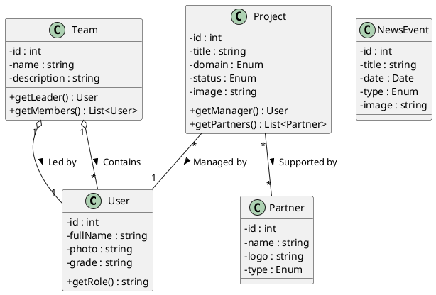

# Project Implementation Guide: TDW-2CSSIL (Part I)

## 1. Analysis & Objectives
**Goal:** Develop the public-facing side of the Laboratory Management System. This interface is accessible to visitors (unregistered) and members (registered) before they log in.

**Key Functional Requirements (Part I):**
1.  **Homepage:** Dynamic slideshow, latest news, and navigation.
2.  **Project Catalog:** List of research projects with **AJAX filtering** (by theme, status).
3.  **Team Presentation:** Organizational chart displaying Team Leaders and Members separately.
4.  **Authentication:** Login form to access the Back-Office (Part II).
5.  **Navigation:** Navigation menu and footer with dynamic links.

**Key Technical Requirements:**
*   **Strict MVC:** Clear separation of Model, View, and Controller.
*   **View Classes:** Views must be objects, not just included files.
*   **Internationalization (i18n):** All text must be variables (not hardcoded) to allow for future language switching.
*   **No Frameworks:** Pure PHP, `PDO` for database, and `jQuery` for frontend interactions.

---

## 2. Technical Architecture (MVC Structure)
This diagram illustrates how the application processes a user request. It follows the **Front Controller Pattern**.

```plantuml
@startuml
skinparam packageStyle rectangle

package "Core (Infrastructure)" {
    class Router {
        + dispatch() : void
        - parseUrl() : array
    }
    class Database <<Singleton>> {
        + static getInstance() : PDO
    }
    class Controller {
        # view(name, data) : void
        # model(name) : object
    }
}

package "MVC Layers" {
    class "SpecificController" as SC {
        + index()
        + filter()
    }
    class "SpecificModel" as SM {
        + fetchAll()
        + fetchByFilter()
    }
    class "SpecificView" as SV {
        - data : array
        - lang : array
        + render()
    }
}

file "Templates (.phtml)" as TPL

Router -> SC : Instantiates based on URL
SC -> SM : Requests Data
SM -> Database : SQL Queries
SC -> SV : Passes Data & Lang
SV -> TPL : Includes HTML Template

@enduml
```

---

## 3. Domain Logic (Business Class Diagram)
This diagram represents the "Business Objects" and their relationships specific to Part I (Public Interface).



---

## 4. Project Directory Structure
Create this exact folder structure to maintain the separation of concerns.

```text
/TDW_Project
├── /app
│   ├── /Config
│   │   └── config.php         # DB Credentials & Constants
│   ├── /Controllers           # Logic
│   │   ├── HomeController.php
│   │   ├── ProjectController.php
│   │   ├── TeamController.php
│   │   └── AuthController.php
│   ├── /Models                # Database Interactions
│   │   ├── ProjectModel.php
│   │   ├── UserModel.php
│   │   ├── TeamModel.php
│   │   └── NewsModel.php
│   └── /Views
│       ├── /Classes           # The View Objects (Logic)
│       │   ├── HomeView.php
│       │   ├── ProjectView.php
│       │   └── LayoutView.php
│       └── /Templates         # The HTML Files (Display)
│           ├── layout.phtml   # Header & Footer
│           ├── home.phtml
│           ├── project_list.phtml
│           └── team_list.phtml
├── /core                      # Framework Core
│   ├── Database.php           # Singleton PDO
│   ├── Router.php             # URL Parsing
│   ├── Controller.php         # Base Parent Class
│   └── View.php               # Base Parent Class
├── /public                    # Web Root
│   ├── index.php              # Entry Point
│   ├── /assets
│   │   ├── /css
│   │   │   └── style.css
│   │   ├── /js
│   │   │   └── script.js      # jQuery Logic
│   │   └── /img
│   └── /uploads               # Dynamic user uploads
└── /lang
    └── fr.php                 # Array of text strings
```

---

## 5. Implementation Plan

### Phase 1: The Core "Engine"
1.  **Database:** Run the SQL script provided (ensure `utf8mb4` and `admin`/`user` accounts exist).
2.  **Config:** Set up `app/Config/config.php`.
3.  **Database Class:** Implement `core/Database.php` using the **Singleton** pattern.
4.  **Router:** Implement `core/Router.php` to map `index.php?controller=X&action=Y` to a specific Controller class.

### Phase 2: The View Architecture
To satisfy the **"View as Class"** and **"Text as Variable"** constraints:
1.  Create `core/View.php`.
2.  Create `lang/fr.php` returning an array: `$lang = ['welcome' => 'Bienvenue', ...];`.
3.  Create `app/Views/Templates/layout.phtml`. This holds the HTML boilerplate (`<html>`, `<body>`, Navbar, Footer).

### Phase 3: The Homepage (Section 1)
1.  **Model:** `NewsModel` fetches the 3 most recent events/news from the DB.
2.  **Controller:** `HomeController` gets data -> passes to `HomeView`.
3.  **Frontend:** Write **jQuery** in `script.js` to handle the slideshow (5-second interval).

### Phase 4: Project Catalog & AJAX (Section 4)
*This is the most complex part of Part I.*
1.  **Display:**
    *   `ProjectController->index()` fetches all projects.
    *   `ProjectView` renders them in a Grid (CSS Grid).
2.  **Filtering (AJAX):**
    *   Create a dropdown `<select id="filter">`.
    *   **JS:** On change, send `$.ajax` request to `index.php?controller=Project&action=filter`.
    *   **PHP:** `ProjectController->filter()` calls `ProjectModel`, gets data, and returns **JSON**.
    *   **JS:** Parse JSON and rebuild the HTML cards without reloading the page.

### Phase 5: Teams & Organizational Chart (Section 3)
1.  **Model:** `TeamModel` needs to fetch Teams, their Leaders, and their Members.
2.  **View:** Logic is needed here. Iterate through teams, print the Leader card first (with specific styling), then the grid of members.
3.  **Details:** Add the link to the "Biography" page (which is just a detailed User View).

### Phase 6: Authentication Form (Section 5)
1.  Create `AuthController`.
2.  Simple Login Form (Username/Password).
3.  **Logic:** Verify hash. If success, start Session.
4.  **Note:** Actual dashboard is Part II, but the login mechanism belongs here.

---

## 6. Technical Constraints & Rules Checklist

| Constraint | Implementation Strategy |
| :--- | :--- |
| **MVC Format** | Strict separation: Code in `app/` is split into M, V, C. No SQL in Views. |
| **Class-based Views** | We separate the View *Object* (`HomeView.php`) from the HTML *Template* (`home.phtml`). |
| **Text as Variables** | All static text comes from `$lang` array injected into the View. |
| **No External Libs** | No Bootstrap JS, no React. Only **jQuery** is permitted. |
| **Database** | Named `TDW`. User `admin`/`admin` and `user`/`user` must exist. |
| **Data Seeding** | Database must have at least 3 rows per table (3 Projects, 3 Teams, etc.). |
| **Ergonomics** | Use CSS Flexbox/Grid for responsive layout. |